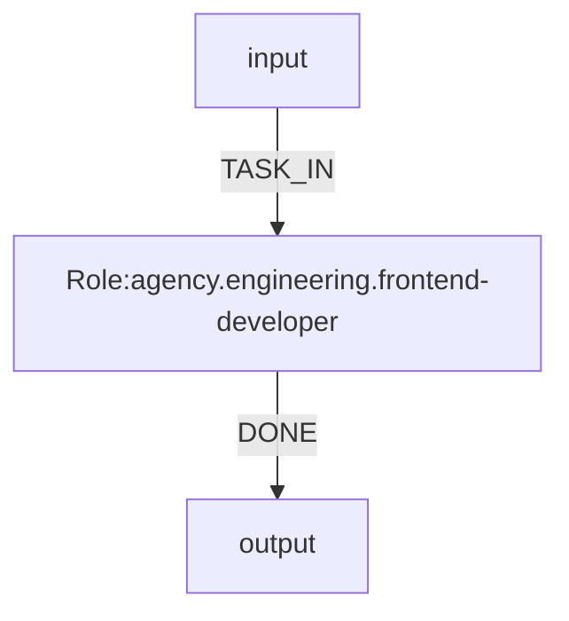

# agency-agents 作为 OGSystem role 仓库的接入方案

Date: 2026-04-20

Status: recommended integration plan

## 1. 结论

不建议把 `https://github.com/msitarzewski/agency-agents/tree/main` 直接作为 OGSystem 的 `roleRepo`。

推荐方案：

1. 将 `agency-agents` 视为上游 prompt 源仓库。
2. 通过转换脚本生成一个 OGSystem 兼容的派生 role 仓库。
3. 在项目的 `.ogs/runtime.json` 中将 `roleRepo` 指向这个派生仓库。

推荐生成仓库名：

- `agency-og-roles`

## 2. 原因

OGSystem 当前的 role 仓库契约不是“任意 markdown agent 集合”，而是严格的 role package 目录。

每个 role 至少需要：

- `roles/<roleId>/role.json`
- `roles/<roleId>/prompt.md`
- `roles/<roleId>/output.schema.json`

可选文件：

- `persona.md`
- `work.md`
- `input.schema.json`

当前 loader 还要求：

- `role.json` 只能包含受支持字段
- `promptTemplate`、`inputSchema`、`outputSchema` 要能解析到真实文件
- 运行时输出必须满足 JSON Schema

而 `agency-agents` 的核心形态是面向 Claude / OpenCode / Gemini / Cursor 等工具的 markdown agents。它更像“专家 prompt 源”，不是 OGSystem 的工作流 role package。

## 3. 主要不兼容点

### 3.1 目录结构不兼容

`agency-agents` 不是 `roles/<roleId>/role.json` 结构，不能被当前 loader 直接读取。

### 3.2 缺少 OGSystem manifest

OGSystem 需要 `role.json`，用于声明：

- `roleId`
- `roleVersion`
- `name`
- `description`
- `promptTemplate`
- `inputSchema`
- `outputSchema`
- `preferredModelTags`
- `tags`

`agency-agents` 没有这层 manifest。

### 3.3 缺少输出契约

OGSystem role 的输出不是自由文本，而是结构化 JSON，并且通常要求：

- `event`
- `content`
- 可选 `data`

同时 `event` 还要和 Mermaid 图中的边标签严格对齐。

`agency-agents` 的 markdown agents 不提供这层工作流事件契约。

### 3.4 prompt 语义层级不同

`agency-agents` 更像独立专家人格定义。

OGSystem role 不只是“一个专家 prompt”，还是：

- 工作流节点
- 输入上下文消费者
- 事件选择器
- 结构化输出生产者

因此不能简单把上游 markdown 原样塞进 `prompt.md` 就完成集成。

## 4. 推荐架构

推荐采用“双层仓库”：

### 4.1 上游仓库

- `agency-agents`
- 作用：提供 agent 原始 markdown 规范

### 4.2 派生仓库

- `agency-og-roles`
- 作用：提供 OGSystem 可直接消费的 role packages

目录建议：

```txt
agency-og-roles/
  roles/
    _shared/
      input.schema.json
    agency.engineering.frontend-developer/
      role.json
      prompt.md
      output.schema.json
      persona.md
      work.md
    agency.design.ui-designer/
      role.json
      prompt.md
      output.schema.json
      persona.md
      work.md
```

## 5. 字段映射建议

### 5.1 roleId

建议显式加命名空间，避免和本仓已有 role 冲突。

示例：

- `agency.engineering.frontend-developer`
- `agency.engineering.backend-architect`
- `agency.design.ui-designer`

### 5.2 name / description

优先取上游 frontmatter 中的：

- `name`
- `description`

### 5.3 tags

建议组合：

- 上游目录名
- 上游自带标签
- 统一附加 `agency`

示例：

```json
["agency", "engineering", "frontend"]
```

### 5.4 preferredModelTags

不要从上游 markdown 猜模型。

建议由本地转换规则统一指定，例如：

- `["general", "instruction-following"]`

后续再按角色族细分。

## 6. prompt 生成建议

不建议把 upstream markdown 直接当最终 `prompt.md`。

推荐做一层 OGSystem 包装。

示例模板：

```md
{{persona}}

{{work}}

Upstream agent specification:
...这里插入 agency-agents 原文主体...

Current task:
{{task}}

Context:
{{context}}

User profile:
{{user_profile}}

Allowed events:
{{allowed_events}}

Last output:
{{last_output}}

Return JSON only.
```

建议拆分：

- `persona.md`：上游 agent 的身份、原则、风格
- `work.md`：上游 agent 的步骤、边界、执行要求
- `prompt.md`：OGSystem 包装模板

这样更利于后续复用和审计。

## 7. output schema 方案

这是接入的关键点。

### 7.1 不推荐

不推荐从 `agency-agents` 自动推断项目级事件名。

原因：

- 上游仓库不表达 Mermaid 工作流路由
- 事件名属于项目编排层，不属于通用专家定义层

### 7.2 推荐

先给派生 role 仓库提供一个通用三态输出契约：

```json
{
  "type": "object",
  "required": ["event", "content"],
  "properties": {
    "event": {
      "type": "string",
      "enum": ["DONE", "NEEDS_CLARIFICATION", "BLOCKED"]
    },
    "content": { "type": "string" },
    "data": { "type": "object" }
  },
  "additionalProperties": false
}
```

适用场景：

- 原型流程
- 通用专家库
- 单步调用或轻量路由

### 7.3 更稳的长期做法

将 `agency-agents` 只作为“专家 prompt 源”。

实际放进某个系统图时，再在项目里包一层项目专属 role，使事件名贴合具体工作流，例如：

- `UI_DONE`
- `REQS_UNCLEAR`
- `HANDOFF_BACKEND`

即：

- 上游 role：定义专家能力
- 项目 wrapper role：定义工作流事件契约

这是更干净的分层。

## 8. 运行时接入方式

生成派生仓库后，在项目 `.ogs/runtime.json` 中配置：

```json
{
  "executor": "opencode",
  "roleRepo": "/abs/path/to/agency-og-roles",
  "modelRepo": "./og-models",
  "runsDir": ".ogs/runs"
}
```

然后在 `system.mmd` 中引用：



注意：

- 当前 runtime 的 `roleRepo` 是本地路径，不是 Git URL
- 默认 `./og-roles` 缺失时，CLI 只会回退到自身 bundled repo
- 如果显式配置自定义 `roleRepo`，则该路径必须真实存在

## 9. 推荐实施步骤

### Phase 1: 最小可行集成

只挑 5 到 10 个高价值 agents 做转换，不要一开始全量导入。

建议先选：

- 前端开发
- 后端架构
- 代码评审
- 测试工程
- 产品分析

交付：

- 一个转换脚本
- 一个生成后的 `agency-og-roles`
- 一个最小演示 `system.mmd`

### Phase 2: 稳定角色映射

补齐：

- `roleId` 命名规范
- `tags` 规范
- `preferredModelTags` 策略
- 通用 `output.schema.json`

### Phase 3: 项目级 wrapper roles

在具体业务系统里，把通用 upstream role 包装成工作流专用 role：

- 明确事件名
- 明确上下游 handoff
- 明确失败/澄清路径

## 10. 不推荐方案

### 10.1 直接把上游仓库路径填进 `roleRepo`

不可行，当前 loader 无法识别。

### 10.2 修改 loader 直接读取 agency markdown

短期不推荐。

这只能解决“文件格式”问题，解决不了：

- 没有 `output.schema.json`
- 没有 OGSystem 事件契约
- 没有 OGSystem prompt 包装
- 没有项目级路由语义

最终仍然需要转换层。

## 11. 最终建议

推荐的工程策略是：

1. 不直接兼容 `agency-agents` 原始格式。
2. 写一个导入脚本，把上游 markdown 转成 OGSystem role packages。
3. 产出独立派生仓库 `agency-og-roles`。
4. 用项目级 wrapper role 处理具体事件语义。

一句话总结：

`agency-agents` 适合做上游专家 prompt 源，不适合直接做 OGSystem roleRepo。正确接法是“转换为 OGSystem role 包，再接入运行时”。 
