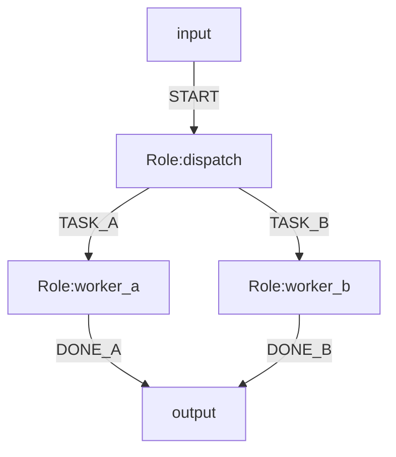
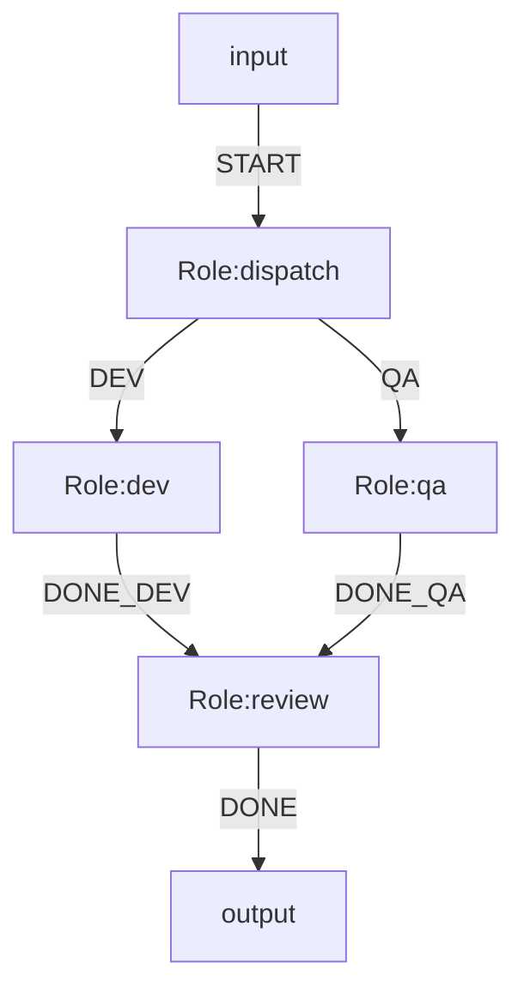

# OGSystem Flow Contract 重构方案（修订版，2026-04-14）

Archived: yes (delivery proposal; not active source of truth)  
Status: proposed  
Date: 2026-04-14  
Owner: Runtime maintainers

## 1. 目标与核心结论

本修订版明确采用三层分工，避免把业务合同和技术协议混在一起：

1. 技术层（Runtime Envelope）：统一 `event/content/data`，`_meta` 由运行时注入。
2. 业务层（Flow Contract）：以 flow 为准，定义“这条边允许传什么”。
3. 能力层（Role Capability）：角色表达“能做什么”，不直接定义场景合同。

结论：

- 用户关注与配置重点应是业务合同（flow contract），不是技术字段。
- 技术字段由框架统一约束；role 仅保留最小生成护栏（minimal schema）。
- 编译期做主校验，运行期做 fail-closed 执行校验。

---

## 2. 当前实现约束与已知冲突

当前仓库已落地且必须兼容的事实：

1. Mermaid metadata 是白名单，未知 key 直接失败。
2. 角色输出当前只允许 `event/content/data` 三个字段。
3. `parallel_split` 可以在无 event 的情况下激活全部下游。
4. `join` 通过 `all_of/quorum_of + join.sources + join.min` 判定就绪。
5. `ERROR*` 是运行时失败路由，不是普通业务输出事件。

已知冲突（本修订必须规避）：

1. `handoff.contract.<from>.<event>.<to>.*` 作为 metadata key 有歧义风险。  
原因：`roleId` 与 `eventType` 允许包含 `.`，按 `.` 分段不稳定。
2. 若只改 parser 不改 NL2MMD，会出现“可写不可保留/可写不可生成”的链路断裂。
3. 若直接移除 role output schema，会破坏执行器结构化生成约束与现有校验链路。

---

## 3. 分层定义（建议作为后续文档回写口径）

### 3.1 技术层：Runtime Envelope（统一、框架托管）

运行时交接信封（角色无需输出 `_meta`）：

```json
{
  "event": "PASS",
  "content": "summary",
  "data": {
    "score": 87
  },
  "_meta": {
    "runId": "20260414-120001-ab12cd34",
    "fromRoleId": "review",
    "toRoleId": "decision",
    "branchId": "review@1#2",
    "lineageId": "dispatch@1#1",
    "loopIteration": 1,
    "contractId": "review.pass.to.decision.v1",
    "contractVersion": 1,
    "at": "2026-04-14T12:00:01.000Z"
  }
}
```

边界：

- 业务合同默认仅约束 `event/content/data`。
- `_meta` 是技术审计字段，不作为业务合同输入来源（除非显式允许只读引用）。
- `_meta` 属于运行时临时交接信封，不进入持久化 `StoredRoleResult/result.json` 主体。
- 若需要审计 `_meta`，应写入 `events.ndjson` 或专门的运行时审计事件，而不是回写为 role 输出事实。

### 3.2 业务层：Flow Contract（以 flow 为准）

不再把 `from/event/to` 编进 metadata key。  
改为独立合同清单文件，并在 Mermaid 只声明引用：

```txt
%% handoff.mode=strict|compat
%% handoff.contracts=contracts/handoff.contracts.json
%% route.order.<fromRoleId>=<toRoleIdA>,<toRoleIdB>,...
```

`contracts/handoff.contracts.json` 示例：

```json
{
  "version": 1,
  "contracts": [
    {
      "id": "intake.pass.to.dispatch.v1",
      "kind": "flow",
      "match": {
        "fromRoleId": "intake",
        "eventType": "PASS",
        "toRoleId": "dispatch"
      },
      "schema": "schemas/handoff/intake-pass.json",
      "onViolation": "FAIL"
    },
    {
      "id": "dispatch.split.to.worker_a.v1",
      "kind": "flow",
      "match": {
        "fromRoleId": "dispatch",
        "mode": "split",
        "toRoleId": "worker_a"
      },
      "schema": "schemas/handoff/split-worker-task.json",
      "onViolation": "FAIL"
    },
    {
      "id": "review.join.input.v1",
      "kind": "role_input",
      "match": {
        "roleId": "review"
      },
      "schema": "schemas/handoff/review-join-input.json",
      "onViolation": "FAIL"
    }
  ]
}
```

说明：

- `kind=flow`：校验 flow 上传递载荷。
- `kind=role_input`：校验节点最终输入（特别适合 join + context.map，也适用于 split/普通接收节点的 `context.map` 投影输入）。
- `mode=split`：用于 `parallel_split` 场景，不依赖 event 匹配。
- `role_input` 是业务层输入合同；现有 `role.inputSchema` 继续保留为技术层 prompt-input 合同，两者并存但不互相替代。

### 3.3 能力层：Role Capability（软约束）

`role.json` 建议口径：

```json
{
  "roleId": "developer",
  "name": "Developer",
  "can": ["implement:c", "implement:java", "refactor"],
  "cannot": ["approve_release"],
  "capabilityNotes": "当前团队 C 交付稳定性更高",
  "tags": ["lang:c", "lang:java", "domain:backend"]
}
```

能力匹配原则：

- flow contract 定义“本次业务需要什么”（例如必须 `lang:c`）。
- role capability 仅用于编译期风险判定（warn/error 策略化），不默认替代合同校验。

范围收敛说明：

- Role Capability 不属于本方案 Phase 0-2 主链。
- 在当前实现中，`role.json` 校验器尚不接受 `can/cannot/capabilityNotes` 等字段，因此该部分仅保留为后续演进方向，不作为本次合同重构闸门。
- 本次主链只处理：技术 envelope、flow contract、minimal schema、resume 一致性。

---

## 4. 特殊节点实现示例

### 4.1 `parallel_split`（无 event 分发）

Mermaid：



合同匹配：

1. `dispatch` 进入 split 时忽略输出 event。
2. 对每个命中下游（`worker_a`、`worker_b`）按 `mode=split + from + to` 匹配 flow 合同。
3. split 后若不同下游需要不同输入视图，不新增额外投影机制；统一由接收节点使用现有 `context.map.<roleId>.* = direct.*` 做接收侧投影。
4. flow 合同校验共享上游 envelope；接收节点若声明 `role_input` 合同，则在其 `context.map` 投影后的结构化对象上校验最终输入，而不是校验字符串化后的 prompt context。
5. 每条 flow 单独进入匹配集合，但 strict/compat 的激活策略按第 7 节统一处理。

### 4.2 `join.mode=all_of` + `context.map`

Mermaid：



推荐校验顺序：

1. `dev -> review`、`qa -> review` 分别走 `kind=flow` 合同校验。  
2. `all_of` 就绪后，运行 `context.map.review.*` 构建输入。  
3. 对 `review` 执行 `kind=role_input` 合同校验。  
4. 通过后才激活 `review`。

### 4.3 `join.mode=quorum_of`（阈值激活）

原则与 `all_of` 一致，只是就绪条件变为 `join.min`。  
建议保留当前“激活一次，迟到 source 仅审计不重复激活”的语义。

但需补一条 v1 硬约束：

1. 当 `join.mode.<roleId>=quorum_of` 且 `join.min < |join.sources|` 时，`context.map.<roleId>.*` 不允许使用 `source(...)` selector。
2. 原因：当前运行时允许任意满足 quorum 的 source 子集触发激活，但 `source(x)` 在缺席时会直接 fail-closed。
3. 因此在现有实现下，`quorum_of` 节点的 `context.map` 仅允许：
   - `global.*`
   - 未来新增的显式 optional selector（本方案 v1 不包含）
4. 若 `join.min == |join.sources|`，该 `quorum_of` 退化为事实上的全量到齐，此时 `source(...)` 才是安全的。

---

## 5. 字段冲突/字段不足处理规则

### 5.1 编译期（必须失败）

1. flow 合同引用 schema 不可加载/不可编译（AJV）。
2. 合同与 flow 无绑定关系（孤儿合同）。
3. flow 命中关系在 strict 下无合同覆盖。
4. `role_input` 合同要求字段在 `context.map` 投影后不可达。
5. 同一 target 字段多来源映射且类型冲突。
6. `parallel_split` 同时声明 event 匹配合同与 split 匹配合同（语义歧义）。
7. `quorum_of` 且 `join.min < |join.sources|` 时，若 `context.map` 使用 `source(...)`，直接报错。

### 5.2 运行期（策略化）

1. `strict`：合同失败 -> fail-closed，不激活对应 flow；在 `parallel_split` 等多目标场景下按第 7 节两阶段规则整体处理。
2. `compat`：  
   - 合同缺失 -> WARN + skip flow（避免脏数据透传）。  
   - 合同存在但校验失败 -> 默认 FAIL（允许显式 WARN 仅用于过渡）。
3. 若 `compat + skip flow` 会导致某个 join 条件变为不可达，则该情况必须升级为 `FAIL`，不能只保留告警。

---

## 6. `strict/compat` 与边界范围

默认合同作用范围（v1）：

1. role-to-role 业务边（普通事件边 + split 边）。
2. 不默认覆盖 `ERROR*` 运行时异常边。
3. 不强制覆盖 role->output 边（可选）。

行为矩阵：

| 场景 | strict | compat |
| :--- | :--- | :--- |
| 合同缺失（在作用范围内） | FAIL | WARN（默认不激活该 flow；若导致 join 不可达则升级为 FAIL） |
| 合同 schema 无效 | FAIL | FAIL |
| 合同校验失败 | FAIL | 按 `onViolation`（默认 FAIL） |
| `onViolation=WARN` | 不允许 | 允许（过渡期） |

---

## 7. 编译与运行实现清单

### 7.1 编译期（lint/plan）

新增 `ContractPlan`：

1. 读取 `handoff.contracts` 指向的合同文件。
2. 收集 flow：普通 `from+event+to` 与 split `from+mode=split+to`。
3. 建立 `flow <-> contract` 唯一映射。
4. 校验普通 flow 不允许重复声明（同一 `fromRoleId + eventType + toRoleId`）。
5. 校验 `route.order.<fromRoleId>`：目标合法、无重复。
6. 校验 `role_input` 合同与 `context.map` 可达性。
7. 识别 `compat + skip flow` 是否会让 join 条件不可达；若不可达则直接报错或升级策略。

### 7.2 运行期（execute/transition）

每次 role 成功输出后：

1. 先做 envelope 基础校验（`event/content/data`）。
2. 运行时注入 `_meta`。
3. 计算命中边集合（普通事件匹配或 split）。
4. 应用 `route.order`（仅重排，不改命中集合）。
5. `strict` 下采用两阶段语义：
   - Phase A：先对全部命中 flow 做合同校验，不激活任何下游。
   - Phase B：仅当全部通过时，再统一激活所有命中下游。
6. `compat` 下允许逐 flow 处理：
   - 单条 flow 校验通过则可激活该 flow 下游。
   - 单条 flow 校验失败则按 `onViolation` 处理，且不影响其他已通过 flow。
7. 下游节点在激活前，若声明 `role_input` 合同，则先构造其 `context.map` 投影后的结构化输入对象；`role_input` 合同只校验该对象，不校验字符串化后的 prompt context。
8. `role.inputSchema` 若存在，继续只校验技术层 promptInput；不得把 `role_input` 业务合同并入或替代 `role.inputSchema`。
9. flow 合同与 `role_input` 合同校验所用 envelope/输入对象均为运行时派生的临时结构；不得为此把 `StoredRoleResult` 改造成按 flow 分叉的持久化 artifact 模型。
10. 通过后激活下游。

---

## 8. 最小约束（Minimal Schema）策略

原则：

1. 不再让每个 role schema 承担业务协作契约。
2. role 保留最小技术护栏：输出 envelope 基础形状与基础类型。
3. 业务约束全部放到 flow contract。

Schema floor（建议）：

1. 顶层仅允许 `event/content/data`。
2. `event` 为可选非空字符串，`content` 为可选字符串，`data` 为可选对象。
3. 不要求把 `ERROR*` 禁止编码进 schema；该规则继续由 runtime 独立强制。

Lint policy（建议）：

1. 若某 role 的普通业务事件集合稳定，继续建议保留 `event enum`。
2. `event enum` 作为 lint/生成质量信号，不再是 flow 业务合同真源。
3. 无稳定事件集的 role 可只使用 schema floor，由 flow contract 补业务约束。

最小约束价值：

1. 给模型输出提供稳定轨道（降低格式漂移）。
2. 配合 runtime 规则，降低保留事件与非法字段误输出风险。
3. 保持恢复/审计一致性（输出结构稳定）。

---

## 9. 分阶段计划（修订）

## Phase 0：契约载体与工具链对齐（低风险）

1. parser 白名单放行：`handoff.mode`、`handoff.contracts`、`route.order.*`。
2. 新增合同文件加载与 `lint:contracts`。
3. NL2MMD 同步支持上述 metadata；normalize 不再丢弃这些 key。
4. `SystemDefinition` / `GraphMetadata` / plan 类型补充合同引用与 `route.order` 承载字段。
5. 指纹补充完整语义字段（resume 一致性），至少包括：
   - `routingModeByRoleId`
   - `joinModeByRoleId`
   - `joinSourcesByRoleId`
   - `joinMinByRoleId`
   - `contextMapByRoleId`
   - `loopMaxByRoleId`
   - `handoff.mode`
   - 合同文件 digest
   - `route.order.*`

Phase 0 退出前必须冻结接口边界：

1. parser 输入面
2. `SystemDefinition` / execution plan 承载面
3. resume 指纹面
4. NL2MMD 生成与校验面

## Phase 1：运行时并行校验（兼容）

1. 保留现有 role output schema。
2. 增加 flow 合同校验（`compat` 默认）。
3. split 合同匹配路径上线。

## Phase 2：Flow Contract 主导

1. `strict` 成为默认。
2. 作用范围内缺合同直接失败。
3. 支持基于 `context.map` 的节点 `role_input` 合同校验。

## Phase 3：Role Schema 收敛（非移除）

1. role schema 缩减为 minimal schema（技术护栏）。
2. 业务字段约束从 role schema 迁移到 flow contract。
3. capability 相关扩展若要继续推进，另开独立里程碑。

---

## 10. 错误码与观测（建议）

建议新增：

- `CONTRACT_MISSING`
- `CONTRACT_SCHEMA_INVALID`
- `CONTRACT_UNBOUND_FLOW`
- `CONTRACT_VALIDATION_FAILED`
- `CONTRACT_ROLE_INPUT_VALIDATION_FAILED`
- `CONTRACT_PROJECTION_PATH_MISSING`
- `CONTRACT_PROJECTION_TYPE_CONFLICT`

保留为未来 phase 预留，不纳入本次实现范围：

- `CAPABILITY_MISMATCH_WARN`
- `CAPABILITY_MISMATCH_ERROR`

审计建议：

- `events.ndjson` 增加 `contract_validation`（from/event/to 或 role_input、contractId、result）。
- `audit/summary.md` 增加合同通过率与失败分布。

---

## 11. 风险与回滚

主要风险：

1. 迁移期合同缺失导致严格模式阻断。
2. 合同文件与 Mermaid 图漂移。
3. 生成链路（NL2MMD）未同步导致配置被吞。
4. 若 strict 未采用“两阶段校验 -> 统一激活”，split 会出现顺序相关的部分激活。
5. 若未限制 `quorum_of + source(...)`，有 `context.map` 时 join 输入构建本身就可能 fail-closed。
6. 若不把 `role_input` 校验对象固定为“投影后的结构化对象”，且不明确其与现有 `inputSchema` 的分层边界，会形成两套输入合同叠加。
7. 若 `_meta` 进入持久化结果，会把单次 role 结果膨胀为按 flow 分叉的 artifact 模型，显著增加实现复杂度。

回滚：

1. 全局 `handoff.mode=compat`。
2. 保留 role minimal schema + 现有输出校验兜底。
3. 移除 `handoff.contracts` 引用即可回退到旧行为。

---

## 12. 与 wait-timeout v2 的关系

`join.deadline/on_timeout` 不并入本方案主链。  
其上线依赖 `docs/ogsystem-wait-timeout-semantics-v2.md` 从 RFC 进入 Delivered 后再做独立里程碑。

---

## 13. 回写目标（若采纳）

1. `docs/ogsystem-orchestration-semantics-v1.md`
2. `docs/usage-manual.md`
3. `docs/DECISIONS.md`
4. `docs/ogsystem-semantics-manual.md`

---

## 14. 实施前检查清单（已冻结项）

1. 合同文件路径解析基准已冻结为：相对 `system.mmd` 所在目录解析；运行时归一为绝对路径用于加载与 fingerprint。
2. JSON Schema 方言已冻结为：draft-07。
3. `$ref` 策略已冻结为：仅允许本地文件引用；相对 `$ref` 以当前 schema 文件所在目录为基准解析；禁止远程 `http(s)://` 引用。
4. 每个合同 schema 文件应显式声明 `$schema: "http://json-schema.org/draft-07/schema#"`。
5. `compat` 默认动作已冻结为：`WARN + skip flow`；但若导致 join 不可达则升级为 `FAIL`。
6. 指纹覆盖范围已冻结：必须纳入完整语义字段与合同 digest，不能只补增量字段。
7. `role_input` 与 `role.inputSchema` 的边界已冻结：前者是业务层投影对象合同，后者是技术层 prompt-input 合同，两者并存但不互相替代。
8. `role_input` 合同触发时机已冻结为：任何声明该合同且使用 `context.map` 构造业务输入的接收节点，都在激活前校验一次；且校验对象固定为投影后的结构化对象。
9. `_meta` 生命周期已冻结：仅用于运行时校验/审计，不进入持久化 role 结果；flow 合同校验使用派生的临时 envelope，不改造 `StoredRoleResult` 持久化模型。
10. `ERROR*` 合同策略：v1 继续排除，若需纳入另开 RFC。
11. 迁移脚本策略：从现有 role output schema 自动生成 flow 合同草案并人工确认。
12. schema floor 已冻结为：允许仅保留 `event/content/data` 基础形状；若业务事件集稳定，则保留 `event enum` 作为强建议 lint，而非硬合同真源。
