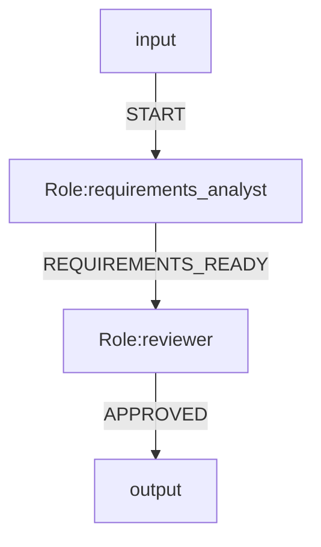

# OGSystem Visual Authoring Modularity And Chinese Labels Review

Date: 2026-05-02

## Conclusion

当前可视化能力已经具备可用的模块化基础，但还不是完全平台化的最佳实践状态。

适合继续演进的方向是：

```text
runtime/parser/compiler: stable core
studio-authoring: editing truth
studio-client: graph interaction
visualizer lifecycle workspaces: Project / Build / Validate & Release / Operate
server API: controlled project read/write/validation/export
```

中文角色名和中文连线名应作为显示层能力支持，不应直接改成运行 ID。

推荐原则：

```text
roleId / eventType = stable runtime identity
title / label = localized business display name
```

这样可以支持中文业务体验，同时不影响 parser、runtime、compiler、run artifacts、resume、contracts 和 release manifest。

当前实现状态需要区分清楚：

- 角色显示名基础能力已经存在：`StudioAuthoringRole.title` 已定义，角色表单已支持 `title`，图节点已显示 `role.title || roleId`。
- 真正缺口是连线显示名：`StudioAuthoringFlow` 尚未定义 `label?: string`，边渲染和边表单仍主要围绕 `eventType`。
- Mermaid 显示名 metadata 应后置；第一阶段应先稳定保存在 `.ogs/studio/system.authoring.json` / `StudioAuthoringDocument`。

## Current Modularity Assessment

### Strengths

- Visualizer 与 runtime/parser/compiler 基本隔离。
- Studio Graph/X6 能力位于浏览器图编辑边界内。
- Authoring 模型已有独立文件：
  - `src/visualizer/studio-contracts.ts`
  - `src/visualizer/studio-authoring.ts`
- Studio Graph 浏览器端已拆分：
  - `src/visualizer/studio-client/studio-graph.ts`
  - `src/visualizer/studio-client/studio-graph-adapter.ts`
  - `src/visualizer/studio-client/studio-graph-command-forms.ts`
  - `src/visualizer/studio-client/studio-graph-commands.ts`
  - `src/visualizer/studio-client/studio-graph-render.ts`
  - `src/visualizer/studio-client/studio-graph-validation.ts`
- Project projection、readiness、ops summary、run graph projection 已有独立模块。
- 测试覆盖较强：
  - client tests
  - server visualizer tests
  - authoring tests
  - browser smoke tests

### Gaps

- `src/visualizer/client-app.ts` 约 4600 行，承担路由、状态、渲染、事件、API、表单和生命周期逻辑，已经偏“大控制器”。
- `src/visualizer/page-shell.ts` 约 1300 行，HTML shell、CSS 和布局在同一文件中，长期维护会变重。
- Project / Build / Validate & Release / Operate 在产品体验上已分层，但代码尚未完全按生命周期工作区拆分。
- Project Wizard、Open Project、Role Catalog、Build Chat、Workbench、Operate tabs 等仍大量使用 DOM 字符串拼接和局部事件绑定。
- Authoring schema 已有角色 `title`，但 flow `label` 尚未正式固化；“运行标识 vs 显示名称”的 contract 需要补齐到连线层。
- Chat to MMD、图表单、Inspector、Project Wizard 都可能创建或修改 authoring，后续需要统一 patch/validation 边界，避免多入口写入不一致。

## Long-Term Stability Assessment

当前实现适合作为本地控制台式 Visualizer 稳定运行。测试基础较好，短期风险可控。

长期平台化风险主要来自可维护性，而不是当前功能正确性：

- 新功能继续叠加到 `client-app.ts` 会增加状态同步和重渲染副作用。
- 表单、Chat、Graph、Project 创建加载能力继续增长后，回归成本会升高。
- 如果不先补齐连线显示名 contract，中文命名可能被错误地塞进 `eventType`，进而影响内核语义。

判断：

```text
Current: usable and tested
Next target: modular and contract-stable
```

## Chinese Role And Flow Naming

### Recommended Design

角色：

```ts
{
  roleId: "requirements_analyst",
  title: "需求分析"
}
```

角色显示名是当前已有基础能力，后续重点是补测试和统一 Inspector/Chat 表达。

连线：

```ts
{
  eventType: "REQUIREMENTS_READY",
  label: "需求已完成"
}
```

连线显示名是当前主要缺口，应作为第一阶段落地重点。

图上显示：

```text
node title: title || roleId
node hint: roleId
edge label: label || eventType
edge hint: eventType
```

### Why Not Use Chinese Runtime IDs

当前 Mermaid parser 对 role 节点使用严格格式：

```mermaid
r1[Role:requirements_analyst]
```

`Role:<roleId>` 当前只接受稳定 ASCII 标识符。直接支持：

```mermaid
r1[Role:需求分析]
```

会影响 parser、serializer、metadata keys、bindings、joins、context selectors、logs、run artifacts、URLs、contracts 和 migration。

因此不建议本轮直接把中文作为运行 ID。

### Mermaid Metadata Policy

第一阶段不要求把显示名写入 `system.mmd`。显示名优先保存在 `.ogs/studio/system.authoring.json` / `StudioAuthoringDocument`，运行语义继续只依赖稳定 ID：



第二阶段如需把显示名同步到 Mermaid，可引入受控 metadata：


Notes:

- `role.title.*` and `flow.label.*` are visual authoring metadata, not runtime routing semantics.
- Runtime execution continues to use `roleId` and `eventType`.
- Mermaid metadata support must be parser allow-listed before writing these keys into `system.mmd`.
- Metadata serialization is not a blocker for the first phase of Chinese visual labels.
- `label` should be trimmed and treated as optional display metadata; empty strings must not be persisted or rendered as empty labels, and should fall back to `eventType`.

Phase 1 boundary:

- `save/load` for Chinese display names means `StudioAuthoringDocument` round-trip through `.ogs/studio/system.authoring.json`.
- `system.mmd` round-trip is intentionally not the persistence mechanism for display names in phase 1.
- `serializeAuthoringToMermaid()` should continue emitting only stable IDs and event codes.
- Re-importing from `system.mmd` is expected to lose display names until phase 2 metadata support exists.

## Best-Practice Target Architecture

### Module Boundaries

```text
src/visualizer/
  lifecycle/
    project-workspace.ts
    build-workspace.ts
    validate-release-workspace.ts
    operate-workspace.ts
  panels/
    project-open-panel.ts
    project-create-panel.ts
    role-catalog-panel.ts
    studio-chat-panel.ts
    workbench-actions-panel.ts
  state/
    visualizer-state.ts
    route-state.ts
    lifecycle-state.ts
  studio-authoring.ts
  studio-contracts.ts
  studio-client/
```

This does not need to happen in one large refactor. New feature work should avoid increasing `client-app.ts` and should gradually extract stable panels.

### State Boundaries

Current state should be split conceptually into:

```text
projectState
buildState
studioState
operateState
chatState
releaseState
```

Goal:

- Project Wizard updates should not re-render Build Chat.
- Build graph edits should not disturb Operate state.
- Chat input should not be lost through unrelated workspace refreshes.
- Open Project should reset only project-bound state.

### Authoring Contract

Current and target display fields:

```ts
type StudioAuthoringRole = {
  roleId: string;
  // Already exists.
  title?: string;
  // existing fields...
};

type StudioAuthoringFlow = {
  flowId: string;
  fromRoleId: string;
  toRoleId: string;
  eventType: string;
  // Missing today; add in first phase.
  label?: string;
  // existing fields...
};
```

Rules:

- `roleId` is required and stable.
- `eventType` is required and stable.
- `title` and `label` are optional display fields.
- `title` already exists for roles; `label` must be added for flows.
- UI may allow Chinese `title` and `label`.
- UI must validate or auto-generate ASCII-safe `roleId` and `eventType`.
- Chat to MMD must emit structured patches, not raw Mermaid text, when creating display names.

## Before Implementation

These items should be completed before landing flow labels and deeper visual editing:

- [x] Confirm role display foundation: `StudioAuthoringRole.title` exists and graph nodes display `title || roleId`.
- [ ] Define `label?: string` in `StudioAuthoringFlow`.
- [ ] Preserve `label` through canvas projection, command application, authoring draft save/load, and graph refresh.
- [ ] Add or update authoring validation for stable IDs plus optional display names.
- [ ] Keep display metadata persisted in `.ogs/studio/system.authoring.json` / authoring document for phase 1.
- [ ] Defer `role.title.*` / `flow.label.*` serialization into `system.mmd` until parser allow-list is implemented.
- [ ] Update Studio Graph renderer to display `edge.label || edge.eventType`.
- [ ] Update edge forms and Inspector to show both:
  - display name
  - runtime identity
- [ ] Update Chat to MMD patch handling to split Chinese business names from stable IDs.
- [ ] Add tests for Chinese display names with unchanged runtime IDs.
- [ ] Add tests proving `StudioAuthoringDocument -> canvas -> authoring` preserves `flow.label`, while `authoring -> Mermaid -> import` intentionally drops display labels in phase 1.
- [ ] Add regression tests that editing `eventType` does not drop `label`, and editing `label` does not change duplicate detection or `flowKey`.
- [ ] Add browser smoke showing Chinese node/edge labels while generated Mermaid still parses.
- [ ] Extract panel/workspace modules opportunistically as touched; do not block this feature on a large upfront refactor.

## Recommended Execution Order

1. Add `StudioAuthoringFlow.label?: string`, validation, commands, and edge form support.
2. Update graph projection/rendering so edges display `label || eventType`.
3. Update Inspector to show display name and runtime identity for roles and flows; role side should reuse existing `title`.
4. Add tests for Chinese role title and flow label, ensuring generated Mermaid still only uses stable `roleId/eventType` and parses.
5. Update Chat to MMD structured patch contract to distinguish `roleId/title` and `eventType/label`.
6. Decide later whether to serialize display metadata into `system.mmd`; if yes, add parser allow-list first.
7. Extract Project/Build panels only as related code is touched; avoid a large upfront refactor.

## Acceptance Criteria

- [x] The authoring model supports a role display name through `title`.
- [ ] Users can name a role `需求分析` in the visual graph and keep that name through save/load.
- [ ] The underlying role keeps a stable ID such as `requirements_analyst`.
- [ ] Users can name a flow `需求已完成` through `label`.
- [ ] The underlying event keeps a stable event type such as `REQUIREMENTS_READY`.
- [ ] `flow.label` survives canvas projection, save/load, and graph refresh.
- [ ] Editing `eventType` does not drop `label`, and editing `label` does not change duplicate detection or `flowKey`.
- [ ] Generated Mermaid parses successfully without runtime/parser semantic changes and continues to use stable `roleId/eventType`.
- [ ] Inspector shows both display name and runtime identity.
- [ ] Inspector, lists, and search/filter all include `label` in display and lookup paths.
- [ ] Chat to MMD can generate Chinese business names while emitting stable IDs and event codes in structured patches.
- [ ] Duplicate detection, join/source logic, route/order logic, and contracts remain keyed only by `fromRoleId + eventType + toRoleId`, allowing repeated Chinese labels.
- [ ] Existing runtime, parser, compiler, run artifact, resume, readiness, and release tests keep passing.
- [ ] Browser smoke confirms Chinese labels are visible in the graph.

## Non-Goals

- Do not change runtime role identity semantics.
- Do not make parser accept arbitrary Unicode role IDs in this phase.
- Do not make `eventType` carry localized business text.
- Do not require Mermaid display metadata serialization in phase 1.
- Do not write project files directly from UI panels outside controlled APIs.
- Do not create a second graph truth separate from `StudioAuthoringDocument`.

## Additional Notes

- `flow.label` is display metadata, not a key. Duplicates are allowed as long as `fromRoleId + eventType + toRoleId` stays stable.
- `label` should be trimmed before persistence; empty or whitespace-only input should be treated as unset and fall back to `eventType` in the UI.
- Chat to MMD should emit structured authoring patches such as `{ roleId, title, eventType, label }`, then a local normalizer should produce ASCII-safe runtime IDs and event codes.
- Phase 2 Mermaid metadata needs an escaping scheme or another parseable encoding for keys; `flow.label.<from>.<event>.<to>` is fragile when identifiers contain dots, slashes, or other special characters.
