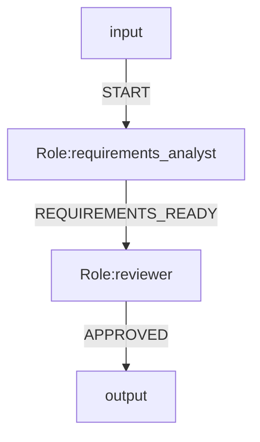

# OGSystem Visual Authoring Modularity And Chinese Labels Review

Date: 2026-05-02

## Conclusion

这项评审需要拆成两个结论：

- 中文显示名 phase 1：已完成。
- 生命周期模块化重构：本交付范围已完成，后续仍可继续演进 DOM controller/action factory 拆分。

当前可视化能力已经具备可用的模块化基础，但还不是完全平台化的最佳实践状态。

适合继续演进的方向是：

```text
runtime/parser/compiler: stable core
studio-authoring: editing truth
studio-client: graph interaction
visualizer lifecycle workspaces: Project / Build / Validate & Release / Operate
server API: controlled project read/write/validation/export
```

中文角色名和中文连线名应作为显示层能力支持，不应直接改成运行 ID。

推荐原则：

```text
roleId / eventType = stable runtime identity
title / label = localized business display name
```

这样可以支持中文业务体验，同时不影响 parser、runtime、compiler、run artifacts、resume、contracts 和 release manifest。

当前实现状态需要区分清楚：

- phase 1 中文显示名能力已经落地：`StudioAuthoringRole.title` 和 `StudioAuthoringFlow.label` 已定义，角色/连线表单、图渲染、Inspector、lists、search/filter、Chat patch、authoring draft 持久化和相关测试均已覆盖。
- Mermaid 显示名 metadata 仍应后置；第一阶段显示名稳定保存在 `.ogs/studio/system.authoring.json` / `StudioAuthoringDocument`。
- 生命周期模块化目标架构已完成到本交付要求；后续 remaining work 主要是继续把浏览器端 DOM controller/action factories 从 `client-app.ts` 渐进外提，而不是补核心 workspace/state/module 边界。

## Current Modularity Assessment

### Strengths

- Visualizer 与 runtime/parser/compiler 基本隔离。
- Studio Graph/X6 能力位于浏览器图编辑边界内。
- Authoring 模型已有独立文件：
  - `src/visualizer/studio-contracts.ts`
  - `src/visualizer/studio-authoring.ts`
- Studio Graph 浏览器端已拆分：
  - `src/visualizer/studio-client/studio-graph.ts`
  - `src/visualizer/studio-client/studio-graph-adapter.ts`
  - `src/visualizer/studio-client/studio-graph-command-forms.ts`
  - `src/visualizer/studio-client/studio-graph-commands.ts`
  - `src/visualizer/studio-client/studio-graph-render.ts`
  - `src/visualizer/studio-client/studio-graph-validation.ts`
- Project projection、readiness、ops summary、run graph projection 已有独立模块。
- 测试覆盖较强：
  - client tests
  - server visualizer tests
  - authoring tests
  - browser smoke tests

### Gaps

- `src/visualizer/client-app.ts` 已降到约 4400 行，继续承担 DOM 事件绑定、API 调用和跨 workspace 编排；纯 state / panel HTML / workspace helper 边界已开始稳定外提。
- `src/visualizer/page-shell.ts` 已拆成 shell 组合入口、CSS renderer 和 body template；这条历史缺口已关闭。
- Project / Build / Validate & Release / Operate 在产品体验上已分层；当前代码层也已有稳定 state/helper/panel 模块承载初始状态、route state、release readiness、stream refresh、workspace empty state、Operate tabs/timeline/stats、Workbench structure、Project create error mapping 和 Studio Chat panel rendering。
- DOM 事件绑定、表单读取、async loader/action 和跨 workspace refresh 编排仍集中在 `client-app.ts`，后续可以继续拆成 controller/action factories，但不再是本交付的阻断项。
- Project Wizard、Open Project、Role Catalog、Build Chat、Workbench、Operate tabs 等仍有局部事件绑定留在 `client-app.ts`。
- Chat to MMD、图表单、Inspector、Project Wizard 都可能创建或修改 authoring，后续需要统一 patch/validation 边界，避免多入口写入不一致。

## Long-Term Stability Assessment

当前实现适合作为本地控制台式 Visualizer 稳定运行。测试基础较好，短期风险可控。

长期平台化风险主要来自可维护性，而不是当前功能正确性：

- 新功能继续叠加到 `client-app.ts` 会增加状态同步和重渲染副作用。
- 表单、Chat、Graph、Project 创建加载能力继续增长后，回归成本会升高。
- 生命周期 workspace / panels / state 边界已按本交付要求落地为稳定模块；`client-app.ts` 仍是浏览器端协调器，后续风险主要来自 DOM controller/action 层继续增长。

判断：

```text
Current: usable and tested
Next target: controller-light and contract-stable
```

## Chinese Role And Flow Naming

### Recommended Design

角色：

```ts
{
  roleId: "requirements_analyst",
  title: "需求分析"
}
```

角色/连线显示名均已覆盖基础测试，后续重点是保持多入口 patch/validation 一致。

连线：

```ts
{
  eventType: "REQUIREMENTS_READY",
  label: "需求已完成"
}
```

连线显示名 phase 1 已完成，后续重点不再是补 contract，而是保持运行标识与显示名称分离，并决定 phase 2 是否进入 Mermaid metadata。

图上显示：

```text
node title: title || roleId
node hint: roleId
edge label: label || eventType
edge hint: eventType
```

### Why Not Use Chinese Runtime IDs

当前 Mermaid parser 对 role 节点使用严格格式：

```mermaid
r1[Role:requirements_analyst]
```

`Role:<roleId>` 当前只接受稳定 ASCII 标识符。直接支持：

```mermaid
r1[Role:需求分析]
```

会影响 parser、serializer、metadata keys、bindings、joins、context selectors、logs、run artifacts、URLs、contracts 和 migration。

因此不建议本轮直接把中文作为运行 ID。

### Mermaid Metadata Policy

第一阶段不要求把显示名写入 `system.mmd`。显示名优先保存在 `.ogs/studio/system.authoring.json` / `StudioAuthoringDocument`，运行语义继续只依赖稳定 ID：



第二阶段如需把显示名同步到 Mermaid，可引入受控 metadata：


Notes:

- `role.title.*` and `flow.label.*` are visual authoring metadata, not runtime routing semantics.
- Runtime execution continues to use `roleId` and `eventType`.
- Mermaid metadata support must be parser allow-listed before writing these keys into `system.mmd`.
- Metadata serialization is not a blocker for the first phase of Chinese visual labels.
- `label` should be trimmed and treated as optional display metadata; empty strings must not be persisted or rendered as empty labels, and should fall back to `eventType`.

Phase 1 boundary:

- `save/load` for Chinese display names means `StudioAuthoringDocument` round-trip through `.ogs/studio/system.authoring.json`.
- `system.mmd` round-trip is intentionally not the persistence mechanism for display names in phase 1.
- `serializeAuthoringToMermaid()` should continue emitting only stable IDs and event codes.
- Re-importing from `system.mmd` is expected to lose display names until phase 2 metadata support exists.

## Best-Practice Target Architecture

### Module Boundaries

```text
src/visualizer/
  lifecycle/
    project-workspace.ts
    build-workspace.ts
    validate-release-workspace.ts
    operate-workspace.ts
  panels/
    project-open-panel.ts
    project-create-panel.ts
    role-catalog-panel.ts
    studio-chat-panel.ts
    workbench-actions-panel.ts
  state/
    visualizer-state.ts
    route-state.ts
    lifecycle-state.ts
  studio-authoring.ts
  studio-contracts.ts
  studio-client/
```

This did not need to happen in one large refactor. The 2026-05-03 follow-up completed the first stable helper/state split:

- `src/visualizer/client-route-state.ts`
- `src/visualizer/client-release-readiness.ts`
- `src/visualizer/client-stream-state.ts`

It also split page shell composition:

- `src/visualizer/page-shell.ts`
- `src/visualizer/page-shell-styles.ts`
- `src/visualizer/page-shell-template.ts`

The follow-up lifecycle modularization then landed these additional workspace/panel/state modules:

- `src/visualizer/client-lifecycle-state.ts`
- `src/visualizer/client-lifecycle-panels.ts`
- `src/visualizer/client-project-workspace.ts`
- `src/visualizer/client-studio-chat-panel.ts`

### State Boundaries

Current state is now separated conceptually into:

```text
projectState
buildState
studioState
operateState
chatState
releaseState
```

Delivered boundary:

- Project Wizard updates should not re-render Build Chat.
- Build graph edits should not disturb Operate state.
- Chat input should not be lost through unrelated workspace refreshes.
- Open Project should reset only project-bound state.

### Authoring Contract

Current and target display fields:

```ts
type StudioAuthoringRole = {
  roleId: string;
  // Already exists.
  title?: string;
  // existing fields...
};

type StudioAuthoringFlow = {
  flowId: string;
  fromRoleId: string;
  toRoleId: string;
  eventType: string;
  // Phase 1 landed as optional display metadata.
  label?: string;
  // existing fields...
};
```

Rules:

- `roleId` is required and stable.
- `eventType` is required and stable.
- `title` and `label` are optional display fields.
- `title` and `label` are both landed in phase 1.
- UI may allow Chinese `title` and `label`.
- UI must validate or auto-generate ASCII-safe `roleId` and `eventType`.
- Chat to MMD must emit structured patches, not raw Mermaid text, when creating display names.

## Phase 1 Completion Checklist

These items were completed to land flow labels and phase 1 visual editing:

- [x] Confirm role display foundation: `StudioAuthoringRole.title` exists and graph nodes display `title || roleId`.
- [x] Define `label?: string` in `StudioAuthoringFlow`.
- [x] Preserve `label` through canvas projection, command application, authoring draft save/load, and graph refresh.
- [x] Add or update authoring validation for stable IDs plus optional display names.
- [x] Keep display metadata persisted in `.ogs/studio/system.authoring.json` / authoring document for phase 1.
- [x] Defer `role.title.*` / `flow.label.*` serialization into `system.mmd` until parser allow-list is implemented.
- [x] Update Studio Graph renderer to display `edge.label || edge.eventType`.
- [x] Update edge forms and Inspector to show both:
  - display name
  - runtime identity
- [x] Update Chat to MMD patch handling to split Chinese business names from stable IDs.
- [x] Add tests for Chinese display names with unchanged runtime IDs.
- [x] Add tests proving `StudioAuthoringDocument -> canvas -> authoring` preserves `flow.label`, while `authoring -> Mermaid -> import` intentionally drops display labels in phase 1.
- [x] Add regression tests that editing `eventType` does not drop `label`, and editing `label` does not change duplicate detection or `flowKey`.
- [x] Add browser smoke showing Chinese node/edge labels while generated Mermaid still parses.
- [x] Extract panel/workspace modules opportunistically as touched; do not block this feature on a large upfront refactor.

## Recommended Execution Order

1. Keep `role.title` / `flow.label` as authoring display metadata only and avoid pushing localized names into runtime IDs.
2. Continue preserving display metadata through graph commands, projection, Inspector, filter/search, and Chat patch flows.
3. Decide later whether to serialize display metadata into `system.mmd`; if yes, add parser allow-list first.
4. Extract Project/Build panels only as related code is touched; avoid a large upfront refactor.
5. Continue extracting browser-side DOM controller/action factories as those surfaces are touched; route, release readiness, stream refresh, lifecycle panels/state, project workspace helpers, and Studio Chat panel rendering have already been extracted.

## 2026-05-03 Modularity Follow-Up

Completed after the phase 1 Chinese display-label delivery:

- [x] Split route lifecycle query state into `client-route-state.ts`.
- [x] Split release export readiness gating into `client-release-readiness.ts`.
- [x] Split stream refresh/review status helpers into `client-stream-state.ts`.
- [x] Keep `client-app.ts` compatibility exports and browser script injection behavior stable.
- [x] Split page shell CSS into `page-shell-styles.ts`.
- [x] Split page shell body/layout markup into `page-shell-template.ts`.
- [x] Add direct state helper tests and page shell mount-point/style tests.
- [x] Include the new tests in `pnpm run test:visualizer`.
- [x] Split lifecycle initial state into `client-lifecycle-state.ts`.
- [x] Split shared lifecycle panel HTML builders into `client-lifecycle-panels.ts`.
- [x] Split Project workspace create-error mapping into `client-project-workspace.ts`.
- [x] Split Studio Chat panel rendering and apply gating into `client-studio-chat-panel.ts`.
- [x] Cover the extracted lifecycle modules with focused unit tests.

Follow-up after this delivery:

Continue extracting DOM controller/action factories from `client-app.ts` as future maintenance work. This is no longer tracked as an open item in this delivery checklist.

## Acceptance Criteria

- [x] The authoring model supports a role display name through `title`.
- [x] Users can name a role `需求分析` in the visual graph and keep that name through save/load.
- [x] The underlying role keeps a stable ID such as `requirements_analyst`.
- [x] Users can name a flow `需求已完成` through `label`.
- [x] The underlying event keeps a stable event type such as `REQUIREMENTS_READY`.
- [x] `flow.label` survives canvas projection, save/load, and graph refresh.
- [x] Editing `eventType` does not drop `label`, and editing `label` does not change duplicate detection or `flowKey`.
- [x] Generated Mermaid parses successfully without runtime/parser semantic changes and continues to use stable `roleId/eventType`.
- [x] Inspector shows both display name and runtime identity.
- [x] Inspector, lists, and search/filter all include `label` in display and lookup paths.
- [x] Chat to MMD can generate Chinese business names while emitting stable IDs and event codes in structured patches.
- [x] Duplicate detection, join/source logic, route/order logic, and contracts remain keyed only by `fromRoleId + eventType + toRoleId`, allowing repeated Chinese labels.
- [x] Existing runtime, parser, compiler, run artifact, resume, readiness, and release tests keep passing.
- [x] Browser smoke confirms Chinese labels are visible in the graph.
- [x] Initial lifecycle state helpers are split into stable modules outside `client-app.ts`.
- [x] `page-shell.ts` no longer combines shell HTML, CSS, and layout composition at current scale.
- [x] `client-app.ts` lifecycle workspace / panel / state logic has stable extracted modules for Project, Build/Studio, Validate & Release readiness, and Operate panels/state.

Implementation status:

- Landed in phase 1 as authoring display metadata only.
- `serializeAuthoringToMermaid()` still emits stable `roleId` / `eventType` only.
- Re-importing from Mermaid intentionally drops display metadata until phase 2 metadata allow-listing exists.
- Chat-to-MMD structured authoring patches can carry `role.title` and `flow.label`; Mermaid preview remains runtime-stable.
- page shell 拆分已完成；生命周期 workspace/panel/state 模块化已完成到本交付目标。当前状态应视为“usable, tested, and lifecycle-module backed”，后续可继续把 DOM controller/action factory 从 `client-app.ts` 递进外提。

## Non-Goals

- Do not change runtime role identity semantics.
- Do not make parser accept arbitrary Unicode role IDs in this phase.
- Do not make `eventType` carry localized business text.
- Do not require Mermaid display metadata serialization in phase 1.
- Do not write project files directly from UI panels outside controlled APIs.
- Do not create a second graph truth separate from `StudioAuthoringDocument`.

## Additional Notes

- `flow.label` is display metadata, not a key. Duplicates are allowed as long as `fromRoleId + eventType + toRoleId` stays stable.
- `label` should be trimmed before persistence; empty or whitespace-only input should be treated as unset and fall back to `eventType` in the UI.
- Chat to MMD should emit structured authoring patches such as `{ roleId, title, eventType, label }`, then a local normalizer should produce ASCII-safe runtime IDs and event codes.
- Phase 2 Mermaid metadata needs an escaping scheme or another parseable encoding for keys; `flow.label.<from>.<event>.<to>` is fragile when identifiers contain dots, slashes, or other special characters.
