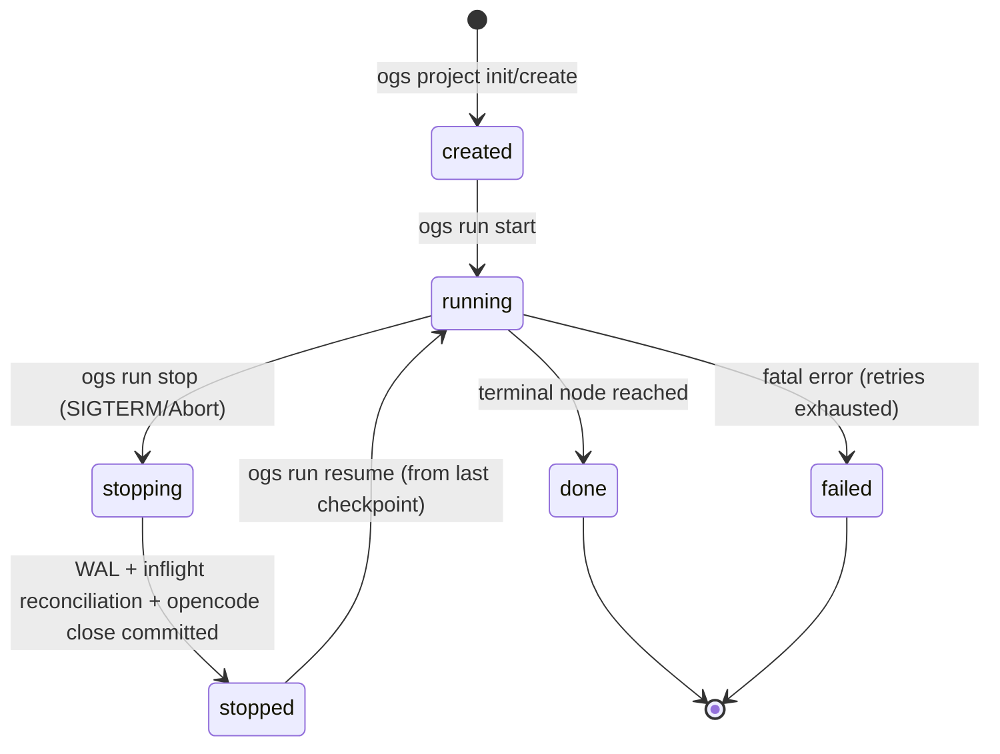

# OGSystem Project CLI & Lifecycle Plan (Proposed)

Archived: yes (delivery proposal; not active source of truth)  
Stable-track interaction: if accepted, contract changes must be backported to `docs/usage-manual.md`, `docs/ogsystem-orchestration-semantics-v1.md`, and `docs/DECISIONS.md`.  
Status: Proposed  
Date: 2026-04-12  
Owner: Runtime maintainers

## 1. Objective

Upgrade OGSystem from a run-command tool into a project-managed CLI product (`ogs`) with explicit lifecycle operations:

- create/init project
- start run
- resume run
- stop run
- inspect/list/logs

while preserving existing recovery correctness guarantees (fingerprint, checkpoint, outcome reconciliation, resume lock).

Compatibility mode for this proposal:

- Breaking-change mode enabled.
- No compatibility with legacy directory layout or historical run data is required.
- New CLI/runtime writes and reads only `.ogs/runs/` authority paths.

## 2. Design Principles

1. Do not regress current recovery authority set.
2. Keep storage deterministic and auditable.
3. Separate control-plane metadata from execution-plane state.
4. Make run behavior reproducible under later config drift.
5. Keep index files rebuildable from authority files.

## 3. Domain Layers

### 3.1 Global Domain (user machine)

Purpose: user-level credentials and install caches only.

Recommended path:

- `~/.ogs/`

Must not hold project run authority state.

### 3.2 Project Domain (repo-local control plane)

Recommended path:

- `<project>/.ogs/`

Contains project identity, config, and run index views.

### 3.3 Run Domain (repo-local execution plane)

Recommended path:

- `<project>/.ogs/runs/<run-id>/`

Contains authority state plus operator-facing projections.

## 4. Canonical Directory Contract

### 4.1 Project Control Plane

- `.ogs/project.json`
- `.ogs/runtime.json`
- `.ogs/providers/opencode.json`
- `.ogs/runs-index.json` (rebuildable view)

### 4.2 Run Execution Plane

- `.ogs/runs/<run-id>/state.json`
- `.ogs/runs/<run-id>/sessions.json`
- `.ogs/runs/<run-id>/plan-fingerprint.json`
- `.ogs/runs/<run-id>/checkpoints/*.json`
- `.ogs/runs/<run-id>/roles/<roleId>/executions/<executionId>/execution-outcome.json`
- `.ogs/runs/<run-id>/shared/`
- `.ogs/runs/<run-id>/roles/<roleId>/private/`

### 4.3 OpenCode Runtime Isolation (run-local)

- `.ogs/runs/<run-id>/.opencode/server.pid`
- `.ogs/runs/<run-id>/.opencode/endpoint.json`
- `.ogs/runs/<run-id>/.opencode/` data/cache/state subpaths (if isolation enabled)

## 5. Config Inheritance & Effective Snapshot

Merge precedence:

1. Run-specific override
2. Project config
3. Global user config
4. Framework default

Mandatory artifact:

- `.ogs/runs/<run-id>/resolved-config.json`

This snapshot freezes execution-time effective config for audit/replay even when global or project config later changes.

## 6. Run ID & Indexing

Run ID format:

- `YYYYMMDD-HHMMSS-<shortHash>`

Rationale:

- lexicographically sortable
- grep/ls friendly
- collision-resistant with short hash suffix

Index rule:

- `runs-index.json` is a query view and can be rebuilt from run directories.
- authority remains run-local authority files.

## 7. Lifecycle State Machine



Critical stop invariant:

- `stopping -> stopped` requires:
- final checkpoint boundary committed (or explicit abort marker committed)
- inflight executions reconciled as `aborted`/`failed`
- opencode server close result persisted

## 8. CLI Surface (v2)

Project lifecycle:

- `ogs project init`
- `ogs project create <name> --template <template_id>`

Run lifecycle:

- `ogs run start`
- `ogs run resume <run-id>`
- `ogs run stop <run-id>`
- `ogs run list`
- `ogs run status <run-id>`
- `ogs run inspect <run-id>`
- `ogs run logs <run-id> [--engine|--role <roleId>]`

Diagnostics:

- `ogs doctor`

## 9. Template System

`ogs project create <name> --template <template_id>`

Initial template set:

- `minimal`
- `software-dev`
- `consultation`

Each template provides:

- starter `system.mmd`
- role/model skeleton
- runtime/provider defaults aligned with template scope

## 10. Log Bifurcation

Engine log (framework operations):

- scheduler decisions
- retries/backoff
- lock acquisition/release
- checkpoint/reconciliation events

Role log (business/model operations):

- role input projection
- role output projection
- model/tool execution diagnostics

CLI query support:

- `ogs run logs <run-id> --engine`
- `ogs run logs <run-id> --role <roleId>`

## 11. OpenCode Closure Policy

For each run:

1. persist `server.pid` and `endpoint.json`
2. on run terminal (`done|failed|stopped`), attempt graceful shutdown
3. record shutdown result in run events
4. if graceful fails, escalate to forced kill with explicit event marker

Goal: no orphan OpenCode server process after run terminalization.

## 12. Cutover Plan (No Legacy Compatibility)

Phase A (hard cutover):

- remove legacy read/write paths to `ogsystem-history/`
- make `.ogs/runs/` the only authority root for all lifecycle commands
- fail fast when commands receive legacy run paths


## 13. Test Matrix

Contract tests:

- config merge precedence and `resolved-config.json` snapshot immutability
- run-id format and sort behavior
- runs-index rebuild from run directories

Lifecycle tests:

- start -> stop -> resume correctness
- stop with inflight role execution (no duplicate replay)
- terminal auto-close of opencode server

Recovery tests:

- fingerprint drift reject on resume
- checkpoint/outcome reconciliation under crash window
- lock contention under concurrent resume attempts

Log tests:

- engine and role log channel separation
- CLI log filtering correctness

## 14. Non-Goals (this phase)

- cross-host distributed lock provider rollout
- semantic-compatible lossy resume mode
- multi-host shared-storage scheduler arbitration

## 15. Acceptance Criteria

1. `ogs` project lifecycle commands run end-to-end on local projects.
2. Run authority files remain deterministic and resume-safe.
3. `resolved-config.json` exists for every run.
4. OpenCode process lifecycle is fully run-scoped and leak-resistant.
5. Engine/role logs are independently queryable.
6. Runtime and CLI operate on one canonical run storage format (`.ogs/runs/`) without dual-path logic.

## 16. Package Manager Baseline (pnpm-only)

To support deterministic installs, better disk efficiency, and future workspace expansion, this track standardizes on pnpm as the only supported package manager.

### 16.1 Migration Steps

1. Clean npm artifacts and reinstall with pnpm.
2. Remove `package-lock.json` from source control.
3. Generate and commit `pnpm-lock.yaml`.
4. Replace npm commands in scripts/docs/CI with pnpm equivalents.

Suggested local commands:

```bash
rm -rf node_modules package-lock.json
corepack enable
corepack prepare pnpm@10.14.0 --activate
pnpm install
```

### 16.2 Enforcements

- `package.json` must include:
- `"packageManager": "pnpm@10.14.0"`
- optional install guard to reject non-pnpm user agents in `preinstall`
- CI must use:
- `pnpm install --frozen-lockfile`
- pnpm cache mode in `actions/setup-node`

### 16.3 Dependency Strictness Policy

- Default: keep pnpm strict dependency behavior.
- If migration reveals phantom dependencies, fix by explicit `pnpm add <dep>`.
- `shamefully-hoist=true` is temporary migration fallback only, not default policy.

### 16.4 Verification

```bash
pnpm run build
pnpm test
```

All lifecycle and recovery test gates must pass under pnpm before this track is considered merged.

## 17. Recommended Execution Sequence (Implementation Order)

Current section ordering is conceptually coherent (contract -> lifecycle -> migration -> tests).  
For engineering rollout, execute in the sequence below to minimize rollback risk.

### Phase 0: Baseline & Toolchain Freeze

- lock pnpm version and enforce pnpm-only installation
- keep existing `run:adapter` path green (`pnpm test` baseline snapshot)
- remove legacy compatibility assumptions from implementation plan before coding

Exit gate:

- no regression on current runtime test suites

### Phase 1: Project Control Plane Skeleton

- introduce `.ogs/project.json`, `.ogs/runtime.json`, `.ogs/providers/opencode.json`
- implement run-id generator: `YYYYMMDD-HHMMSS-<shortHash>`
- generate `.ogs/runs/<run-id>/resolved-config.json` on every run start

Exit gate:

- config precedence tests pass
- resolved-config snapshot immutability verified

### Phase 2: Run Authority Path Switch

- write authority files to `.ogs/runs/<run-id>/...`
- persist run-local `.opencode/server.pid` and `.opencode/endpoint.json`

Exit gate:

- resume correctness tests (fingerprint/checkpoint/outcome/lock) pass on canonical path

### Phase 3: Stop/Resume Lifecycle Hardening

- implement `ogs run stop` (`running -> stopping -> stopped`)
- enforce inflight reconciliation before entering `stopped`
- persist stop outcome markers for later deterministic resume

Exit gate:

- stop->resume idempotency tests pass
- no duplicate role execution under crash/stop windows

### Phase 4: Observability & Logs

- split engine log and role log channels
- implement `ogs run logs --engine` and `ogs run logs --role`
- emit config source and opencode state path in run start metadata

Exit gate:

- log-channel separation tests pass

### Phase 5: Project UX & Templates

- implement `ogs project create --template`
- ship `minimal`, `software-dev`, `consultation` templates

Exit gate:

- template smoke tests pass on clean machine

### Phase 6: Hardening & Scale

- `runs-index.json` stays rebuildable from run dirs
- add operational tooling (`reindex`, integrity checks)

Exit gate:

- canonical-path replay and run inspection tests pass at scale

## 18. Mandatory Risk Controls

### 18.1 Stop Timeout Degrade Policy

In `stopping` state, if inflight role/session reconciliation exceeds `stopTimeoutMs`:

1. write forced-stop marker with unresolved inflight records
2. persist fail/abort classification per unresolved branch
3. close opencode server best-effort, then force-kill if needed
4. release resume lock and commit terminal status (`stopped` or `failed`) deterministically

This prevents lock leakage and half-stopped runs.

### 18.2 Large-Scale Indexing Policy

For projects with large run counts:

- `runs-index.json` is maintained incrementally by default
- full scan is only for first build, explicit `reindex`, or corruption recovery
- add file-watch based incremental updates with debounce/batch
- expose index health metrics: scan count, rebuild latency, index lag

This avoids repeated O(n) directory scans during normal CLI operations.
