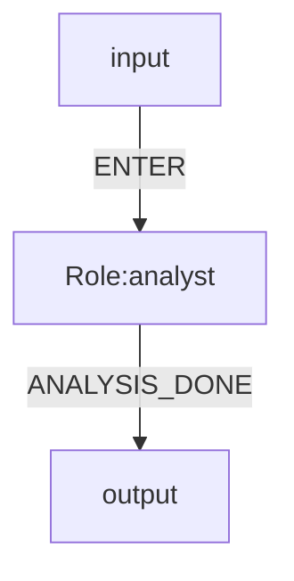

# Mermaid DSL v0.1 (Restricted)

Date: 2026-04-09  
Status: stable-minimal

## 1. Purpose

This document defines the executable Mermaid `flowchart` subset for OGSystem runtime.

Compilation target:

`Mermaid flowchart -> SystemDefinition (internal IR) -> explicit state machine`

## 2. Allowed Grammar Surface

Only the following surface is executable:

1. `flowchart TD` or `flowchart LR`
2. Node format: `id[Role:<roleId>]`
3. System boundary tokens: `input`, `output` (not roles)
4. Edge format: `from -->|EVENT| to`
   - `Role -->|EVENT| Role`
   - `input -->|EVENT| Role`
   - `Role -->|EVENT| output`
5. Header metadata comments: `%% key=value`
6. Non-empty executable lines after header must be metadata or event edges
7. Metadata keys outside required/optional allow-list fail validation

Everything else fails validation.

## 3. Required Metadata

1. `system.id`
2. `system.version`
3. `law.global`

Optional metadata:

1. `talent.bind.<roleId>`
2. `exec.bind.<roleId>`
3. `entry.role` (can be inferred from `input -->|EVENT| <Role>`)

## 4. Constraints

1. First non-empty line must be `flowchart TD|LR`.
2. Node ids must be unique.
3. Role ids in labels must be unique.
4. Role id and node id mapping must be 1:1.
5. Every edge must provide a non-empty `EVENT` label.
6. Allowed boundary edges:
   - `input -->|EVENT| Role`
   - `Role -->|EVENT| output`
7. Multiple input-boundary targets are not allowed.
8. `entry.role` must exist in role set (or be inferred from input boundary).
9. At least one terminal role or one `Role -->|EVENT| output` transition is required.
10. `input/output/start/end/done` must not be used as role ids.
11. `talent.bind.<roleId>` and `exec.bind.<roleId>` must reference existing roles.
12. If law catalog is provided at runtime, `law.global` must exist in that catalog.

Parser behavior for boundary aliases:

- `start/end/done` used as boundary tokens fail validation.
- Only `input/output` are accepted as boundary tokens.

## 5. Compile Mapping (Minimal)

1. `Role` nodes -> `system.roleIds`
2. `input --> ...` -> entry role candidate
3. `... --> output` -> terminal transition (`SYSTEM_END_ROLE_ID`)
4. Labeled edges -> `system.flows`
5. Header metadata -> `lawBinding`, `entryRoleId`, `talentBinding`, `executionBinding`

## 6. Example

## 7. Tool Output Contract

- Executable roles must write one JSON object to stdout: `{"event":"EVENT_NAME","content":"..."}`.
- `event` is required when the role has outgoing flows, and it must match one outgoing Mermaid edge label exactly.
- `content` is optional free-form text. When present, it becomes the role's `lastOutput`.
- Tool stderr is reserved for diagnostics; only stdout participates in event resolution.
- The runtime never scans for `EVENT:` substrings and never tries to guess events from arbitrary JSON lines.

## 8. No-Exec Policy

- Roles that lack `%% exec.bind.<roleId>` produce an execution failure by default. This protects against silent bypasses of the DSL graph.
- To allow intentional no-op nodes, the law catalog introduces `allowNoopWithoutExecutionBinding:true`.
- When noop is enabled, the node may only continue through a single deterministic path. Branching no-bind nodes still fail validation at runtime.
