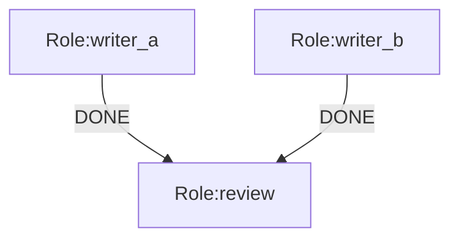

# `context.map` 投影说明

`context.map` 是 OGSystem 里最明确的“输入投影层”。它不是通用表达式系统，只是一组白名单 selector，把运行时的少量事实投影成目标 role 的 `context`。

## 1. 作用

`context.map.<targetRoleId>.<field>=<selector>` 的作用是：

- 为某个目标 role 构造稳定的 JSON 输入对象。
- 决定这个 role 在 prompt 里看到哪些字段。
- 让 `role_input` 合同可以对投影后的对象做 schema 校验。

它的核心原则是：

- 显式映射优先于隐式注入。
- 失败闭合优先于自动补全。
- 只允许读取白名单来源，不允许任意遍历运行时状态。

## 2. 支持的 selector

当前 selector 只支持以下几类。

### 2.1 全局来源

- `global.task`
- `global.user_profile`
- `global.user_profile.<path>`

含义：

- `global.task` = 当前用户输入。
- `global.user_profile` = 用户配置对象。
- `global.user_profile.<path>` = 用户配置里的嵌套字段。

### 2.2 普通节点来源

仅非 join 节点可用：

- `direct.content`
- `direct.event`
- `direct.data`
- `direct.data.<path>`

含义：

- `direct.*` 读取当前节点的直接上游结果。
- `direct.content` 读取上游 `content`。
- `direct.event` 读取上游 `event`。
- `direct.data` 读取上游 `data`。
- `direct.data.<path>` 读取上游 `data` 的嵌套字段。

### 2.3 Join 节点来源

仅 join 节点可用：

- `source(<roleId>).content`
- `source(<roleId>).event`
- `source(<roleId>).data`
- `source(<roleId>).data.<path>`

含义：

- `source(x)` 不是“任意祖先”，而是“join.sources 里声明过的来源 role”。
- 读取的是该 source role 在当前 `lineageId + loopIteration` 下的结果。

## 3. 节点类型差异

### 3.1 普通节点

普通节点默认使用直接上游结果。

如果没有 `context.map`，它的 `context` 默认来自：

- 上游 `content`
- 没有上游时回退到用户输入

如果声明了 `context.map`，则会改成字段级投影对象，不再使用默认上下文字符串。

### 3.2 Join 节点

Join 节点默认使用按 `join.sources` 归一化后的 JSON 命名空间。

每个 source role 会被收集成一个对象，通常包含：

- `event`
- `content`
- `data`

如果声明了 `context.map`，则 join 节点也会转成字段级投影对象。

## 4. 明确限制

### 4.1 `direct.*` 的限制

- 只能在普通节点使用。
- 必须存在直接上游结果。
- 不能跨两层、三层继续向上找。

### 4.2 `source(...)` 的限制

- 只能在 join 节点使用。
- `source(<roleId>)` 必须出现在 `join.sources.<targetRoleId>` 里。
- `quorum_of` 且 `join.min < |join.sources|` 时，当前实现会拒绝 `source(...)`，因为触发时可能只有部分 source 到齐。

### 4.3 selector 路径限制

- `global.user_profile.<path>` 的 path 只能由字母、数字和下划线等安全片段组成。
- `direct.data.<path>` 和 `source(...).data.<path>` 都只能继续访问对象路径，不能用数组下标或表达式。
- 路径不存在、字段缺失、source 不可用都会 fail closed。

## 5. 能否获取“爷爷节点”

结论：**不能直接获取。**

`context.map` 没有祖先遍历能力，不支持“往上跳两层再取值”这类语义。

你能做的只有：

- 直接取当前节点的上游：`direct.*`
- 在 join 节点取已声明的来源：`source(<roleId>).*`
- 取全局值：`global.task`、`global.user_profile.*`

如果你口中的“爷爷节点”不是当前节点的直接上游，也不是当前 join 的 `join.sources` 成员，那么它不能被 selector 直接访问。

## 6. 如果确实需要爷爷节点数据

建议三种改法，按优先级排序：

1. 把那个节点显式加入 `join.sources`，然后用 `source(grandparentRole).content` / `source(grandparentRole).data.<path>` 读取。
2. 让父节点把所需字段转发到自己的 `data` 里，再由子节点用 `direct.data.<path>` 读取。
3. 调整图结构，让你真正需要的节点变成当前节点的直接上游。

不要试图在 selector 里做“祖先递归”，因为 runtime 不提供这类能力。

## 7. 与 `role_input` 的关系

`role_input` 合同不是校验整条 flow，也不是校验 prompt 文本，而是校验 `context.map` 投影出来的那个结构化对象。

也就是说：

- `flow` 决定 role 之间怎么走。
- `context.map` 决定这个 role 能看到什么。
- `role_input` 决定这个投影结果是否满足该 role 的输入 schema。

## 8. 一个最小例子

这个例子里：

- `review` 不能直接读任意祖先。
- `review` 只能读 `writer_a` 和 `writer_b`，因为它们在 `join.sources` 里。
- `review` 还能读 `global.task`。

## 9. 速记

- 普通节点看 `direct.*`
- join 节点看 `source(...)`
- 全局变量看 `global.*`
- 爷爷节点不能直接跳读
- 需要更远祖先时，先把数据显式转发或把它变成 join source

