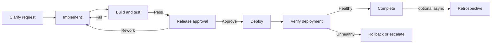

# OGS GStacklike Productionization Plan

Status: proposal
Date: 2026-09-26

## Goal

Evolve `examples/ogs-gstacklike/` from a deterministic orchestration demonstration into a
production-shaped software delivery workflow. Keep the example small, make each role correspond to
a real responsibility boundary, and require evidence before release decisions.

This plan does not claim that the current example or runtime is ready for every production
environment. It separates workflow improvements from platform capabilities that remain outside
the current single-host runtime boundary.

## Current Baseline

The current workflow demonstrates local role execution, runtime-native human review, resume,
rework context, shared run artifacts, and error routing. The current local scripts return fixed
role results, so they validate orchestration mechanics rather than the quality of real engineering,
test, or deployment work.

The example should not claim that a deployment failure was compensated unless a concrete recovery
action ran and its result was verified. When no compensation action is configured, the error handler
must preserve failure context and escalate or abort.

## Target Workflow

`Clarify request` may terminate with a request for more information or a rejection. Deployment
failure and post-deployment health failure must follow explicit error or business routes; they must
not silently produce a successful terminal result.

## Role Boundaries

Keep a role as a separate node only when it has a distinct responsibility, contract, authority, or
failure policy.

| Responsibility | Required behavior | Keep separate when |
| --- | --- | --- |
| Request clarification | Normalize the request, identify missing acceptance criteria, and reject out-of-scope work. | Intake and solution review have different owners or approval authority. |
| Implementation | Change files in an isolated target workspace and report changed paths and implementation notes. | Work divides into independently owned specialist tasks. |
| Build and test | Run declared checks and return commands, exit codes, artifact digests, and failure summaries. | Security, compliance, or independent QA needs a separate trust boundary. |
| Release approval | Present a release candidate and evidence to an authorized reviewer. | Approval policy differs by risk, repository, or environment. |
| Deploy and verify | Deploy an immutable artifact, verify health, and report the deployed version and endpoint. | Deployment and verification require separate credentials or operators. |
| Recovery | Execute a declared rollback/cleanup action and verify its outcome, or escalate with preserved context. | Recovery has different permissions or needs a separate on-call owner. |
| Retrospective | Record useful follow-up after successful completion. | It should normally run outside the release critical path. |

The initial production-shaped example should use one implementation role and one automated
verification role. Add specialist roles only when parallel ownership or a separate authority boundary
is real. Do not retain a role merely to mirror a job title or an external tool name.

## Contract Requirements

Each role package and handoff should make these fields explicit where applicable:

- Input: request, acceptance criteria, upstream artifact references, and relevant review feedback.
- Output: selected event, structured result data, and artifact paths or immutable digests.
- Evidence: test commands and results, deployment version, health checks, or recovery verification.
- Failure: retryable versus terminal errors, and the permitted business/error route.
- Authority: tools and actions the role may perform; human approval authority remains explicit.

Use schemas to validate structure and required evidence fields. Schema validity alone must not be
treated as proof that an external action actually occurred. Verify side effects through tool results,
deployment APIs, health checks, or independently recorded evidence.

## Delivery Phases

### Phase 1: Make the example truthful and runnable

- Fix the documented command so `--system` is resolved relative to the selected `--ogs-dir`.
- Keep deterministic local scripts as a fast control-flow fixture, clearly labeled as simulated.
- Ensure every failure handler preserves the failed role, branch, error code, and relevant artifact
  references.
- Use `ESCALATED` or `ABORTED` when no concrete compensation action is configured.
- Keep approval, rework, pause, terminate, and deploy-failure cases independently reproducible.

Acceptance:

- The README's copyable commands work from the repository root on supported shells.
- The success path creates a deliverable only after approval.
- The no-compensation path cannot report `COMPENSATED`.
- Rework returns feedback to implementation and creates a new review round.

### Phase 2: Replace simulated work with real engineering actions

- Bind implementation to an explicit target directory or isolated worktree.
- Require implementation output to identify changed files and the proposed artifact/version.
- Make verification run the project's declared build, test, and policy checks.
- Gate release on machine-readable verification evidence and an explicit human decision.
- Store only the intended deliverable and its provenance in shared run artifacts.

Acceptance:

- A test failure routes back to implementation with the failure summary and does not reach deploy.
- A passing run records reproducible commands, exit status, artifact digest, and source revision.
- Concurrent runs cannot write to the same mutable checkout without isolation or locking.
- Approval is bound to the release candidate that is actually deployed.

### Phase 3: Add controlled deployment and recovery

- Deploy an immutable, identified artifact to a configured environment.
- Verify health after deployment before reporting success.
- Define an idempotent rollback or cleanup action for each supported deployment target.
- Require recovery evidence before selecting `COMPENSATED`; otherwise route to `ESCALATED`.
- Keep production credentials out of prompts, role output, and run artifacts.

Acceptance:

- A deployment retry cannot create duplicate or ambiguous releases.
- Failed health verification triggers the declared rollback or escalation route.
- Run artifacts identify the deployed version and the verified recovery result, if any.

### Phase 4: Establish an operational production boundary

Before using the flow for sustained or multi-team production operation, provide the required
platform controls for the deployment context:

- durable storage and recovery guarantees appropriate to the run's impact;
- multi-instance coordination if runs can be resumed or controlled from multiple hosts;
- identity and authorization for review decisions and privileged tools;
- review timeout, escalation, and external signal handling where the business process requires it;
- concurrency limits, queueing, retention, secret handling, and audit access policy;
- monitoring for run status, role failures, review wait, deployment health, and recovery outcome.

These controls are not all implemented by the current example. In particular, the current runtime
uses local filesystem artifacts and single-host resume locking, schedules logical fan-out
sequentially, and does not automatically expire human reviews. Treat multi-instance operation,
automatic review expiry, and physically concurrent execution as separate platform work, not as
properties provided by this example.

## Production Readiness Levels

| Level | Intended use | Minimum bar |
| --- | --- | --- |
| Demo | Explain OGS routing and review semantics. | Deterministic fixture roles; no production credentials or claims of real deployment. |
| Controlled pilot | Run a bounded, reversible workflow with a human release gate. | Real implementation and tests, isolated workspace, explicit approval, observable artifacts, manual recovery path. |
| Sustained production | Run business-critical or multi-team workflows. | Pilot bar plus durable operations, identity/authorization, concurrency and retention policies, alerting, and tested recovery. |

The current example is at the demo level. The intended next milestone is a controlled pilot, not a
general enterprise process platform.

## Out of Scope

- Modeling a complete company hierarchy or assigning every Role to an employee.
- Replacing OGS core semantics with BPMN or introducing generic gateway/task nodes.
- Adding roles that have no independent contract, authority, or operational responsibility.
- Treating a successful schema validation as proof of deployment, rollback, or other side effects.
- Claiming distributed scheduling, automatic review expiry, or physical parallelism without the
  corresponding runtime implementation and tests.

## Recommended Implementation Order

1. Correct the README command and keep the simulated scenario suite reliable on supported shells.
2. Specify the implementation and verification handoff contracts.
3. Add real workspace-isolated implementation and test execution.
4. Add release-candidate-bound approval and artifact provenance.
5. Integrate one deployment target with health verification and a verified recovery action.
6. Decide which platform controls are required before expanding beyond a controlled pilot.
