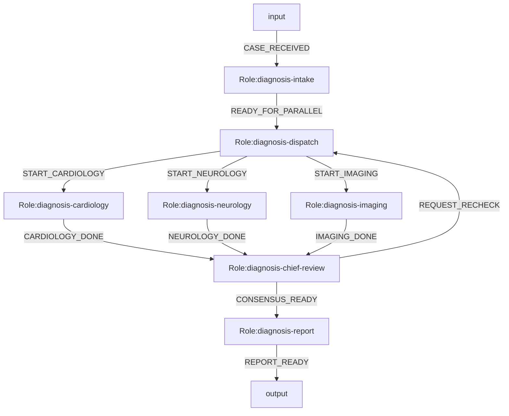
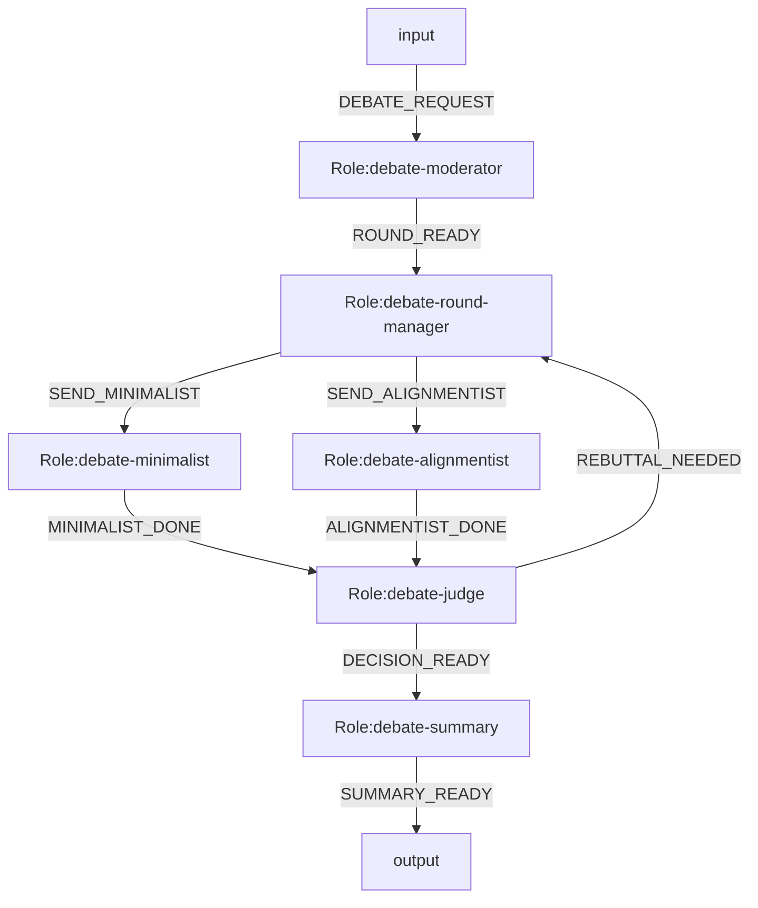

# LangGraph Engine Example Systems

Date: 2026-04-09  
Status: design examples

This document provides Mermaid-first examples for a future `LangGraph` engine mode.

Important:

- these are design examples, not runnable on the current minimal runtime
- they use target terminology: `model.bind.<roleId>=<modelId>`
- runtime migration may still keep `exec.bind.*` compatibility in implementation

Assumed capabilities:

- parallel split
- `all_of` join
- loop budget
- per-role model binding
- structured role output

Proposed executable output contract:

```json
{"event":"EVENT_NAME","content":"...","data":{}}
```

Proposed metadata extensions:

- `%% engine=langgraph`
- `%% role.mode.<roleId>=parallel_split`
- `%% join.mode.<roleId>=all_of`
- `%% join.sources.<roleId>=roleA,roleB,...`
- `%% loop.max.<roleId>=N`
- `%% model.bind.<roleId>=<modelId>`

## 1. Expert Consultation System

Goal:

- intake one medical problem
- dispatch to multiple specialist roles in parallel
- each specialist can use a different model package
- chief physician merges parallel diagnoses
- if evidence conflicts, run one more consultation loop

### Mermaid



### Model Packages

Role execution is expected to resolve from `og-models/models/<modelId>/model.json`.

Example package ids used above:

- `fast-gpt54`
- `deep-o3`
- `claude-sonnet`

### Role Packages

Role behavior is expected to resolve from `og-roles/roles/<roleId>/`:

- `diagnosis-intake`
- `diagnosis-dispatch`
- `diagnosis-cardiology`
- `diagnosis-neurology`
- `diagnosis-imaging`
- `diagnosis-chief-review`
- `diagnosis-report`

### Notes

- `diagnosis-dispatch` is lowered as one parallel split node
- `diagnosis-chief-review` is an `all_of` join waiting for all specialists
- `REQUEST_RECHECK` forms a bounded loop back to dispatch

## 2. Current Debate Example

Goal:

- run two debaters in parallel
- judge produces either final decision or one rebuttal round
- each role may use a different model package

### Mermaid



### Role Packages

- `debate-moderator`
- `debate-round-manager`
- `debate-minimalist`
- `debate-alignmentist`
- `debate-judge`
- `debate-summary`

### Notes

- `debate-round-manager` is lowered to a parallel split
- `debate-judge` is an `all_of` join waiting for both debaters
- `REBUTTAL_NEEDED` creates a bounded loop

## 3. Minimal Future Engine Requirements

To run these systems, the engine should minimally support:

1. role-level model binding
2. parallel split into multiple active branches
3. `all_of` join with deterministic merge input
4. bounded loop control
5. audit records with `branchId`, `joinId`, and `loopIteration`
6. projections from runtime state and audit trail rather than leaking internal engine step ids
