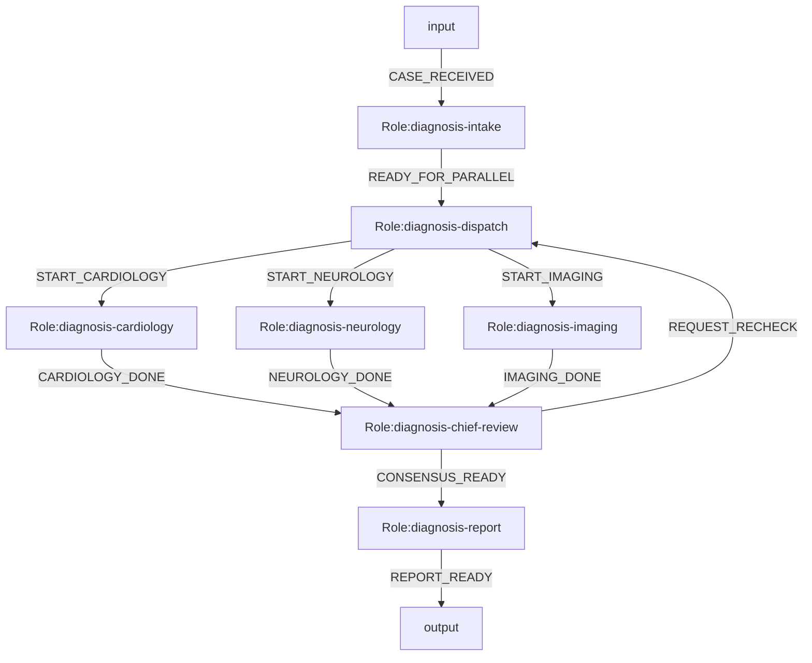
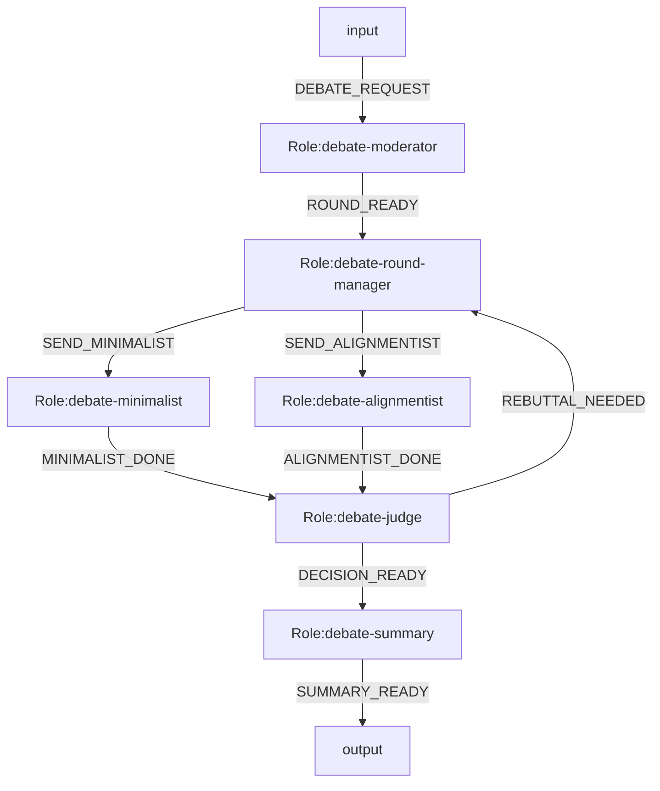

# LangGraph Engine Example Systems

Date: 2026-04-09  
Status: design examples

This document provides two Mermaid-first system examples intended for a future `LangGraph` engine mode.

Important:

- These are design examples, not runnable on the current minimal runtime.
- They assume the runtime supports:
  - parallel split
  - `all_of` join
  - loop budget
  - per-role execution binding
  - structured role output

Proposed structured output contract for executable roles:

```json
{"event":"EVENT_NAME","content":"...","data":{}}
```

Proposed LangGraph-oriented metadata extensions used below:

- `%% engine=langgraph`
- `%% role.mode.<roleId>=parallel_split`
- `%% join.mode.<roleId>=all_of`
- `%% join.sources.<roleId>=roleA,roleB,...`
- `%% loop.max.<roleId>=N`
- `%% exec.bind.<roleId>=<profileId>`

Concrete sample files:

- `examples/langgraph-expert-consultation/`
- `examples/langgraph-debate-current/`
- minimal future engine boundary: `src/runtime/langgraph-engine.ts`

## 1. Expert Consultation System

Goal:

- intake one medical problem
- dispatch to multiple specialist roles in parallel
- each specialist uses a different CLI and profile
- chief physician merges parallel diagnoses
- if evidence conflicts, run one more consultation loop

### Mermaid



### Execution Profiles

```json
[
  {
    "profileId": "profile.intake.codex",
    "toolRef": "tool.codex.exec",
    "timeoutMs": 60000,
    "maxOutputBytes": 65536
  },
  {
    "profileId": "profile.dispatch.codex",
    "toolRef": "tool.codex.exec",
    "timeoutMs": 60000,
    "maxOutputBytes": 65536
  },
  {
    "profileId": "profile.cardiology.claude",
    "toolRef": "tool.claude.exec",
    "timeoutMs": 90000,
    "maxOutputBytes": 65536
  },
  {
    "profileId": "profile.neurology.gemini",
    "toolRef": "tool.gemini.exec",
    "timeoutMs": 90000,
    "maxOutputBytes": 65536
  },
  {
    "profileId": "profile.imaging.python",
    "toolRef": "tool.python.imaging",
    "timeoutMs": 45000,
    "maxOutputBytes": 65536
  },
  {
    "profileId": "profile.chief.codex",
    "toolRef": "tool.codex.exec",
    "timeoutMs": 90000,
    "maxOutputBytes": 65536
  },
  {
    "profileId": "profile.report.codex",
    "toolRef": "tool.codex.exec",
    "timeoutMs": 60000,
    "maxOutputBytes": 65536
  }
]
```

### Tool Registry

```json
{
  "tools": [
    {
      "toolRef": "tool.codex.exec",
      "runner": "local_shell",
      "command": "codex",
      "argsTemplate": [
        "exec",
        "--skip-git-repo-check",
        "--color",
        "never",
        "{{prompt}}"
      ],
      "stdinMode": "none"
    },
    {
      "toolRef": "tool.claude.exec",
      "runner": "local_shell",
      "command": "claude",
      "argsTemplate": [
        "--print",
        "{{prompt}}"
      ],
      "stdinMode": "none"
    },
    {
      "toolRef": "tool.gemini.exec",
      "runner": "local_shell",
      "command": "gemini",
      "argsTemplate": [
        "--prompt",
        "{{prompt}}"
      ],
      "stdinMode": "none"
    },
    {
      "toolRef": "tool.python.imaging",
      "runner": "local_shell",
      "command": "python3",
      "argsTemplate": [
        "scripts/imaging_consult.py",
        "{{prompt}}"
      ],
      "stdinMode": "none"
    }
  ]
}
```

### Role Packages

Role behavior is expected to live in role packages resolved by roleId:

- `diagnosis-intake`
- `diagnosis-dispatch`
- `diagnosis-cardiology`
- `diagnosis-neurology`
- `diagnosis-imaging`
- `diagnosis-chief-review`
- `diagnosis-report`

### LangGraph Execution Notes

- `diagnosis-dispatch` is lowered as one parallel split node.
- `diagnosis-chief-review` is lowered as an `all_of` join node that waits for `diagnosis-cardiology`, `diagnosis-neurology`, and `diagnosis-imaging`.
- `REQUEST_RECHECK` forms a bounded loop back to `diagnosis-dispatch`.
- Each specialist role uses a different tool/profile.

## 2. Current Debate Example

Debate topic:

- should OGSystem continue with a minimal implementation, or align early to a larger semantic system

Goal:

- run two debaters in parallel
- judge produces either final decision or one rebuttal round
- use different CLIs for different debate roles

### Mermaid



### Execution Profiles

```json
[
  {
    "profileId": "profile.moderator.codex",
    "toolRef": "tool.codex.exec",
    "timeoutMs": 60000,
    "maxOutputBytes": 65536
  },
  {
    "profileId": "profile.round.codex",
    "toolRef": "tool.codex.exec",
    "timeoutMs": 60000,
    "maxOutputBytes": 65536
  },
  {
    "profileId": "profile.minimalist.claude",
    "toolRef": "tool.claude.exec",
    "timeoutMs": 90000,
    "maxOutputBytes": 65536
  },
  {
    "profileId": "profile.alignmentist.gemini",
    "toolRef": "tool.gemini.exec",
    "timeoutMs": 90000,
    "maxOutputBytes": 65536
  },
  {
    "profileId": "profile.judge.codex",
    "toolRef": "tool.codex.exec",
    "timeoutMs": 90000,
    "maxOutputBytes": 65536
  },
  {
    "profileId": "profile.summary.codex",
    "toolRef": "tool.codex.exec",
    "timeoutMs": 60000,
    "maxOutputBytes": 65536
  }
]
```

### Role Packages

Role behavior is expected to live in role packages resolved by roleId:

- `debate-moderator`
- `debate-round-manager`
- `debate-minimalist`
- `debate-alignmentist`
- `debate-judge`
- `debate-summary`

### LangGraph Execution Notes

- `debate-round-manager` is lowered to a parallel split.
- `debate-judge` is an `all_of` join that waits for both debaters.
- `REBUTTAL_NEEDED` creates a bounded debate loop.
- This example is intentionally small: two parallel debaters, one judge, one optional rebuttal loop.

## Minimal LangGraph Engine Requirements Behind These Examples

To run these systems, the engine should minimally support:

1. role-level execution binding
2. parallel split from one role into multiple active branches
3. `all_of` join with deterministic merge input
4. bounded loop control
5. audit records with `branchId`, `joinId`, and `loopIteration`
6. projection from runtime state and audit trail rather than exposing LangGraph internal step ids
