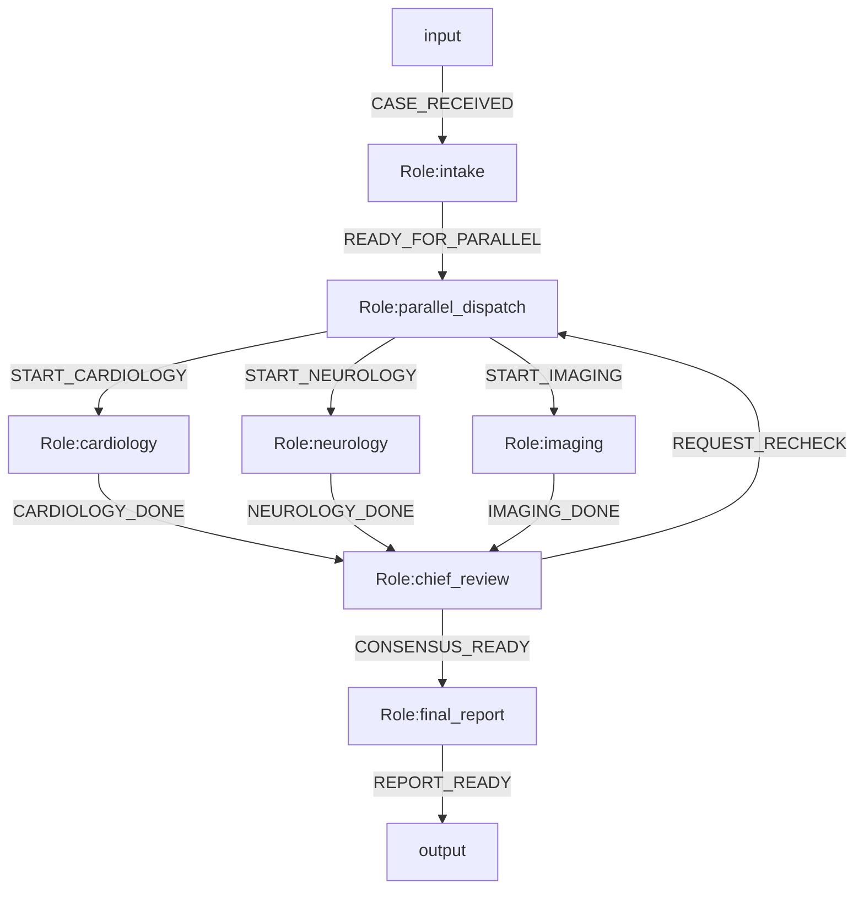
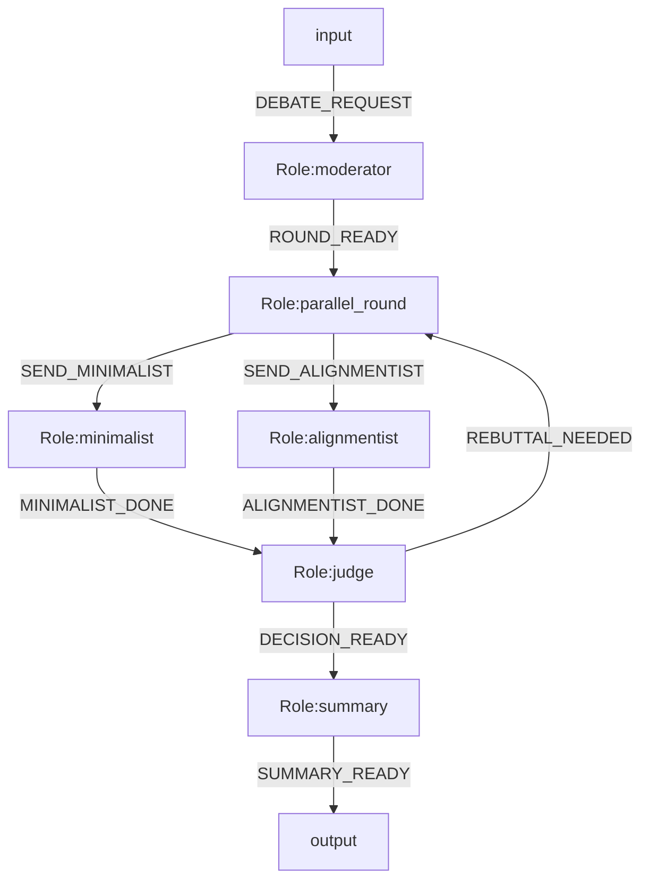

# LangGraph Engine Example Systems

Date: 2026-04-09  
Status: design examples

This document provides two Mermaid-first system examples intended for a future `LangGraph` engine mode.

Important:

- These are design examples, not runnable on the current minimal runtime.
- They assume the runtime supports:
  - parallel split
  - `all_of` join
  - loop budget
  - per-role execution binding
  - structured role output

Proposed structured output contract for executable roles:

```json
{"event":"EVENT_NAME","content":"...","data":{}}
```

Proposed LangGraph-oriented metadata extensions used below:

- `%% engine=langgraph`
- `%% role.mode.<roleId>=parallel_split`
- `%% join.mode.<roleId>=all_of`
- `%% join.sources.<roleId>=roleA,roleB,...`
- `%% loop.max.<roleId>=N`
- `%% exec.bind.<roleId>=<profileId>`

Concrete sample files:

- `examples/langgraph-expert-consultation/`
- `examples/langgraph-debate-current/`
- minimal future engine boundary: `src/runtime/langgraph-engine.ts`

## 1. Expert Consultation System

Goal:

- intake one medical problem
- dispatch to multiple specialist roles in parallel
- each specialist uses a different CLI and profile
- chief physician merges parallel diagnoses
- if evidence conflicts, run one more consultation loop

### Mermaid



### Execution Profiles

```json
[
  {
    "profileId": "profile.intake.codex",
    "toolRef": "tool.codex.exec",
    "timeoutMs": 60000,
    "maxOutputBytes": 65536
  },
  {
    "profileId": "profile.dispatch.codex",
    "toolRef": "tool.codex.exec",
    "timeoutMs": 60000,
    "maxOutputBytes": 65536
  },
  {
    "profileId": "profile.cardiology.claude",
    "toolRef": "tool.claude.exec",
    "timeoutMs": 90000,
    "maxOutputBytes": 65536
  },
  {
    "profileId": "profile.neurology.gemini",
    "toolRef": "tool.gemini.exec",
    "timeoutMs": 90000,
    "maxOutputBytes": 65536
  },
  {
    "profileId": "profile.imaging.python",
    "toolRef": "tool.python.imaging",
    "timeoutMs": 45000,
    "maxOutputBytes": 65536
  },
  {
    "profileId": "profile.chief.codex",
    "toolRef": "tool.codex.exec",
    "timeoutMs": 90000,
    "maxOutputBytes": 65536
  },
  {
    "profileId": "profile.report.codex",
    "toolRef": "tool.codex.exec",
    "timeoutMs": 60000,
    "maxOutputBytes": 65536
  }
]
```

### Tool Registry

```json
{
  "tools": [
    {
      "toolRef": "tool.codex.exec",
      "runner": "local_shell",
      "command": "codex",
      "argsTemplate": [
        "exec",
        "--skip-git-repo-check",
        "--color",
        "never",
        "{{prompt}}"
      ],
      "stdinMode": "none"
    },
    {
      "toolRef": "tool.claude.exec",
      "runner": "local_shell",
      "command": "claude",
      "argsTemplate": [
        "--print",
        "{{prompt}}"
      ],
      "stdinMode": "none"
    },
    {
      "toolRef": "tool.gemini.exec",
      "runner": "local_shell",
      "command": "gemini",
      "argsTemplate": [
        "--prompt",
        "{{prompt}}"
      ],
      "stdinMode": "none"
    },
    {
      "toolRef": "tool.python.imaging",
      "runner": "local_shell",
      "command": "python3",
      "argsTemplate": [
        "scripts/imaging_consult.py",
        "{{prompt}}"
      ],
      "stdinMode": "none"
    }
  ]
}
```

### Role Prompts

```json
{
  "intake": "读取病例输入，整理主诉、症状、已知检查结果，并只输出 JSON：{\"event\":\"READY_FOR_PARALLEL\",\"content\":\"<结构化病例摘要>\",\"data\":{\"case_summary\":\"...\"}}",
  "parallel_dispatch": "读取病例摘要，为心内科、神经科、影像专家准备并行任务上下文。只输出 JSON：{\"event\":\"START_ALL\",\"content\":\"<并行调度说明>\",\"data\":{\"dispatch_bundle\":\"...\"}}",
  "cardiology": "你是心内科专家。基于病例摘要输出专科判断、风险点、建议检查。只输出 JSON：{\"event\":\"CARDIOLOGY_DONE\",\"content\":\"<心内科结论>\",\"data\":{\"specialty\":\"cardiology\",\"confidence\":0.0}}",
  "neurology": "你是神经科专家。基于病例摘要输出专科判断、风险点、建议检查。只输出 JSON：{\"event\":\"NEUROLOGY_DONE\",\"content\":\"<神经科结论>\",\"data\":{\"specialty\":\"neurology\",\"confidence\":0.0}}",
  "imaging": "你是影像分析角色。基于病例摘要和影像结果给出影像侧判断。只输出 JSON：{\"event\":\"IMAGING_DONE\",\"content\":\"<影像结论>\",\"data\":{\"specialty\":\"imaging\",\"confidence\":0.0}}",
  "chief_review": "汇总并行专家意见。如果结论冲突或证据不足则输出 JSON：{\"event\":\"REQUEST_RECHECK\",\"content\":\"<需要补充的问题>\",\"data\":{\"missing\":\"...\"}}；如果已可形成共识则输出 JSON：{\"event\":\"CONSENSUS_READY\",\"content\":\"<会诊结论>\",\"data\":{\"diagnosis\":\"...\"}}",
  "final_report": "把最终会诊结论整理成面向临床的报告。只输出 JSON：{\"event\":\"REPORT_READY\",\"content\":\"<最终报告>\",\"data\":{\"report\":\"...\"}}"
}
```

### LangGraph Execution Notes

- `parallel_dispatch` is lowered as one parallel split node.
- `chief_review` is lowered as an `all_of` join node that waits for `cardiology`, `neurology`, and `imaging`.
- `REQUEST_RECHECK` forms a bounded loop back to `parallel_dispatch`.
- Each specialist role uses a different tool/profile.

## 2. Current Debate Example

Debate topic:

- should OGSystem continue with a minimal implementation, or align early to a larger semantic system

Goal:

- run two debaters in parallel
- judge produces either final decision or one rebuttal round
- use different CLIs for different debate roles

### Mermaid



### Execution Profiles

```json
[
  {
    "profileId": "profile.moderator.codex",
    "toolRef": "tool.codex.exec",
    "timeoutMs": 60000,
    "maxOutputBytes": 65536
  },
  {
    "profileId": "profile.round.codex",
    "toolRef": "tool.codex.exec",
    "timeoutMs": 60000,
    "maxOutputBytes": 65536
  },
  {
    "profileId": "profile.minimalist.claude",
    "toolRef": "tool.claude.exec",
    "timeoutMs": 90000,
    "maxOutputBytes": 65536
  },
  {
    "profileId": "profile.alignmentist.gemini",
    "toolRef": "tool.gemini.exec",
    "timeoutMs": 90000,
    "maxOutputBytes": 65536
  },
  {
    "profileId": "profile.judge.codex",
    "toolRef": "tool.codex.exec",
    "timeoutMs": 90000,
    "maxOutputBytes": 65536
  },
  {
    "profileId": "profile.summary.codex",
    "toolRef": "tool.codex.exec",
    "timeoutMs": 60000,
    "maxOutputBytes": 65536
  }
]
```

### Role Prompts

```json
{
  "moderator": "读取用户给出的辩题，生成一轮辩论规则和评价标准。只输出 JSON：{\"event\":\"ROUND_READY\",\"content\":\"<辩题与规则>\",\"data\":{\"topic\":\"...\"}}",
  "parallel_round": "读取辩题与当前轮次上下文，为正反双方分别生成本轮任务。只输出 JSON：{\"event\":\"START_DEBATE_ROUND\",\"content\":\"<本轮任务>\",\"data\":{\"round\":1}}",
  "minimalist": "你代表“最小化实现优先”立场。输出清晰论点、风险和边界。只输出 JSON：{\"event\":\"MINIMALIST_DONE\",\"content\":\"<最小化立场论证>\",\"data\":{\"stance\":\"minimal-first\"}}",
  "alignmentist": "你代表“尽早对齐更大语义体系”立场。输出清晰论点、收益和风险。只输出 JSON：{\"event\":\"ALIGNMENTIST_DONE\",\"content\":\"<对齐立场论证>\",\"data\":{\"stance\":\"align-early\"}}",
  "judge": "汇总双方论证。如果还需要一轮反驳则输出 JSON：{\"event\":\"REBUTTAL_NEEDED\",\"content\":\"<反驳重点>\",\"data\":{\"next_round\":2}}；如果可以裁决则输出 JSON：{\"event\":\"DECISION_READY\",\"content\":\"<裁决理由>\",\"data\":{\"winner\":\"...\"}}",
  "summary": "根据裁决理由输出最终摘要。只输出 JSON：{\"event\":\"SUMMARY_READY\",\"content\":\"<辩论摘要>\",\"data\":{\"decision\":\"...\"}}"
}
```

### LangGraph Execution Notes

- `parallel_round` is lowered to a parallel split.
- `judge` is an `all_of` join that waits for both debaters.
- `REBUTTAL_NEEDED` creates a bounded debate loop.
- This example is intentionally small: two parallel debaters, one judge, one optional rebuttal loop.

## Minimal LangGraph Engine Requirements Behind These Examples

To run these systems, the engine should minimally support:

1. role-level execution binding
2. parallel split from one role into multiple active branches
3. `all_of` join with deterministic merge input
4. bounded loop control
5. audit records with `branchId`, `joinId`, and `loopIteration`
6. projection from runtime state and audit trail rather than exposing LangGraph internal step ids
