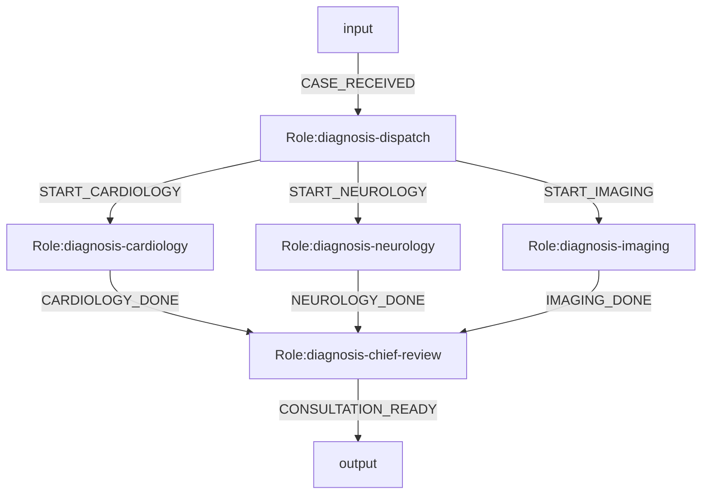
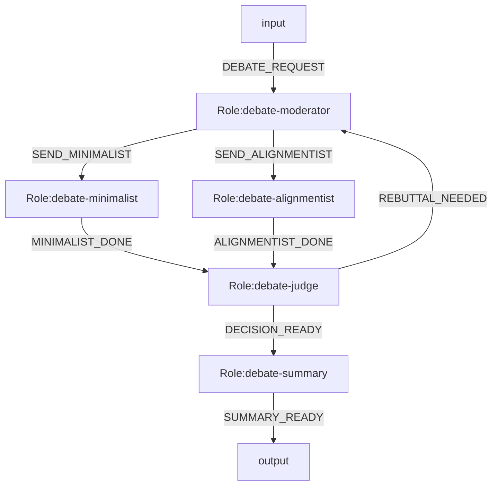

# LangGraph Engine Example Systems

Date: 2026-04-09  
Status: runnable minimal examples

This document records the two Mermaid-first examples that match the current runtime:

- debate: `parallel_split + all_of join + bounded loop`
- expert consultation: `parallel_split + all_of join`

Common metadata:

- `%% engine=langgraph`
- `%% role.mode.<roleId>=parallel_split`
- `%% join.mode.<roleId>=all_of`
- `%% join.sources.<roleId>=roleA,roleB,...`
- `%% loop.max.<roleId>=N`
- `%% model.bind.<roleId>=<modelId>`

Current curated model ids:

- `fast-gpt54`
- `balanced-gpt52`
- `steady-gpt54`
- `deep-o3`

Raw local availability snapshot:

- `og-models/catalog/opencode-models.json`

## 1. Expert Consultation

Goal:

- one difficult case enters once
- three experts analyze in parallel
- chief specialist outputs one final summary
- final summary must preserve disagreement plus overall conclusion

### Mermaid



### Notes

- `diagnosis-dispatch` is the only split node
- `diagnosis-chief-review` is the final join node
- the example is intentionally loop-free to stay minimal
- example user profile: `examples/langgraph-expert-consultation/user-profile.json`

Run:

```bash
npm run run:adapter -- \
  --system examples/langgraph-expert-consultation/system.mmd \
  --laws examples/langgraph-expert-consultation/laws.json \
  --user-profile examples/langgraph-expert-consultation/user-profile.json \
  --prompt "患者间断高热、皮疹、胸闷、肌无力，常规检查未能解释原因，请组织多学科会诊。" \
  --dry-run
```

## 2. Debate

Goal:

- moderator dispatches both sides directly
- both sides argue in parallel
- judge either asks for one more round or finalizes
- summary writes the final decision for the chosen user profile

### Mermaid



### Notes

- `debate-moderator` now owns round framing and split dispatch
- `debate-judge` is the only join node
- the loop budget is attached to the moderator node
- example user profile: `examples/langgraph-debate-current/user-profile.json`

Run:

```bash
npm run run:adapter -- \
  --system examples/langgraph-debate-current/system.mmd \
  --laws examples/langgraph-debate-current/laws.json \
  --user-profile examples/langgraph-debate-current/user-profile.json \
  --prompt "是否应继续保持 OGSystem 最小化并延后 reducer 与恢复语义？" \
  --dry-run
```
