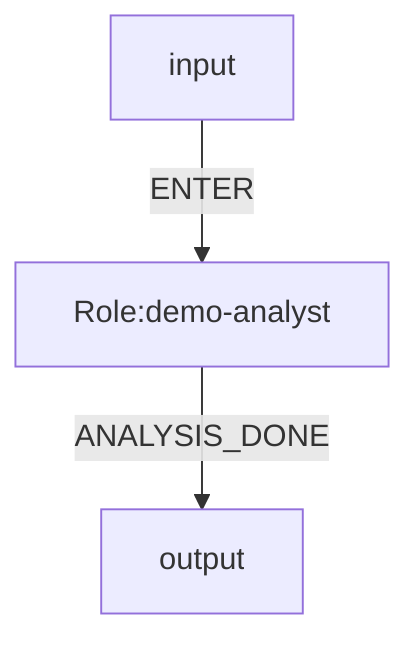

# OGSystem Role Repo Minimal Plan

Date: 2026-04-09  
Status: landed

## Goal

Keep the runtime minimal:

- `system.mmd` owns orchestration
- `og-roles/roles/<roleId>/` owns role behavior
- `profiles.json` and `tools.json` keep the current execution path
- no `assembly.json`

## Runtime Model

```txt
system.mmd
-> parse Mermaid graph
-> collect every roleId
-> resolve og-roles/roles/<roleId>/
-> validate role package
-> render prompt with runtime context
-> validate output JSON
-> route by event
```

## Directory Shape

```txt
og-roles/
  roles/
    debate-minimalist/
      role.json
      persona.md
      work.md
      prompt.md
      output.schema.json

systems/
  debate-minimal/
    system.mmd
    model-repo/
      models/
    .ogsystem/
      runtime.json
      user-profile.json
    laws.json
```

## Role Package Contract

Required files:

- `role.json`
- `prompt.md`
- `output.schema.json`

Optional files:

- `persona.md`
- `work.md`
- `input.schema.json`

`role.json`:

```json
{
  "roleId": "debate-minimalist",
  "roleVersion": "1.0.0",
  "name": "Minimalist Debater",
  "description": "Argues for minimal implementation first.",
  "promptTemplate": "prompt.md",
  "inputSchema": "../_shared/input.schema.json",
  "outputSchema": "output.schema.json",
  "tags": ["debate", "architecture"]
}
```

Prompt variables:

- `task`
- `context`
- `allowed_events`
- `last_output`
- `system_notes`
- `round`
- `persona`
- `work`

Output contract:

```json
{"event":"EVENT_NAME","content":"...","data":{}}
```

Rules:

- `event` is required for roles with outgoing edges
- `event` must match one Mermaid edge label exactly
- no free-form text outside JSON

## System Contract

`system.mmd` defines:

- entry role
- role graph
- event edges
- law binding
- `model.bind.<roleId>` (legacy runtime may still read `exec.bind.<roleId>`)

`system.mmd` does not define:

- role prompt bodies
- role input/output schemas
- tool commands inside roles

## Minimal Example



## Kept And Removed

Kept:

- Mermaid parser
- explicit runtime state machine
- `model repo`
- runtime defaults in `.ogsystem/runtime.json`
- law catalog
- strict JSON output validation

Removed:

- `assembly.json`
- `roles.lock.json`
- `role-prompts.json`
- role registries and extra indirection
