# OGSystem 语义手册（实现对齐版）

更新时间：2026-09-02
适用范围：当前 `src/runtime/*` 的解析器与执行器实现（含 `ERROR*` 语义开关）
文档级别：二级参考（非权威）。语义最终真相以 `src/runtime/*` 与 `docs/ogsystem-orchestration-semantics-v1.md` 为准。

---

## 1. 手册目标

这份手册不是概念介绍，而是“可执行语义合同”：

- 你在 Mermaid 里写的语义，解析器是否接受。
- 解析通过后，运行时如何调度、汇合、补偿与恢复。
- 每个语义对应的常见误用与 fail-closed 行为。

---

## 2. DSL 基础语法与全局约束

### 2.1 最小可执行图（基础路由）

#### 图示

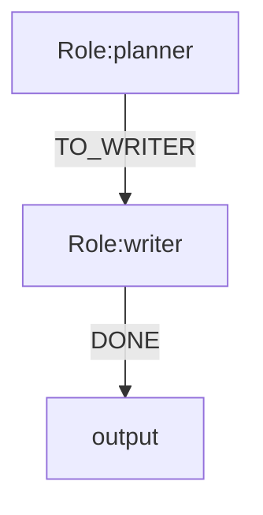

#### 含义

- 第一行必须是 `flowchart TD` 或 `flowchart LR`。
- 节点必须是 `nodeId[Role:roleId]`，系统边界仅允许 `input` 和 `output`。
- 边必须是 `from -->|EVENT| to`，每条边必须有非空事件名。
- 必填元数据：`system.id`、`system.version`、`law.global`。
- 入口必须唯一：`entry.role` 或单一 `input -->|...| Role`。

#### 注意事项

- `input/output` 仅可作为 boundary token；`input/output/start/end/done` 一律禁止作为角色 ID（解析期硬拒绝）。
- 不在白名单中的元数据键会被直接拒绝。
- 至少需要一个“终点”：无出边角色，或存在 `Role -->|...| output`。

### 2.2 元数据键白名单

#### 含义

当前仅支持以下键族：

- 精确键：`engine`、`system.id`、`system.version`、`law.global`、`entry.role`
- 绑定键：`model.bind.<roleId>`、`exec.bind.<roleId>`、`talent.bind.<roleId>`
- 图语义键：`role.mode.<roleId>`、`join.mode.<roleId>`、`join.min.<roleId>`、`join.sources.<roleId>`
- 上下文键：`context.map.<roleId>.<field>`
- 循环键：`loop.max.<roleId>`
- 合同与路由键：`handoff.mode`、`handoff.contracts`、`route.order.<fromRoleId>`
- 人工审核键：`review.mode.<roleId>`、`review.timeout.<roleId>`、`review.timeout.action.<roleId>`、`review.rework.target.<roleId>`、`review.rework.max.<roleId>`、`review.terminate.scope.<roleId>`

#### 注意事项

- `engine` 如声明，当前仅接受 `langgraph`。
- 同一角色不能同时声明 `model.bind` 和 `exec.bind`。
- 绑定解析不是覆盖优先级：有且仅有一种绑定时使用该绑定；同时声明 `model.bind` 与 `exec.bind` 会在解析期拒绝；无绑定时只有在 law 允许且出边不超过 1 时才进入 `noop`。
- `talent.bind.<roleId>` 当前只作为兼容性元数据解析并纳入 fingerprint，不参与当前模型或执行器选择；它保留给未来基于能力标签的模型/执行器路由。
- `runtime.error_flows.v1` 不是 Mermaid 元数据键，必须配置在项目的 `.ogs/runtime.json` 中；未知 Mermaid 元数据会被拒绝。

---

## 3. 路由语义

反馈建模规则：反馈是已有责任席位之间的事件流，不是默认的独立节点。A 向 B 反馈时使用
`A --|FEEDBACK|--> B`，由 A 产生事件/Payload、由 B 消费；不要创建 `a-feedback`、`b-feedback`
等仅表示反馈动作的席位。只有反馈由独立主体承担独立职责、权限和审计责任时，才建立独立角色。

### 3.1 默认事件路由（无 `role.mode`）

#### 图示

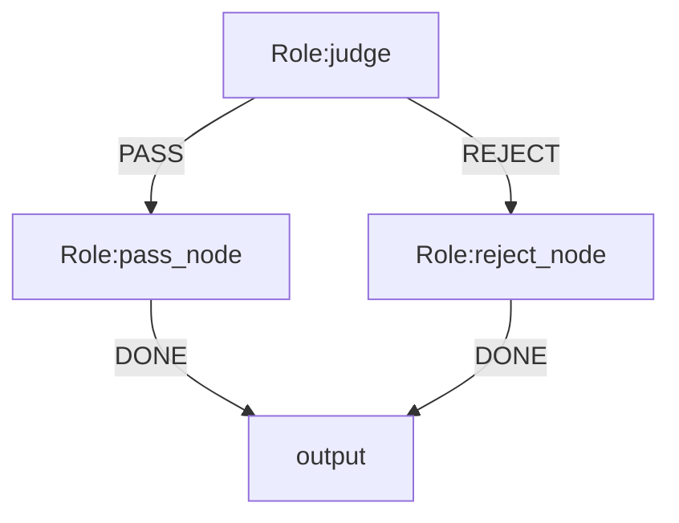

#### 含义

- 角色输出 `event` 后，只走与该 `event` 匹配的出边。
- 非并行模式下，若存在可选出边，输出里通常必须给出 `event`。

#### 注意事项

- 角色输出事件若与任何出边不匹配，会判定失败。
- 当“只有一个可选事件”时，运行时会进行单值归一修复（不建议依赖）。

### 3.2 语义分叉（`role.mode: parallel_split`）

#### 图示

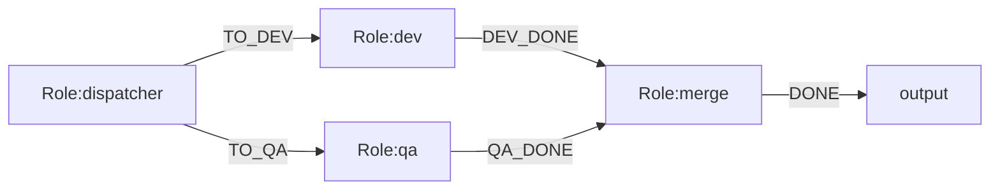

#### 含义

- `parallel_split` 会在一次状态转移中激活所有普通下游目标，表达的是 Flow 语义分叉，不承诺这些分支由 scheduler 物理并发执行。
- 并行模式的目标选择会排除运行时保留事件 `ERROR*`。

#### 注意事项

- 并行分发依赖运行时状态，不靠角色返回的单一 `event` 决定去向。
- 分支并行时，模型会话记忆按 `sessionLineageId` 隔离；同角色目录默认不做分支级隔离。
- 当前 graph scheduler 按活动角色队列顺序逐个处理分支；受控物理并发属于未来执行策略，不改变分支可达性或 join 就绪语义。

### 3.3 合同门禁与路由顺序

#### 含义

- `handoff.mode=strict|transition` 启用 flow contract 校验，`handoff.contracts` 指向合同 bundle。
- `strict` 遇到合同违规或缺失时硬失败；`transition` 可跳过受影响的 WARN/缺失合同 flow，但如果跳过会使下游 join 无法满足，仍会 fail-closed。
- `route.order.<fromRoleId>=<toRoleIdA>,<toRoleIdB>,...` 只重排同一来源角色的 sibling fan-out 目标顺序，不新增或删除可达路径；目标列表必须与普通 Mermaid 出边完全一致。

#### 注意事项

- `handoff.contracts` 必须与 `handoff.mode` 一起声明；路径相对 `system.mmd` 所在目录解析。
- 合同 schema 的 `$ref` 仅支持本地文件引用，不支持远程 URL。

---

## 4. Join 语义

### 4.1 全量汇合（`join.mode: all_of`）

#### 图示

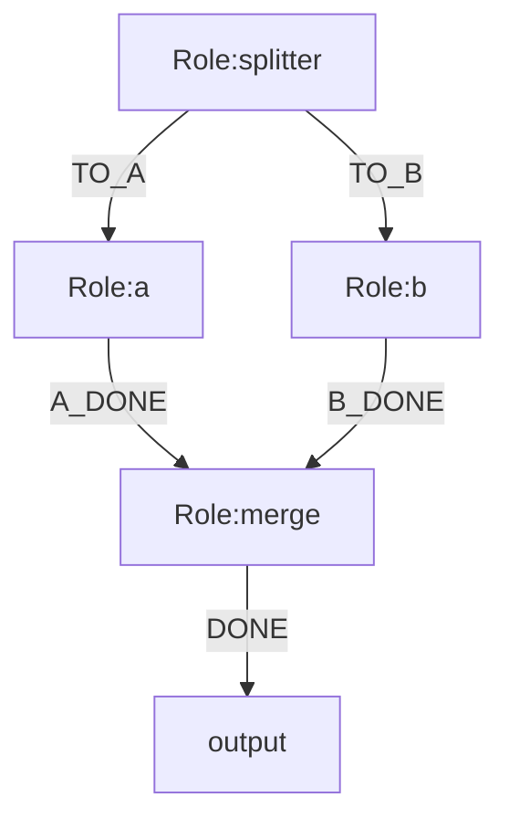

#### 含义

- `merge` 仅在 `a` 与 `b` 都完成后激活。
- 判定基于同一 `lineageId + loopIteration` 的 source 结果。

#### 注意事项

- `join.sources.merge` 必须与 Mermaid 中 `merge` 的入边角色集合完全一致。
- `join.sources` 不能重复声明同一角色。

### 4.2 法定人数汇合（`join.mode: quorum_of`）

#### 图示

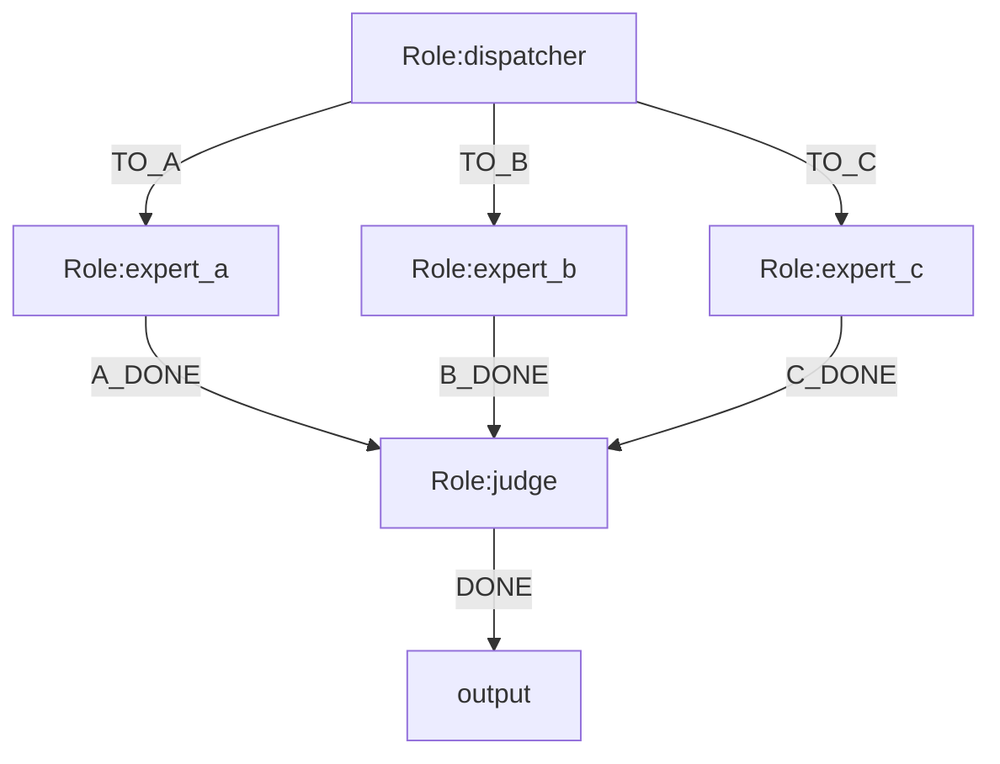

#### 含义

- `judge` 在 3 个 source 中任意 2 个完成时即可激活。
- 达到阈值后只激活一次，后到 source 会被记审计但不会再次触发 join。

#### 注意事项

- `quorum_of` 必须同时提供 `join.sources` 与 `join.min`。
- `join.min` 取值范围必须在 `[1, sourceCount]`。
- 当 `quorum_of` 的 `join.min` 小于 source 数量时，当前实现不允许在该 join 的 `context.map` 中使用 `source(...)`，因为 join 激活时部分 source 可能尚未到达；此时使用 `global.*`，或将阈值设为 source 总数。

### 4.3 Join 基础超时（已实现）

- Join spec 必须使用正整数 `timeoutSeconds`；`failurePolicy: wait` 只表示在该期限内等待，不表示无限等待。
- 到达期限后按 `onTimeout` 收敛：`fail` 进入失败链，`quorum_continue` 仅允许用于 `quorum_of`（未达到 `min` 时仍失败），`pause` 将运行置为 `stopped` 并保留等待证据，`terminate` 将运行置为 `terminated`。
- 超时会记录 expected、ready、missing sources、Join scope、超时时刻和最终动作，并纳入 checkpoint/resume 对账。
- 同一 Join scope 只处理一次；迟到 source 不会二次激活 Join。
- Join 的 readiness 作用域由 `runId`、Join 角色、`lineageId` 和 `loopIteration` 组成；UI 用的 `joinId` 只是显示标识，不能替代内部作用域键。
- `join.first_packet.*`、`join.gap.*` 等分阶段等待窗口尚未实现，详见 [Join 等待超时 RFC](./ogsystem-wait-timeout-semantics-v2.md)。

---

## 5. 上下文投影语义（`context.map`）

规范入口：当前 `context.map` selector 规则与祖先可达性说明，以 [context-map 投影说明](./context-map-projection-guide.md) 为准。

### 5.1 普通节点投影

#### 图示

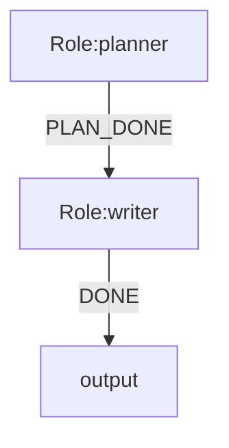

#### 含义

- `writer` 的 `context` 将重建为稳定字段序 JSON：
  `goal/profile/brief/outline`。
- 支持 `global.task`、`global.user_profile(.path)`、`direct.content|event|data(.path)`。

#### 注意事项

- `direct.*` 仅在存在上游产物时可用；无上游会 fail-closed。
- 路径不存在、字段缺失、selector 非法都会失败，不会静默置空。
- `global.human_review.current(.comment|.round|.previous_output(.path))` 只用于审核返工上下文；selector 末尾的 `?` 可忽略首轮没有审核上下文的情况。

### 5.2 Join 节点投影

#### 图示

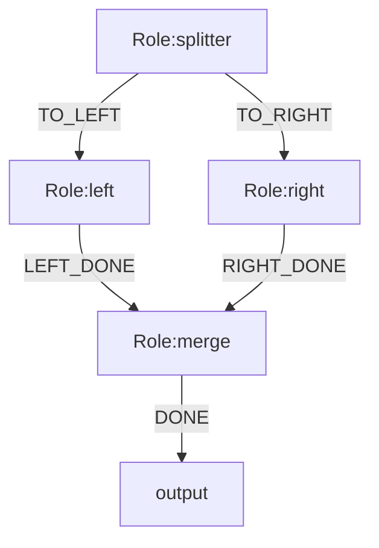

#### 含义

- Join 节点支持 `source(<roleId>).content|event|data(.path)`。
- `source(<roleId>)` 必须是该节点 `join.sources` 中声明过的角色。

#### 注意事项

- Join 节点不允许 `direct.*` selector。
- 若未配置 `context.map`，Join 默认上下文是按 `join.sources` 归一化的命名空间 JSON。

---

## 6. 循环语义（`loop.max`）

本节描述 Mermaid 的 `loop.max.<roleId>` 角色激活预算。它与 Semantic IR 的 Loop Scope 业务回合计数不同：Loop Scope 使用 `loopId`，并按 `runId + lineageId + loopId` 隔离；其 `counterField` 必须由业务状态 Schema 声明，OGS 不预置 `round` 等领域字段。

### 6.1 有界循环

#### 图示

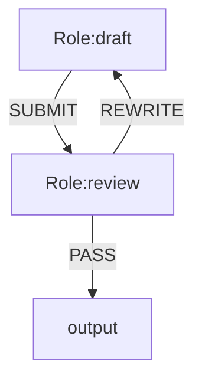

#### 含义

- `draft` 最多被激活 3 次（按目标角色预算控制）。
- 循环既有解析期约束，也有执行期预算守卫。

#### 注意事项

- 图中存在环时，至少一个环内角色必须声明 `loop.max`，否则解析失败。
- `loop.max.<role>` 必须是可达角色且为正整数。
- 每个声明预算的目标角色独立计数；环上多个角色分别声明预算时，任一角色超限都会失败。

---

## 7. 绑定与执行语义

### 7.1 绑定决议

#### 含义

- 每个角色必须解析出一种有效执行方式：显式 `model.bind`、显式 `exec.bind`、项目模型选择默认值，或满足法律约束的 `noop`。
- 两种显式绑定同时存在会在解析期失败；没有显式绑定时不会自动回退到 `noop`，会先尝试模型选择默认值。
- `noop` 仅在 law 设置 `allowNoopWithoutExecutionBinding=true` 且该角色最多有一条出边时可执行。
- `talent.bind.<roleId>` 不改变上述决议，也不会在当前 runtime 选择模型或执行器；未来实现时仅作为能力标签路由输入。

#### 注意事项

- `noop` 节点若有多个可选出边会被拒绝（避免歧义路由）。
- `model.bind` 与 `exec.bind` 同时声明属于冲突，解析期失败。

### 7.2 Runtime-native Human Review

#### 含义

- 在被审核角色上声明 `review.mode.<roleId>=required`，角色执行完成后先持久化 draft result，再进入 `waiting_review`。
- 审核不是独立的 Mermaid `human-gate` role。通过 `ogs run review list|inspect|decide` 操作控制面，再用 `ogs run resume` 继续主链。
- 支持 `approve`、`rework`、`pause`、`terminate` 四种决策；`review.timeout.action` 仅支持 `pause|terminate`，`review.terminate.scope` 仅支持 `branch|run`。
- `review.rework.target` 默认为当前角色，`review.rework.max` 限制返工次数；返工上下文通过 `global.human_review.current.*` 投影。

#### 注意事项

- 当前只支持 `review.mode.<roleId>=required`，其它 review mode 会在解析期拒绝。
- `review.timeout` 单位为秒，必须为非负整数；它当前只会被解析并持久化到 review spec，运行时不会自动计时或将 review 标记为 expired；review 的附加配置必须同时声明 `review.mode`。
- 首轮和返工共用同一图语义；需要兼容首轮缺少审核上下文时，给 selector 末尾加 `?`。

### 7.3 角色输出合同

#### 含义

- 输出必须是 JSON 对象，且仅允许 `event/content/data` 三个键。
- 运行时会注入 `allowed_events`，但 `ERROR*` 不在可选集合里。

#### 注意事项

- 角色输出禁止使用 `ERROR*` 前缀事件；异常流只允许由运行时失败路径触发。
- 非并行且存在可选普通出边时，缺失 `event` 会失败（`ERROR*` 出边不计入该判定）。

---

## 8. 异常流语义（`ERROR*`）

### 8.1 失败补偿路由

#### 图示

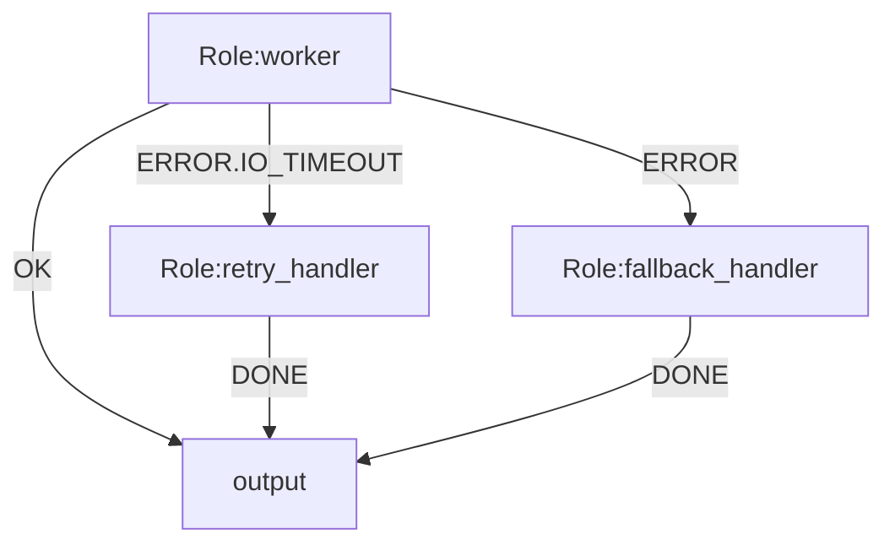

#### 含义

- 失败时先匹配 `ERROR.<errorCode>`，再匹配 `ERROR` 兜底。
- 匹配成功会进入补偿分支，并记 `failure_handled` 事件。
- 失败产物会写入特殊 artifact（`<failedRole>.__handled_failure`）供下游读取。

#### 注意事项

- `ERROR*` 语义受 `runtime.error_flows.v1` 控制，默认 `false`。
- 未开启或无匹配时保持 fail-stop。
- 同一来源角色最多一个 `ERROR` 兜底边；同一 `ERROR.<code>` 不可重复。
- `input` 边界不允许声明 `ERROR*`。

---

## 9. 分支、血缘与会话语义

### 9.1 会话血缘规则

#### 含义

- `branchId`：分支实例标识（`role@loop#seq`）。
- `lineageId`：同一并行谱系标识。
- `sessionLineageId`：模型会话记忆隔离/复用键的一部分。

#### 注意事项

- 单路顺序流转通常继承 `sessionLineageId`（复用会话）。
- 并行分叉、一次激活多个目标、进入 join 激活时会切换新 `sessionLineageId`。
- 会话隔离不等于文件系统隔离；同角色默认共用 role 目录。

---

## 10. 恢复与持久化语义（Resume/WAL）

### 10.1 执行落盘流程

#### 图示

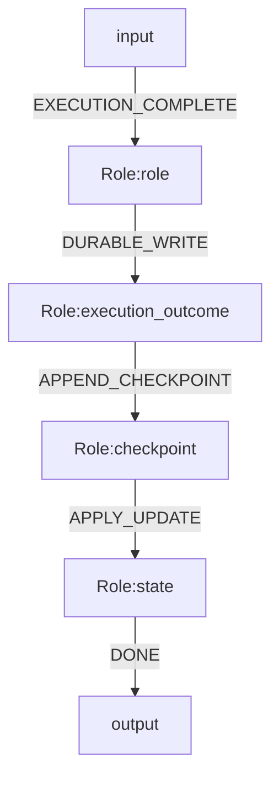

#### 含义

- 先落 `execution-outcome`，再写 checkpoint（WAL 语义）。
- 恢复时先回放 checkpoint，再补偿“已落 outcome 但未入 checkpoint”的窗口。

#### 注意事项

- Resume 会校验 `plan-fingerprint.json`，图/角色/模型/法律有变更即拒绝恢复。
- Resume 需要 `state.json` 与 `sessions.json` 等关键文件完整可读。
- `.resume.lock` 防止同一 run 目录并发恢复。

---

## 11. 常见错误对照（查漏补缺用）

| 场景 | 典型触发 | 处理建议 |
| :--- | :--- | :--- |
| 头部非法 | 首行不是 `flowchart TD/LR` | 改为严格头部，删除多余前置文本 |
| 元数据冲突 | `entry.role` 与 `input` 目标不一致 | 保留一个单一入口定义 |
| join 不一致 | `join.sources` 与入边角色不完全相同 | 以 Mermaid 入边为准，双向对齐 |
| quorum 参数错误 | 缺 `join.min` 或超范围 | 补齐并限制到 `[1, sources]` |
| selector 非法 | join 用了 `direct.*` 或路径不存在 | 换成 `source(...)`，并补齐数据路径 |
| 角色发出 `ERROR*` | 输出事件命中保留前缀 | 改用业务事件，失败补偿交给运行时 |
| 无绑定误用 | 角色无绑定且 law 不允许 noop | 增加 `model.bind/exec.bind` 或调整 law |
| 无限循环风险 | 环路无 `loop.max` | 在环内至少一个节点配置 `loop.max` |

---

## 12. 建议的语义设计顺序

1. 先画业务主链（默认事件路由），确认入口与终点。
2. 再加并行与 join，并立即对齐 `join.sources` 与入边集合。
3. 然后配置 `context.map`，确保每个 selector 都有稳定来源。
4. 最后加 `loop.max` 与 `ERROR*` 补偿语义，做失败路径演练。

按这个顺序建模，最容易在解析期就发现问题，减少运行期歧义。

---

## 13. 组合优先级与执行取舍（重点）

### 13.1 运行时判定链路（总览）

#### 图示

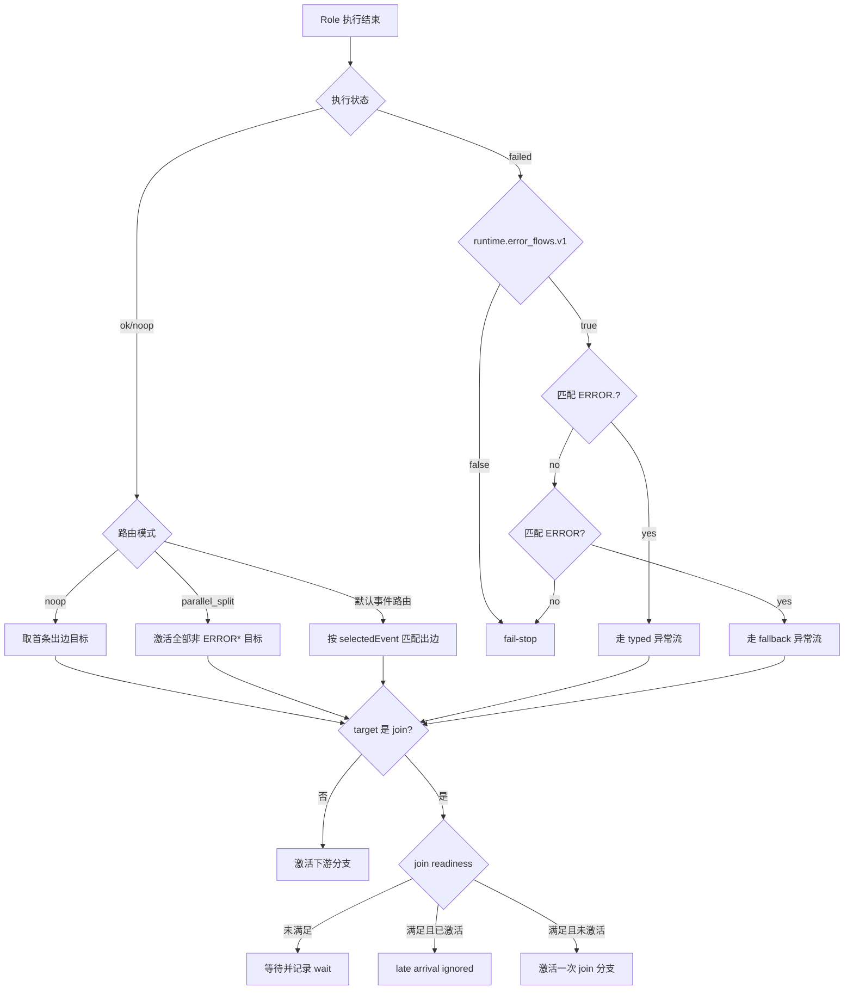

#### 含义

- 成功与失败走两条不同判定链，失败链只有在 `runtime.error_flows.v1=true` 时才尝试异常流。
- Join 不是“到边即执行”，而是“到边后再判 ready”，并且同一 `lineageId + loopIteration` 只激活一次。

#### 注意事项

- 失败链里，`ERROR.<code>` 永远优先于 `ERROR`。
- 失败链命中异常流后，仍会经过 loop budget 与 join 语义检查，不是无条件放行。

### 13.2 优先级矩阵（冲突时谁生效）

| 主题 | 优先级/顺序 | 取舍说明 |
| :--- | :--- | :--- |
| 入口角色决定 | `input` 边界目标 与 `entry.role` 二选一且必须一致 | 入口冲突直接拒绝，避免恢复时入口漂移 |
| 节点绑定 | 冲突直接拒绝；单绑定使用对应执行器；无绑定按 law 判定 noop | `model.bind` 与 `exec.bind` 不是覆盖关系，避免隐藏配置错误 |
| 上下文来源 | `context.map` > `join 默认命名空间` > `direct 上游内容` | 显式映射优先，防止隐式 context 漂移 |
| 成功路由 | `routingMode handler`（如 `parallel_split`）> 默认事件匹配 | 扩展模式优先，默认模式兜底 |
| 失败路由 | `ERROR.<code>` > `ERROR` > fail-stop | typed 优先保证补偿精确性 |
| Resume 恢复 | 回放 checkpoint WAL > 补偿未对账 outcome | 先尊重已落 WAL，再修补 crash 窗口 |
| 会话血缘 | 并行/多目标/join 激活时新 lineage，否则继承 | 优先隔离并行记忆，顺序链路复用会话 |

### 13.3 组合场景 1：`parallel_split + quorum_of + context.map`

#### 图示

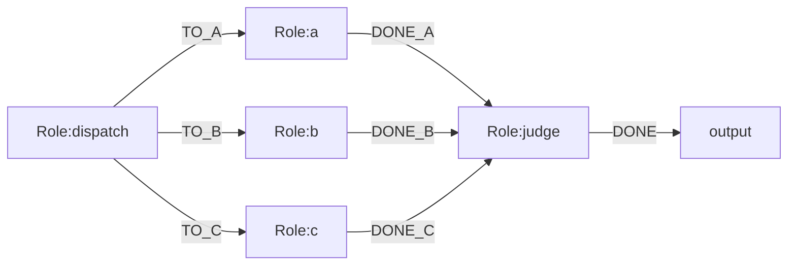

#### 含义

- `dispatch` 会并发激活 `a/b/c`。
- `judge` 达到 3 个 source 完成即激活；第 3 个到达前不会激活，达到阈值后只激活一次。
- `context.map` 生效后，`judge` 的 `context` 按映射重建，不再用默认 join 命名空间全量注入。

#### 注意事项

- 一旦声明 `context.map`，字段缺失会 fail-closed；不会“自动补默认 join 上下文”。
- `source(x)` 只能引用 `join.sources` 中的角色。
- 这个示例把 `join.min` 设成了 `|join.sources|`，因此 `source(...)` 选择器在当前 runtime 规则下是合法的；若 `join.min < |join.sources|`，应改用 `direct.*` 或 `global.*`。

### 13.4 组合场景 2：`ERROR*` 与 loop budget 的取舍

#### 图示

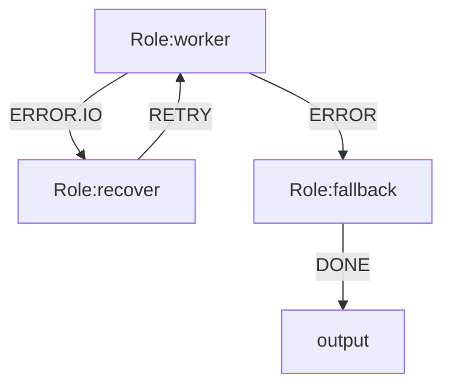

#### 含义

- `worker` 失败后先尝试 `ERROR.IO`，再尝试 `ERROR`。
- 若命中 `ERROR.IO` 但将触发超预算循环，运行时不会强行走补偿分支，最终回退为 fail-stop。

#### 注意事项

- 异常流不是“高于一切”的特权路径，仍受循环预算与图约束控制。
- 建模时要同时检查补偿链是否会与 `loop.max` 冲突。

### 13.5 组合场景 3：`noop` 与异常流并存的例外

#### 含义

- 无绑定角色走 `noop` 需满足法律允许，且不能存在多出边歧义。
- 预检与执行期对 `noop` 的多出边检查口径不同，实践上应按“总出边数 <= 1”设计。

#### 注意事项

- 即使角色不会主动输出 `ERROR*`，给 `noop` 节点再挂异常流也可能触发预检拒绝。
- 最稳妥做法：`noop` 节点只保留单一路径，不承担异常补偿职责。

---

## 14. 例外清单（容易踩坑）

### 14.1 语义开关例外

- `ERROR*` 边即使写进图里，`runtime.error_flows.v1=false` 时也不会参与失败路由。
- 这类场景下，失败行为保持 fail-stop，不会自动降级到 fallback 节点。

### 14.2 事件可选集例外

- 注入给角色的 `allowed_events` 会剔除所有 `ERROR*`。
- 角色侧永远不能“主动声明一次失败补偿事件”来绕过运行时失败判定。

### 14.3 Join 计数例外

- Join readiness 以“source 角色完成状态”计数，不按“到达次数”计数。
- 迟到 source 触发的是 `join_late_arrival_ignored` 审计，不会二次激活 join。

### 14.4 上下文投影例外

- `context.map` 的 selector 解析是 fail-closed：缺 source、缺字段、路径断裂都会直接失败。
- Join 节点使用 `direct.*` 会在解析期被拒绝，不是运行期警告。

### 14.5 恢复流程例外

- Resume 不是“目录存在即可恢复”，而是“指纹一致 + 快照完整 + checkpoint/outcome 可对账”。
- 任一关键约束不满足，恢复会硬失败，不会尝试“部分恢复”。
