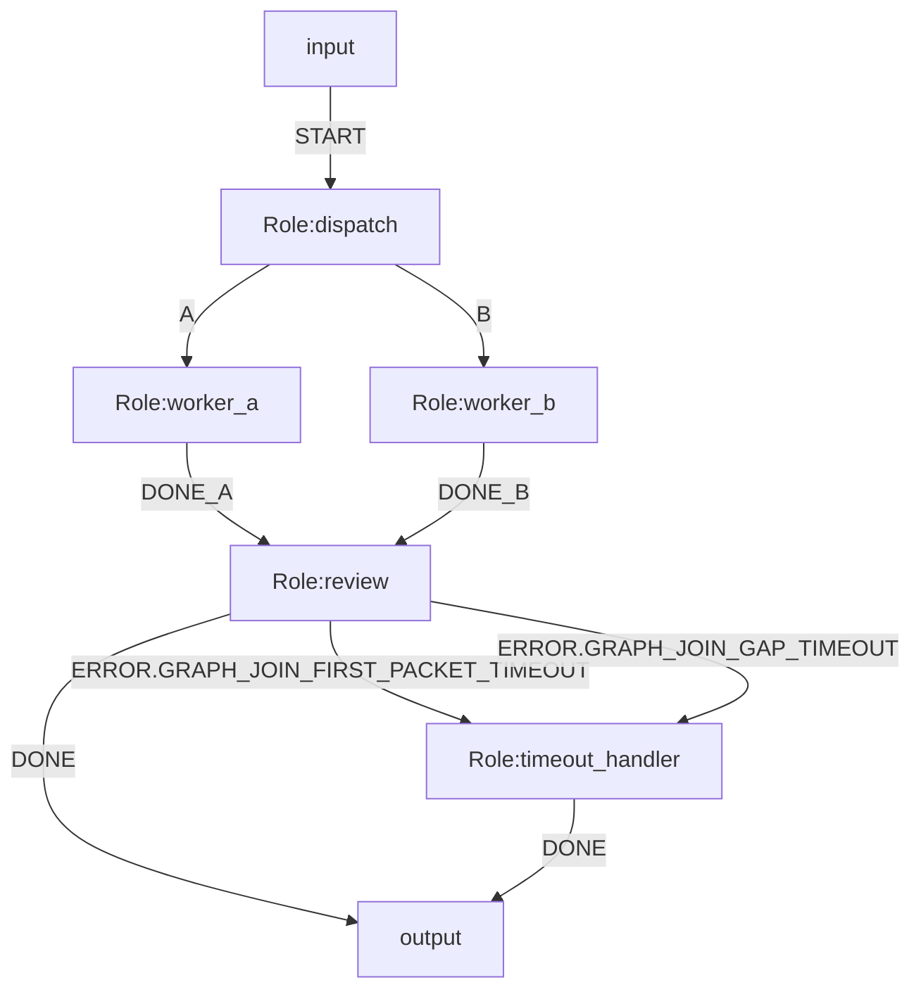

# OGSystem Join 等待超时语义规范（v2 RFC）

更新时间：2026-04-14  
状态：RFC / **未实现**（proposal-only）  
适用范围：运行时编排层（Join 等待、Join timeout 失败路由、resume 一致性）  
权威级别：低于 `src/runtime/*` 与 `docs/ogsystem-orchestration-semantics-v1.md`

---

## 0. 目的与范围冻结

本 RFC 只解决一件事：**给 Join 增加可配置、可恢复、可失败路由的等待超时语义**。

本版范围固定如下：

1. 仅支持 Mermaid metadata。
2. 仅支持两段等待：`first_packet` 与 `gap`。
3. 仅支持一个超时动作：`FAIL`。
4. 执行超时与 Join 等待超时分层：`timeoutMs` 仍是执行预算；本 RFC 新增的是 Join 等待预算。

本版明确**不包含**：

1. Runtime YAML 配置面。
2. alias（如 `join.deadline.*` / `join.on_timeout.*`）。
3. `global.deadlineMs`。
4. `PARTIAL_CONTINUE`、`SKIP` 等扩展动作。

---

## 1. 当前实现事实（As-Is）

以下是当前代码现状，不是目标语义：

1. Mermaid 元数据白名单只接受既有 `join.mode/join.sources/join.min` 等前缀；`join.first_packet.*`、`join.gap.*`、`join.on_timeout.*` 当前会被拒绝。
2. runtime 当前没有显式 `joinPending` 状态，也没有独立 timer/tick 机制。
3. Join readiness 只根据 source 到达情况判断，不包含时间维度。
4. scheduler 结束条件当前只看 `activeRoles.length === 0`；若未来引入等待窗口而不补 pending 语义，会提前 END。
5. `ERROR*` 失败路由已经存在，但 Join timeout 目前没有对应的 runtime failure envelope 产出路径。

---

## 2. 目标达成语义清单（To-Be）

本 RFC 落地后，目标语义必须同时满足：

1. 仅交付 Mermaid metadata 语义，不引入 YAML 配置面。
2. canonical 键固定为 `join.first_packet.*`、`join.gap.*`、`join.on_timeout.*`。
3. 不采用 `wait_join_*` 扁平命名，也不再引入新的顶层 `wait.*` 域。
4. 支持 `join.first_packet.default`、`join.first_packet.<roleId>`、`join.gap.default`、`join.gap.<roleId>`、`join.on_timeout.<roleId>`。
5. 解析为 fail-closed：未知键、非法值、非法作用域直接失败。
6. `join.first_packet/gap/on_timeout` 仅允许声明在 join 角色上；非 join 角色声明直接失败。
7. `join.first_packet.*` 与 `join.gap.*` 必须是正整数毫秒。
8. `join.on_timeout.*` 在 v2 仅允许 `FAIL`。
9. `first_packet(roleId)` 解析顺序为 `role > default > fail`。
10. `gap(roleId)` 解析顺序为 `role > default > first_packet(roleId)`。
11. `first_packet` 从 join 进入 pending 观察态起算。
12. `gap` 从最近一次有效 source 到达起算。
13. `arrivalCount == 0` 时仅判 `first_packet`；`arrivalCount > 0` 时仅判 `gap`。
14. 同一 `(roleId, lineageId, loopIteration, timeoutType)` 只允许一次超时路由，后续重复仅记审计不重复路由。
15. Join timeout 失败码固定为：
    - `GRAPH_JOIN_FIRST_PACKET_TIMEOUT`
    - `GRAPH_JOIN_GAP_TIMEOUT`
16. Join timeout 作为运行时失败进入统一失败链：`ERROR.<code>` -> `ERROR` -> fail-stop（受 `runtime.error_flows.v1` 控制）。
17. scheduler 结束条件变为“无 active roles 且无 join pending”。
18. resume 后按持久化 deadline 恢复；若已过期则立即触发超时路径。
19. 未声明本 RFC 新键的旧图行为保持不变。
20. 必须落审计事件，至少包含 run/branch/lineage/loop/role/timeoutType/budget/elapsed 等关键字段。

---

## 3. 命名与配置（Canonical）

### 3.1 Canonical 键

本版唯一 canonical 键如下：

1. `join.first_packet.default`
2. `join.first_packet.<roleId>`
3. `join.gap.default`
4. `join.gap.<roleId>`
5. `join.on_timeout.<roleId>`

说明：

1. `default` 是唯一保留默认槽位。
2. 除 `default` 外，尾段必须解析为已定义的 join 角色 `roleId`。
3. 本版不定义 alias，不做双写兼容。

### 3.2 解析顺序与继承

对每个 join 角色 `roleId`：

1. `first_packet(roleId)`：  
   `join.first_packet.<roleId>` > `join.first_packet.default` > 解析失败。
2. `gap(roleId)`：  
   `join.gap.<roleId>` > `join.gap.default` > `first_packet(roleId)`。
3. `on_timeout(roleId)`：  
   `join.on_timeout.<roleId>` > `FAIL`。

即：`role > default > fallback`。

### 3.3 解析与校验（fail-closed）

1. `join.first_packet.*` 与 `join.gap.*` 单位统一为毫秒（ms），且必须为正整数。
2. `join.first_packet.*`、`join.gap.*`、`join.on_timeout.*` 仅允许声明在 join 角色上。
3. `join.on_timeout.*` 在 v2 仅允许 `FAIL`。
4. `join.first_packet.*` 缺失且无 `default` 时，解析期直接失败。
5. `default` 之外的尾段若不是已定义 `roleId`，解析期直接失败。

建议解析错误码沿用现有 `MERMAID_*` 风格，例如：

1. `MERMAID_JOIN_WAIT_NON_JOIN_ROLE`
2. `MERMAID_JOIN_WAIT_UNKNOWN_ROLE`
3. `MERMAID_JOIN_WAIT_FIRST_PACKET_MISSING`
4. `MERMAID_JOIN_WAIT_UNSUPPORTED_TIMEOUT_ACTION`

---

## 4. 时间语义与起算点

### 4.1 两段等待

1. `first_packet`：等待首个有效 source 到达的上限。
2. `gap`：首个有效 source 到达后，相邻有效 source 到达间隔的上限。

这里的“有效 source 到达”按**同一 `lineageId + loopIteration` 下的唯一 source role**计数，与当前 Join readiness 口径保持一致。

### 4.2 Join Pending 起点

为支持时间语义，必须引入显式 `joinPending` 观察态。定义：

1. `joinPendingKey = roleId + lineageId + loopIteration`
2. `tPendingStartedAtEpochMs`：某个 join 进入 pending 观察态的起点。
3. `tLastArrivalAtEpochMs`：最近一次有效 source 到达的时刻。
4. `arrivalCount`：已到达的唯一 source role 数。

### 4.3 判定规则

1. `first_packet` 判定：  
   `arrivalCount == 0 && nowEpochMs >= firstPacketDeadlineAtEpochMs`
2. `gap` 判定：  
   `arrivalCount > 0 && nowEpochMs >= gapDeadlineAtEpochMs`

建议直接持久化绝对 deadline：

1. `firstPacketDeadlineAtEpochMs`
2. `gapDeadlineAtEpochMs`

这样 resume 不需要重算起点。

---

## 5. 状态机与调度改造（最小闭环）

要让 Join timeout 真正可触发，最小闭环至少包括：

1. GraphState 新增 `joinPendingByKey`。
2. source 到达 join 且 readiness 未满足时，创建或更新 `joinPending`。
3. readiness 满足并激活 join 后，立即清理对应 `joinPending`。
4. scheduler 每轮在选择下一个 active role 前，先检查所有 `joinPending` 是否超时。
5. scheduler 结束条件必须改为：  
   `activeRoles.length === 0 && joinPendingCount === 0`

否则“无活动角色但仍有 join 等待窗口”的场景会被提前结束。

### 5.1 `all_of` 与 `quorum_of` 下的 pending 生命周期

1. `all_of`：直到全部 source 到齐前，join 一直处于 pending。
2. `quorum_of`：达到阈值后立即激活一次并清理 pending；后续迟到 source 只记 `join_late_arrival_ignored` 审计，不重触发 join。

---

## 6. 超时失败与 ERROR* 路由

### 6.1 失败来源

Join timeout 是**运行时状态失败**，不是角色执行失败。

因此失败 envelope 必须由 scheduler / join timeout 子系统产出，而不是 role executor 产出。

### 6.2 失败码

本版固定使用：

1. `GRAPH_JOIN_FIRST_PACKET_TIMEOUT`
2. `GRAPH_JOIN_GAP_TIMEOUT`

### 6.3 路由规则

Join timeout 进入统一运行时失败链：

1. 若 `runtime.error_flows.v1=true` 且该 join 节点声明 `ERROR.<code>`，优先命中精确异常流。
2. 否则若声明 `ERROR`，走 fallback 异常流。
3. 若未启用异常流或无匹配，保持 fail-stop。

### 6.4 单触发与去重

同一 Join timeout 只允许路由一次。

建议去重键：

`dedupKey = roleId + lineageId + loopIteration + timeoutType`

规则：

1. 首次触发：写审计并进入失败路由。
2. 后续重复：只记 `join_timeout_duplicate_ignored` 审计，不重复路由。

### 6.5 审计字段

超时审计至少应包含：

1. `runId`
2. `branchId`
3. `lineageId`
4. `loopIteration`
5. `roleId`
6. `timeoutType`
7. `budgetMs`
8. `elapsedMs`
9. `arrivalCount`
10. `satisfiedSources`
11. `onTimeoutAction`
12. `dedupKey`

建议事件类型：

1. `join_timeout_fired`
2. `join_timeout_duplicate_ignored`

---

## 7. 持久化与 Resume

本版最小实现不引入 monotonic/wall-clock 双轨，直接使用**绝对 epoch deadline**。

持久化要求：

1. `joinPending` 必须进入 GraphState。
2. `joinPending` 必须通过 checkpoint/WAL 持久化。
3. 至少持久化：
   - `tPendingStartedAtEpochMs`
   - `tLastArrivalAtEpochMs`
   - `firstPacketDeadlineAtEpochMs`
   - `gapDeadlineAtEpochMs`
   - `arrivalCount`
   - `satisfiedSources`
   - `timeoutFired`

Resume 规则：

1. 恢复状态后，scheduler 在继续执行前先扫描 `joinPending`。
2. 若任一 pending 已过期，则立即进入对应 timeout 路由。
3. 已触发且已去重标记的 timeout，不得在 resume 后重复路由。

---

## 8. 配置示例（Mermaid-only）

说明：

1. `review` 未配置 `join.first_packet.review`，因此继承 `join.first_packet.default=120000`。
2. `review` 明确配置 `join.gap.review=90000`。
3. `join.on_timeout.review=FAIL` 表示超时进入运行时失败链，再决定是否命中 `ERROR*`。

---

## 9. 落地实现清单

在宣称“已支持 v2”之前，至少完成以下改造：

1. `parse-mermaid.ts` 扩展白名单并加入 `join.first_packet/gap/on_timeout` 校验。
2. `types.ts` / `execution-plan.ts` 补充 Join wait 策略字段。
3. `graph-runtime-state.ts` 补充 `joinPending` 状态结构与初始投影。
4. `graph-runner.ts` 加入：
   - `joinPending` 生命周期管理
   - timer/tick 等价检查
   - scheduler 结束条件修正
   - Join timeout failure envelope 产出
   - Join timeout 到 `ERROR*` / fail-stop 的显式路由
   - 单触发去重与审计
5. checkpoint/resume 逻辑持久化并恢复 `joinPending` deadline。
6. 单元与集成测试覆盖：
   - parser 校验
   - `first_packet` timeout
   - `gap` timeout
   - `ERROR.<code>` 优先级
   - duplicate ignored
   - crash-window + resume 幂等
7. 文档状态从 RFC 改为 Delivered，并在主语义文档中回写“已交付能力”。

---

## 10. 验收门槛

只有当以下条件全部满足时，才能把本 RFC 状态改成 Delivered：

1. 未声明 `join.first_packet/gap/on_timeout` 的旧图行为完全不变。
2. Join timeout 可稳定触发，且不会因 scheduler 提前 END 而失效。
3. `GRAPH_JOIN_FIRST_PACKET_TIMEOUT` 与 `GRAPH_JOIN_GAP_TIMEOUT` 能正确路由到 `ERROR.<code>` / `ERROR` / fail-stop。
4. 同一 timeout 仅触发一次；重复检查只记 duplicate 审计。
5. resume 后不丢 timeout、不重复 timeout。
6. parser/runtime/recovery 回归测试全部通过。

---

## 11. 文档状态约定

本文件在上述实现清单与验收门槛完成前，始终是“提案文档”，不是当前运行时语义真相。
