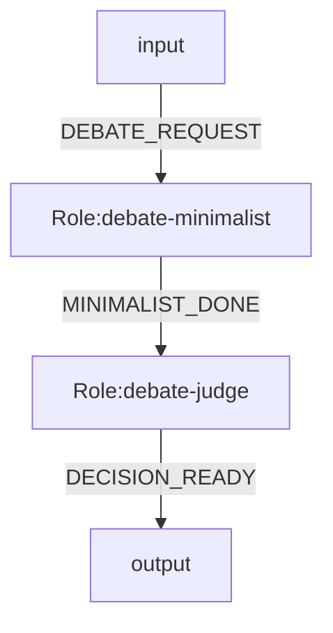

# Role / Model / User Profile Minimal Spec

Date: 2026-04-09  
Status: target design

This document defines the next minimal architecture after the current `profiles/tools` stage.

Goal:

- keep `system.mmd` focused on orchestration
- keep `role repo` focused on role semantics
- move execution configuration into `model repo`
- keep `user profile` separate from both role and model
- support `OpenCode` as the default executor
- support one shared workspace plus one private workspace per role

## 1. Layer Model

There are four layers:

1. `system`
2. `role repo`
3. `model repo`
4. `user profile`

Each layer answers a different question:

- `system`: how does work flow?
- `role`: what does this node do?
- `model`: how is this node executed?
- `user profile`: how should results be delivered to this user?

## 2. Responsibility Boundaries

### 2.1 system

`system.mmd` owns:

- role graph
- event routing
- entry role
- law binding
- model binding

`system.mmd` does not own:

- role prompt bodies
- model execution details
- user output preferences

### 2.2 role repo

`role repo` owns:

- role identity
- role persona
- role work scope
- role input schema
- role output schema
- role talent and capability preference

`role repo` does not own:

- graph routing
- chosen model
- process workspace layout
- user language/style preference

### 2.3 model repo

`model repo` owns:

- executor type
- concrete model name
- reasoning mode
- timeout
- output limit
- executor arguments

`model repo` does not own:

- role persona
- role output contract
- user-facing delivery style

### 2.4 user profile

`user profile` owns:

- language
- style
- risk preference
- output length
- audience/domain background

`user profile` does not own:

- model selection
- role responsibility
- graph structure

## 3. Relationship Model

Binding direction:

```txt
system.mmd
  -> binds roleId into the graph
  -> binds roleId to modelId

role repo
  -> defines what each role must do

model repo
  -> defines how each bound role is executed

user profile
  -> is injected into prompts as delivery preference
```

In short:

- system binds
- role defines behavior
- model defines execution
- user profile defines delivery preference

## 4. Recommended Directory Layout

```txt
project/
  .ogsystem/
    runtime.json
    laws.json
    user-profile.json

  .ogsystems/
    2026-04-09T12-30-22Z-architecture-debate/
      run.md
      request.md
      system.mmd
      state.json
      events.ndjson
      audit/
        summary.md
        transitions.md
      shared/
      roles/
        debate-moderator/
          role.md
          inbox.md
          prompt.md
          result.json
          outbox.md
          audit.md
          private/
            notes.md
        debate-judge/
          ...

  og-roles/
    roles/
      debate-moderator/
        role.json
        persona.md
        work.md
        prompt.md
        input.schema.json
        output.schema.json

  og-models/
    catalog/
      opencode-models.json
    models/
      fast-gpt54/
        model.json
      deep-o3/
        model.json
      balanced-gpt52/
        model.json
```

## 5. system.mmd

Recommended metadata:

- `%% system.id=...`
- `%% system.version=...`
- `%% law.global=...`
- `%% entry.role=...`
- `%% model.bind.<roleId>=<modelId>`

Minimal example:



Notes:

- `roleId` remains the stable semantic identifier
- `model.bind` is an execution binding, not a semantic property
- role ids should resolve directly to `og-roles/roles/<roleId>/`

## 6. role.json

Use `jsonc` for documentation examples only. Runtime files can remain strict JSON.

```jsonc
{
  // Stable semantic identity of the role package.
  "roleId": "debate-judge",

  // Package version for evolution and review.
  "roleVersion": "1.0.0",

  // Human-readable display name.
  "name": "Debate Judge",

  // Short summary of the role's purpose.
  "description": "Aggregates positions and decides whether another round is needed.",

  // Main prompt template file.
  "promptTemplate": "prompt.md",

  // Optional input contract.
  "inputSchema": "../_shared/input.schema.json",

  // Required output contract.
  "outputSchema": "output.schema.json",

  // Role-level capability preference, not a hard execution binding.
  "talent": {
    "reasoningDepth": "high",
    "style": "analytical",
    "riskPreference": "medium"
  },

  // Soft hints to help system/model selection.
  "preferredModelTags": ["reasoning", "long-context"],

  "tags": ["debate", "synthesis"]
}
```

Role rules:

- `roleId` must equal the directory name
- role packages do not define routing
- role packages do not bind a model directly
- role packages may express talent and preferred model tags

## 7. model.json

Each model package describes one executable model configuration for `OpenCode`.

```jsonc
{
  // Stable model package id referenced by system.mmd.
  "modelId": "deep-o3",

  // Default executor. In this design the executor is fixed to OpenCode.
  "executor": "opencode",

  // Concrete model name passed to OpenCode.
  "model": "o3",

  // Optional OpenCode-level runtime arguments.
  "args": {
    "reasoningEffort": "high"
  },

  // Runtime control.
  "timeoutMs": 180000,
  "maxOutputBytes": 65536,

  // Tags used for matching against role preference.
  "tags": ["reasoning", "long-context"]
}
```

Model rules:

- model packages do not contain persona or task logic
- model packages do not know specific role ids
- one `modelId` should be reusable by many systems and roles

## 8. user-profile.json

User profile is about delivery preference, not execution.

```jsonc
{
  // Stable user profile id.
  "userProfileId": "cto.zh.concise",

  // Preferred output language.
  "language": "zh-CN",

  // Preferred response style.
  "style": "concise",

  // Decision and recommendation posture.
  "riskPreference": "high",

  // Output length expectation.
  "outputLength": "short",

  // Optional audience/domain context.
  "domainBackground": ["software-architecture", "engineering-management"]
}
```

User profile rules:

- user profile must not select the model directly
- user profile should be injected into role input/prompt context
- the same user profile should work with many different models

## 9. runtime.json

`runtime.json` keeps global runtime behavior, repo locations, and run directory policies.

```jsonc
{
  // Fixed default executor for the system.
  "executor": "opencode",

  // Relative repo roots.
  "roleRepo": "./og-roles",
  "modelRepo": "./og-models",

  // Run output root.
  "runsDir": ".ogsystems",

  // Role private workspace policy.
  "workspace": {
    "rolesDir": "roles",
    "privateDirName": "private",
    "linkSharedIntoRoleDir": false
  },

  // Common OpenCode arguments shared by all models unless overridden.
  "opencode": {
    "baseArgs": ["run"]
  }
}
```

## 10. Run Directory Contract

When `ogsystem` starts in a directory:

- current working directory becomes the shared read/write workspace
- runtime creates `.ogsystems/<timestamp>-<slug>/`
- each role gets a private directory
- each role runs in its own independent `OpenCode` process

Recommended files:

Top-level run files:

- `run.md`: human-readable run summary
- `request.md`: original user request
- `system.mmd`: execution snapshot
- `state.json`: system state
- `events.ndjson`: append-only event log
- `audit/summary.md`: human summary
- `audit/transitions.md`: transition record

Per-role files:

- `role.md`: resolved role identity, model, allowed events
- `inbox.md`: normalized input for the role
- `prompt.md`: final rendered prompt
- `result.json`: strict machine output
- `outbox.md`: readable role result summary
- `audit.md`: local role execution record
- `private/`: private notes, scratch files, caches

## 11. Prompt Injection Model

Prompt rendering should inject at least:

- `task`
- `context`
- `allowed_events`
- `last_output`
- `system_notes`
- `round`
- `user_profile`
- `persona`
- `work`

Recommended interpretation:

- `role` decides what work is done
- `user_profile` shapes how the result is presented
- `model` shapes execution capability and latency/cost tradeoff

## 12. Selection Logic

Recommended runtime selection logic:

1. Parse `system.mmd`
2. Resolve each `roleId`
3. Resolve each `model.bind.<roleId>`
4. Load `user-profile.json`
5. Render role prompt with role context + user profile
6. Launch one `OpenCode` process per role execution using the selected model package
7. Persist prompt, result, and audit files into the run directory

## 13. Design Rules

Keep these strict:

- `role` is semantic
- `model` is execution
- `user profile` is delivery preference
- `system` is orchestration

Avoid these anti-patterns:

- role package directly hard-binding a model
- user profile deciding model id
- model package containing role persona
- system embedding large prompt bodies

## 14. Migration Guidance

Current state:

- `exec.bind.<roleId>` + `profiles/tools`

Target state:

- `model.bind.<roleId>` + `model repo`

Recommended migration path:

1. keep current runtime working
2. add `model repo`
3. alias existing `exec.bind` to `model.bind` during transition
4. move executor-specific settings out of role/config examples
5. keep `user profile` independent from model selection
