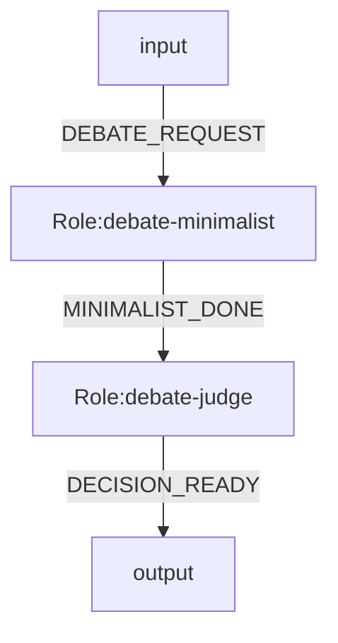
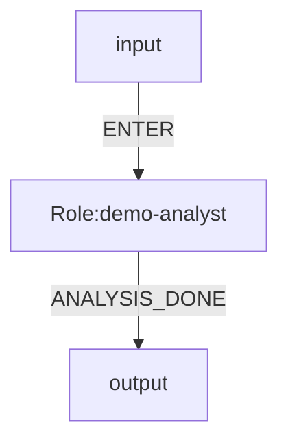
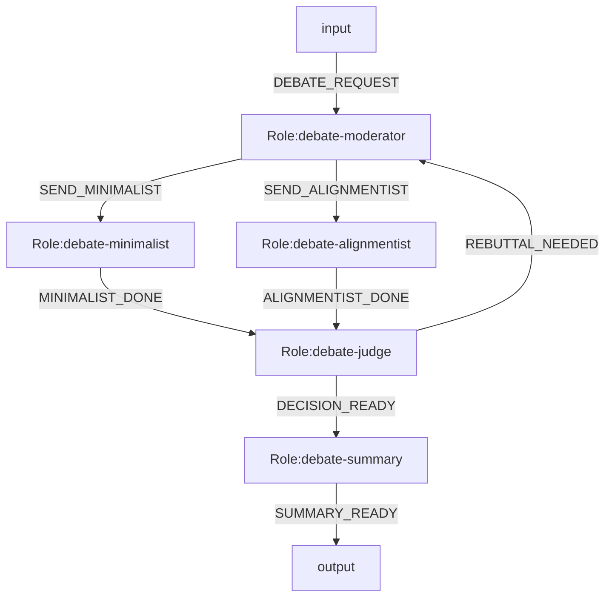

# OGSystem Usage Manual

## 1. Runtime Status

This repository currently has two layers of documentation:

- target architecture: `model.bind + model repo + user profile`
- current LangGraph runtime path: `engine=langgraph + role.mode/join.mode/loop.max`
- legacy-compatible runtime path: `exec.bind + profiles/tools`

Use this rule:

- preferred runtime path: use `model.bind.<roleId>=<modelId>`
- use `%% engine=langgraph` when the system needs parallel split, `all_of` join, or bounded loop
- legacy compatibility path: `exec.bind.<roleId>` still works when paired with `profiles/tools`

## 2. Semantic Layers

- `system.mmd`: role graph, events, law binding, role-to-model binding
- `role repo`: role semantics and I/O contracts
- `model repo`: executor and model runtime config
- `user profile`: delivery preference only

Hard boundary:

- role is semantic
- model is execution
- user profile is delivery preference
- system is orchestration

## 3. Recommended Directory Layout

```txt
OGSystem/
  .ogsystem/
    runtime.json
    user-profile.json
    laws.json

  og-roles/
    roles/
      <roleId>/
        role.json
        prompt.md
        output.schema.json
        persona.md
        work.md
        input.schema.json

  og-models/
    catalog/
      opencode-models.json
    models/
      <modelId>/
        model.json

  examples/
    target-model-binding-system.mmd
    langgraph-debate-current/
      system.mmd
      laws.json
      user-profile.json
    langgraph-expert-consultation/
      system.mmd
      laws.json
      user-profile.json
    console-system.mmd
    console-profiles.json
    console-tools.json
    console-laws.json
```

## 4. system.mmd

Target example:



Legacy-compatible execution example (current adapter):



LangGraph execution example (current adapter):



## 5. Role Package Contract

Required:

- `role.json`
- `prompt.md`
- `output.schema.json`

Optional:

- `persona.md`
- `work.md`
- `input.schema.json`
- `talent` and `preferredModelTags` in `role.json` (soft hints only)

Role rules:

- `role.json.roleId` must equal directory name
- role packages do not define routing
- role packages do not hard-bind model ids

## 6. Model Package Contract

`og-models/models/<modelId>/model.json` defines execution configuration.

Example:

```json
{
  "modelId": "deep-o3",
  "executor": "opencode",
  "model": "openai/o3",
  "args": {
    "reasoningEffort": "high"
  },
  "timeoutMs": 180000,
  "maxOutputBytes": 65536,
  "tags": ["reasoning", "long-context"]
}
```

Model rules:

- model packages do not include persona/prompt logic
- model packages do not include routing logic
- `og-models/catalog/opencode-models.json` is the raw availability snapshot
- `og-models/models/*` should stay a small curated alias layer
- for `executor: "opencode"`, `model.bind` roles run through OpenCode SDK v2 structured output:
  - input = rendered role prompt + `output.schema.json` + model selection + role working directory
  - output = one JSON object from `assistant.info.structured`
  - `args.reasoningEffort` is treated as the OpenCode `variant`
  - unsupported arbitrary CLI flags are not used on the SDK path

## 7. User Profile Contract

`.ogsystem/user-profile.json` contains delivery preference.

Example:

```json
{
  "userProfileId": "default.zh.concise",
  "language": "zh-CN",
  "style": "concise",
  "riskPreference": "medium",
  "outputLength": "short",
  "domainBackground": ["software-architecture"]
}
```

User profile rules:

- must not directly select model id
- should only affect language/style/detail/risk framing

## 8. Runtime Config

`.ogsystem/runtime.json` keeps runtime-level defaults:

- executor
- repo roots
- runs directory
- shared workspace policy

Example:

```json
{
  "executor": "opencode",
  "roleRepo": "./og-roles",
  "modelRepo": "./og-models",
  "runsDir": ".ogsystems"
}
```

## 9. Run Directory Contract

When a run starts, `.ogsystems/<run-id>/` should persist:

- run-level files: `run.md`, `request.md`, `system.mmd`, `state.json`, `events.ndjson`
- run-level OpenCode metadata: `opencode-server.json` for `model.bind` runs
- run-level shared workspace: `shared/`
- audit files: `audit/summary.md`, `audit/transitions.md`
- per-role files: `role.md`, `inbox.md`, `prompt.md`, `result.json`, `outbox.md`, `audit.md`, `private/`

Markdown files are human projections.
`state.json` and `events.ndjson` are authoritative machine state.
`inbox.md` is a projection of normalized runtime input, not a free-form summary.
`.ogsystems/` is generated runtime state and should be ignored by git.

Minimal shared-workspace rule:

- default shared path is `.ogsystems/<run-id>/shared/`
- runtime exposes it through `OGSYSTEM_SHARED_DIR`
- role directories do not receive a `shared` symlink by default

OpenCode lifecycle rule for `model.bind`:

- one OGSystem run starts one shared `opencode serve`
- each node execution creates an isolated OpenCode `session`
- each node prompt still binds to that node's role directory
- node audit records include `sessionId`, `messageId`, and shared `serverPid`
- run events include `opencode_server_started` and `opencode_server_closed`
- transient provider/service failures are retried with a fresh session on the same shared server
- after node completion, session metadata can be retained for audit/resume while the shared server stays alive
- parallel LangGraph branches therefore run as concurrent sessions on the same server process

For `engine=langgraph` runs, `state.json` also persists:

- `activeBranches`
- `completedBranches`
- `pendingJoinRoleIds`
- `loopIterations`
- `graphState`

## 10. Commands

Preferred runtime command:

```bash
npm run run:adapter -- \
  --system examples/target-model-binding-system.mmd \
  --prompt "讨论当前架构是否继续最小化" \
  --dry-run
```

This path auto-discovers:

- `.ogsystem/runtime.json`
- `.ogsystem/user-profile.json`
- `.ogsystem/laws.json`
- `og-models/`
- `og-roles/`

Legacy-compatible runtime command:

```bash
npm run run:adapter -- \
  --system examples/console-system.mmd \
  --profiles examples/console-profiles.json \
  --tools examples/console-tools.json \
  --laws examples/console-laws.json \
  --prompt "analyze this repository" \
  --dry-run
```

LangGraph runtime command:

```bash
npm run run:adapter -- \
  --system examples/langgraph-debate-current/system.mmd \
  --laws examples/langgraph-debate-current/laws.json \
  --user-profile examples/langgraph-debate-current/user-profile.json \
  --prompt "是否应继续保持 OGSystem 最小化并延后 reducer 与恢复语义？" \
  --dry-run
```

Minimal expert consultation command:

```bash
npm run run:adapter -- \
  --system examples/langgraph-expert-consultation/system.mmd \
  --laws examples/langgraph-expert-consultation/laws.json \
  --user-profile examples/langgraph-expert-consultation/user-profile.json \
  --prompt "患者间断高热、皮疹、胸闷、肌无力，常规检查未能解释原因，请组织多学科会诊。" \
  --dry-run
```

Resume a LangGraph run from persisted `state.json.graphState`:

```bash
npm run run:adapter -- \
  --system examples/langgraph-debate-current/system.mmd \
  --laws examples/langgraph-debate-current/laws.json \
  --user-profile examples/langgraph-debate-current/user-profile.json \
  --resume-run .ogsystems/<run-id> \
  --prompt "是否应继续保持 OGSystem 最小化并延后 reducer 与恢复语义？" \
  --dry-run
```

Validation command for generated Mermaid:

```bash
node skills/ogsystem-nl-to-mmd/scripts/validate_ogsystem_mmd.mjs \
  --system examples/target-model-binding-system.mmd
```

Validation command for an actual generated run:

```bash
node skills/ogsystem-nl-to-mmd/scripts/validate_ogsystem_mmd.mjs \
  --system examples/target-model-binding-system.mmd \
  --user-profile .ogsystem/user-profile.json \
  --laws .ogsystem/laws.json \
  --run-dir .ogsystems/<run-id>
```

## 11. Migration Notes

- new docs and templates should use `model.bind.*`
- during migration, `exec.bind.*` remains a compatibility path
- runtime precedence is:
  - `model.bind.<roleId>`
  - then `exec.bind.<roleId>`
