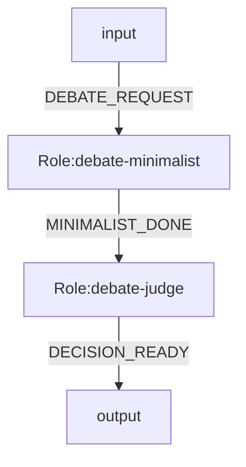
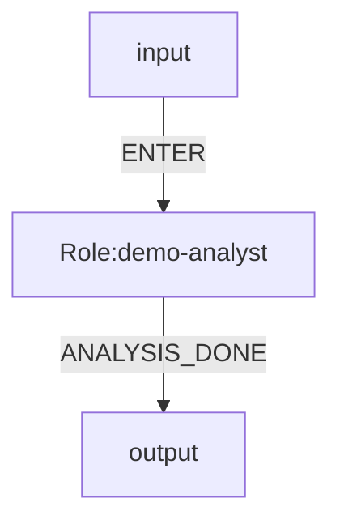
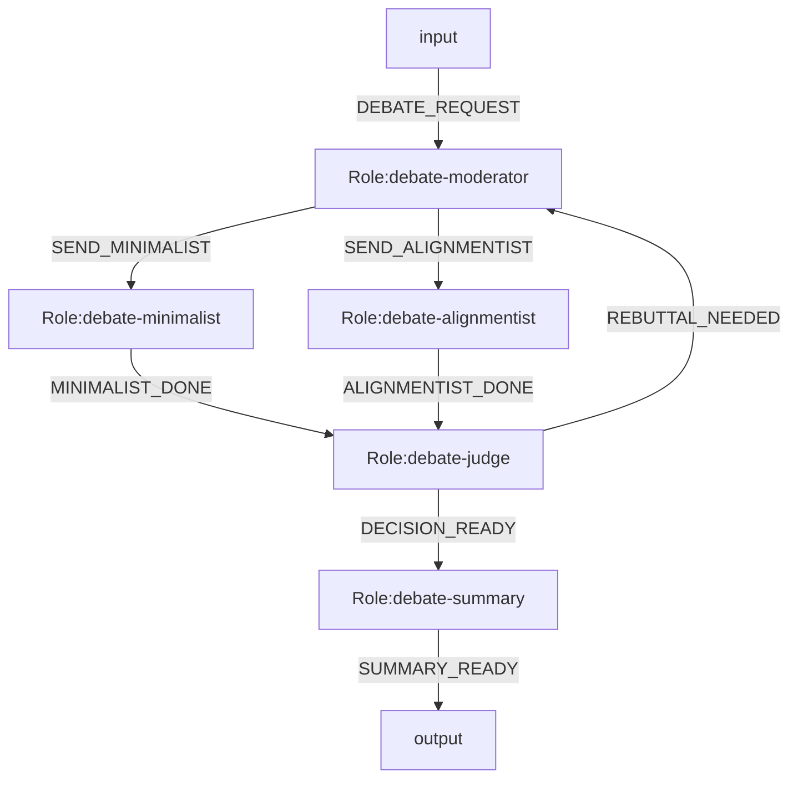

# OGSystem Usage Manual

## Read This First

OGSystem 当前是一套单机、文件优先、可恢复的图编排运行时。它最重要的特点不是“功能很多”，而是把编排语义、执行状态、恢复契约和运行证据收敛到了一条可审计的主路径里。

建议先建立这四个认知：

- 这是一个 graph runtime，不再维护第二套独立引擎。
- Mermaid 图不是展示层，而是会被编译成真正的 `ExecutionPlan`。
- `.ogs/runs/<run-id>/` 不是临时日志目录，而是运行时的数据平面与恢复依据。
- Resume 的前提不是“目录还在”，而是“语义指纹、状态快照、会话索引和 checkpoint/WAL 仍然一致”。

## Capability Snapshot

OGSystem 当前重点优化以下能力：

- 显式图语义：`parallel_split`、`all_of/quorum_of` join、`context.map`、`loop.max` 都有解析期和执行期约束。
- 异常流语义（`ERROR*`）已实现：按节点级 opt-in 引入运行时失败补偿流，默认由 `runtime.error_flows.v1=false` 控制灰度发布。
- 文件优先恢复：`state.json`、`sessions.json`、`plan-fingerprint.json`、`checkpoints/`、`execution-outcome.json` 组成恢复权威集；`plan-fingerprint.json` 现在包含 compiler digest。
- 会话血缘隔离：`roleId:sessionLineageId` 保证顺序流转可复用会话，并行 sibling 不串会话记忆。
- Crash 自愈补偿：角色结果先 durable，再 checkpoint；恢复时补偿缺失 checkpoint，而不是盲目重跑节点。
- 编译期静态门禁：`compiler.ts` 在 setup 阶段统一拒绝未绑定且不允许 noop 的角色、以及可选出边歧义的 noop 角色；parser 继续保留 DSL 白名单和 surface-level fail-closed。
- 运维可观察：`audit/`、`events.ndjson`、per-role execution snapshots 让每一步都有证据。

## Architecture Snapshot

理解项目时，可以先按下面这条链路看：

- `adapter.ts`：setup composition driver，只负责准备 setup、调用 runner、处理 resume 校验和 cleanup。
- `runtime-loader.ts` / `runtime-setup.ts` / `plan-fingerprint.ts`：分别承载配置加载、setup 组装、resume 指纹生成。
- `parse-mermaid.ts` + `execution-plan.ts`：把 Mermaid DSL 归一化为运行时可执行计划。
- `compiler.ts`：汇总 system / role / contract / law 的静态摘要，生成 `CompiledExecutionSnapshot`、静态 diagnostics 与 resume digest。
- `graph-runner.ts`：推进图状态、管理 branch/lineage、写 checkpoint、处理 resume 补偿。
- `role-executor.ts`：执行单个 role，做 prompt 投影、schema 校验、输出修复和结果落盘。
- `flow-contract.ts`：加载 `handoff.contracts`，校验 flow / `role_input` 合同，并参与 resume 指纹。
- `run-artifacts.ts`：管理 runDir、会话索引、`.resume.lock`、execution artifacts 与缓冲刷盘。

## Recommended Reading Order

如果你是第一次进入项目，建议按以下顺序阅读：

1. `README.md`
2. `docs/README.md`
3. `docs/product-introduction.md`
4. 本手册
5. `docs/ogsystem-orchestration-semantics-v1.md`
6. `docs/DECISIONS.md`
7. `docs/ogsystem-ebook.md`

## 0. 安装与构建（Win/macOS/Linux）

前置要求：

- Node.js `>= 20`

安装已发布 CLI（npm）：

```bash
npm install -g ogsystem
```

安装已发布 CLI（pnpm）：

```bash
pnpm add -g ogsystem
```

从源码目录本地安装 CLI：

```bash
npm install -g .

# pnpm 全局安装请使用绝对路径，避免 `pnpm add -g .` 在部分环境下被错误解析
pnpm add -g "$PWD"
```

源码仓开发安装：

```bash
corepack enable
corepack prepare pnpm@10.14.0 --activate
pnpm install --frozen-lockfile
```

统一构建命令（所有平台）：

```bash
pnpm run build
```

统一验证命令（所有平台）：

```bash
pnpm test
pnpm run test:examples
pnpm run test:doctor
pnpm run test:coverage
```

覆盖率判读约定：

- `pnpm run test:coverage` 会先构建 `dist/`，再用 Node 内置 coverage 对 `tests/*.mjs` 输出终端统计表。
- 覆盖率回归优先看 `dist/runtime/*` 与 `dist/nl2mmd/*` 这些已编译主路径，不把临时目录下的 fixture/tool 脚本当成回归门禁。
- 覆盖补强应优先补关键语义分支和公开入口测试，而不是只追求测试文件自身覆盖率。
- 提交覆盖改动时，至少同时执行 `pnpm test` 与 `pnpm run test:coverage`，确保回归和覆盖统计一致。

命令入口策略（最佳实践）：

- 已安装 CLI：优先使用 `ogs`、`ogs-doctor`、`ogs-nl2mmd`、`ogs-visualizer`、`ogs-lint-system`。
- 源码仓开发：继续使用 `pnpm run ...`，与 lockfile 和 CI 保持一致。
- 文档默认面向安装态 CLI；只有在说明源码仓开发时才展示 `pnpm run ...`。

## 0.1 从零到跑通（推荐路径）

如果你只是想“先装上，再看到一次真正可运行的结果”，按下面这条路径走，不需要先理解全部语义细节。

### Step 1. 安装 CLI 并确认命令可见

已发布包：

```bash
npm install -g ogsystem
hash -r
ogs help
```

源码目录本地安装：

```bash
cd /path/to/ogsystem
npm install -g .
hash -r
ogs help
```

如果 `ogs` 仍然提示 `command not found`，先检查全局 bin 目录是否在 `PATH`：

```bash
npm prefix -g
pnpm bin -g
```

当前 shell 临时修复方式（macOS/Linux）：

```bash
export PATH="$(npm prefix -g)/bin:$PATH"
hash -r
ogs help
```

如果你是用 `pnpm add -g ...` 安装的，也可以改用：

```bash
export PATH="$(pnpm bin -g):$PATH"
hash -r
ogs help
```

### Step 2. 初始化项目

在当前目录初始化：

```bash
mkdir demo-app
cd demo-app
ogs project init --template minimal
```

或者直接创建新目录：

```bash
ogs project create demo-app --template minimal
cd demo-app
```

`init` 和 `create` 的区别只有一条：

- `init`：把当前目录变成项目。
- `create`：先新建一个项目目录，再把同样的项目结构写进去。

初始化后你应该看到这些关键内容：

- `.ogs/runtime.json`
- `.ogs/laws.json`
- `.ogs/user-profile.json`
- `.ogs/providers/opencode.json`
- `system.mmd`
- 本地最小 `og-roles/`
- 本地最小 `og-models/`

### Step 3. 先做一次 dry-run

这一步不调用外部模型，只验证项目结构、Mermaid 系统、角色/模型导入和运行主路径是否打通：

```bash
ogs run start --system system.mmd --prompt "请先做一次最小分析" --dry-run
```

如果命令返回 `status: "done"`，说明当前项目已经具备基本可运行结构。

### Step 4. 真实运行前做环境检查

`model.bind` 默认走 OpenCode。项目初始化会生成 `.ogs/providers/opencode.json`，但真实模型凭据和 provider 可用性仍由你本机的 OpenCode 环境负责。

先做本地检查：

```bash
ogs-doctor --required opencode --system system.mmd
```

如果你要在真正运行前确认模型连通性，可以加在线探测：

```bash
ogs-doctor --required opencode --system system.mmd --online-check
```

注意：

- `--online-check` 会实际探测模型连通性，可能消耗 token。
- 如果这里失败，先修复本机 OpenCode/provider 配置，再继续运行 OGSystem。

### Step 5. 进行一次真实运行

```bash
ogs run start --system system.mmd --prompt "请分析这个需求并给出简短结论"
```

默认会在 `stderr` 输出运行进度日志，同时把最终 JSON 结果保留在 `stdout`。

如果你想显式关闭过程日志：

```bash
ogs run start \
  --system system.mmd \
  --prompt "请分析这个需求并给出简短结论" \
  --quiet-run
```

这一步会真正启动一次运行，并在 `.ogs/runs/<run-id>/` 下写入运行状态、日志、audit 和恢复文件。

### Step 6. 查看运行结果

列出最近运行：

```bash
ogs run list
```

查看某次运行状态：

```bash
ogs run status <run-id>
```

查看引擎日志：

```bash
ogs run logs <run-id> --engine --tail 50
```

查看某个角色日志：

```bash
ogs run logs <run-id> --role demo-analyst --tail 50
```

运行目录里最常用的文件是：

- `.ogs/runs/<run-id>/summary.json`
- `.ogs/runs/<run-id>/state.json`
- `.ogs/runs/<run-id>/timeline.jsonl`
- `.ogs/runs/<run-id>/audit/summary.md`

### Step 7. 修改系统后同步依赖

如果你改了 `system.mmd`，引用了当前项目里还没有的角色或模型，不需要手工复制目录，直接同步：

```bash
ogs project sync --system system.mmd
```

这会把系统里用到但当前项目缺失的 role/model 从安装包自带模板源导入到当前项目本地仓库。

## 1. Runtime Status

This repository now has one active runtime path: the graph runtime.

Use this rule:

- default execution path: use `model.bind.<roleId>=<modelId>`
- graph semantics: add `role.mode/join.mode/context.map/loop.max` only when the system needs parallel split, `all_of/quorum_of` join, field-level projection, or bounded loop
- `join.mode.<roleId>=all_of` requires `join.sources.<roleId>`; that source list must contain unique role ids and match the role's Mermaid incoming edges exactly
- `join.mode.<roleId>=quorum_of` requires both `join.sources.<roleId>` and `join.min.<roleId>`; `join.sources` must contain unique role ids, must match the role's Mermaid incoming edges exactly, and readiness counts unique completed source roles under the same `lineageId + loopIteration`
- `handoff.mode=strict|transition` enables flow-contract validation; `transition` skips warned or missing contracts on the affected flow while `strict` hard-fails, and will fail closed if the skip would orphan a downstream join; `handoff.contracts` points to the contract bundle, and `route.order.<fromRoleId>` only reorders sibling fan-out targets without changing reachability
- `role_input` contracts validate the projected `context.map` object before prompt rendering; they do not replace `role.inputSchema`
- selector details and ancestor-access limits are documented in [context-map 投影说明](./context-map-projection-guide.md)
- dynamic fan-out with uncertain `N` is not graph semantics; keep it inside one role (Heavy Node) or pre-expand before orchestration
- controlled fan-out concurrency is an execution policy, not a flow semantic (it must not change graph reachability/join readiness)
- `ERROR*` error-flow semantics are implemented behind a feature-gated rollout (`runtime.error_flows.v1`, default `false`); systems without matching `ERROR*` edges remain fail-stop

### NL2MMD Authoring

`nl2mmd` is the repository's natural-language-to-Mermaid drafting entry for the current graph runtime. It is useful when you want a conversation-driven way to turn requirements into a runnable `system.mmd`, then validate the result against local role and model packages.

It also understands the current flow-contract surface, including `handoff.mode`, `handoff.contracts`, and `route.order.*`.

For structure-first authoring, see [NL2MMD structure templates](./nl2mmd-structure-templates.md). It lists the current semantic skeletons and example Mermaid graphs for `linear_flow`, `fanout_fanin`, `quorum_consultation`, `contract_gated_handoff`, `error_compensation`, `bounded_loop`, `human_gate`, and `binding_compat`.

Use it with `ogs-nl2mmd --message "..."` for one-shot drafting, or omit `--message` for the interactive loop. In a source checkout, the equivalent command is `pnpm run run:nl2mmd -- --message "..."`. It targets the repository's supported Mermaid subset only; it is not a general Mermaid generator.

### Command Layers

- Installed commands are the operator-facing entrypoints, such as `ogs`, `ogs-nl2mmd`, `ogs-doctor`, and `ogs-visualizer`.
- Source repository commands are the direct implementation entrypoints, such as `pnpm run run:nl2mmd -- ...` and `pnpm run run:adapter -- ...`.
- Base commands are for function and runtime behavior.
- Wrapper commands are for project lifecycle and default operational flow.

For project management, `ogs` defaults to the current directory. Use `--workdir <path>` only when you need to operate on another project root. `ogs project init` scaffolds the current directory as a runnable project, and `ogs project create <name> --template <...>` creates the same structure in a new project folder under the current directory unless a different parent is explicitly provided. Both commands materialize project-local `og-roles/` and `og-models/` with only the dependencies required by the chosen template. `ogs project sync --system <file.mmd>` imports any additional role/model dependencies referenced by a Mermaid system into the local project repos.

Recommended test split:

- `tests/nl2mmd*.test.mjs` for base command and prompt/runtime behavior.
- `tests/cli-lifecycle.test.mjs` for `ogs` wrapper lifecycle behavior.

## 2. Semantic Layers

- `system.mmd`: role graph, events, law binding, role-to-model binding
- `role repo`: role semantics and I/O contracts
- `model repo`: executor and model runtime config
- `user profile`: delivery preference only

Hard boundary:

- role is semantic
- model is execution
- user profile is delivery preference
- system is orchestration

## 3. Recommended Directory Layout

```txt
OGSystem/
  .ogs/
    runtime.json
    user-profile.json
    laws.json
    project.json
    providers/
      opencode.json
    runs-index.json
    runs/
      <run-id>/
        ...

  og-roles/
    roles/
      <roleId>/
        role.json
        prompt.md
        output.schema.json
        persona.md
        work.md
        input.schema.json

  og-models/
    catalog/
      opencode-models.json
    models/
      <modelId>/
        model.json

  examples/
    README.md
    target-model-binding-system.mmd
    error-flow-compensation/
      README.md
      system.mmd
      runtime.json
      profiles.json
      tools.json
      laws.json
    human-gate-workflow/
      README.md
      system.mmd
      profiles.json
      tools.json
      laws.json
    incident-response-playbook/
      README.md
      system.mmd
      runtime.json
      profiles.json
      tools.json
      laws.json
    medical-quorum-consultation/
      README.md
      system.mmd
      laws.json
      user-profile.json
    langgraph-debate-current/
      system.mmd
      laws.json
      user-profile.json
    langgraph-expert-consultation/
      system.mmd
      laws.json
      user-profile.json
    console-system.mmd
    console-profiles.json
    console-tools.json
    console-laws.json
```

## 4. system.mmd

Target example:



Compatibility execution example:



Graph execution example:



Orchestration semantics contract:

- `parallel_split` activates all downstream targets of the current role in the same transition
- default routing without `role.mode` is event-driven; runtime injects `allowed_events`, and non-parallel roles with outgoing flows must emit `event`
- default routing activates all outgoing flows whose `eventType` equals the emitted `event`; when `PASS/REJECT` point to the same target, it is still one event choice (the emitted event determines the matched flow set)
- `join.mode.<roleId>=all_of` waits until every role listed in `join.sources.<roleId>` has produced a result under the same `lineageId + loopIteration`
- `join.mode.<roleId>=quorum_of` activates after `join.min.<roleId>` unique sources in `join.sources.<roleId>` complete under the same `lineageId + loopIteration`, activates once only, and records late arrivals without retriggering
- semantic aliases: `quorum_of + join.min=1` is equivalent to `any`; `quorum_of + join.min=|join.sources|` is equivalent to `all`; runtime keeps `all_of` and `quorum_of` as explicit DSL modes and does not add a separate `any_of` mode (preserves `all_of` readability while avoiding extra DSL keyword surface)
- for both `all_of` and `quorum_of`, `join.sources.<roleId>` must match the join node's Mermaid incoming role edges exactly; undeclared incoming role edges are rejected at parse time rather than being ignored at runtime
- join nodes default to the same normalized JSON `{{context}}` namespace keyed by `join.sources` role ids (each value contains that source's `event/content/data`) rather than exposing raw runtime state or plain-text sections
- `context.map.<roleId>.<field>=<selector>` replaces the default `context` payload with a stable JSON projection; supported selectors are `direct.*`, `source(<roleId>).*(join only)`, `global.task`, and `global.user_profile.*`
- `loop.max.<roleId>=N` is both a parser-time cycle budget declaration and an execution-time guard; runtime also injects `round`
- `branchId`, `lineageId`, and `sessionLineageId` are distinct runtime identifiers for branch instance, split/join lineage, and session reuse/isolation

Error flow semantics (`ERROR*`, implemented, flag-gated):

- syntax reuses existing edge labels: `ERROR` and `ERROR.<errorCode>`
- node-level opt-in: only roles whose Mermaid definitions declare `ERROR*` outgoing edges opt into runtime error-flow routing
- trigger source is runtime failure only (execution/validation/io/state), not normal role success output
- exception routing is evaluated only after executor-level retries are exhausted for that attempt
- matching order is exact `ERROR.<errorCode>` first, then fallback `ERROR`
- parser constraints: only one fallback `ERROR` edge per `fromRole`; each `ERROR.<code>` can map to one target only; `input` cannot declare `ERROR*`
- fail-closed parsing: reserved `ERROR*` events must be exactly `ERROR` or `ERROR.<errorCode>`; invalid reserved forms are rejected
- role-facing `allowed_events` excludes runtime-only `ERROR*` edges
- rollout control: `runtime.error_flows.v1` (default `false`) for staged enablement and rollback

When to use error flows vs business event flows:

- use business event flows for expected domain outcomes produced by successful role execution (approve/reject, route-A/route-B, etc.)
- use `ERROR*` edge labels only for runtime failure handling and compensation (execution/validation/io/state failures)
- do not encode expected business negatives as `ERROR*`; keep them in normal role output event vocabulary

Handled failure artifact contract (runtime-generated `roleResults` payload):

- `error_code`
- `error_category`
- `error_message`
- `retryable`
- `stage`
- `failed_role`
- `branch_id`
- `lineage_id`
- `loop_iteration`
- `last_context` (failed role input context snapshot, sanitized and length-capped)

Quorum/projection example with source selectors:

```mermaid
%% join.mode.review=quorum_of
%% join.sources.review=worker_a,worker_b,worker_c
%% join.min.review=3
%% context.map.review.a_summary=source(worker_a).content
%% context.map.review.b_risk=source(worker_b).data.risks.primary
%% context.map.review.task=global.task
```

This keeps `join.min` equal to the source count, which is the current runtime-safe way to use `source(...)` selectors in a quorum node.

## 5. Role Package Contract

Required:

- `role.json`
- `prompt.md`
- `output.schema.json`

Optional:

- `persona.md`
- `work.md`
- `input.schema.json`
- `talent` and `preferredModelTags` in `role.json` (soft hints only)

Role rules:

- `role.json.roleId` must equal directory name
- role packages do not define routing
- role packages do not hard-bind model ids

Recommended template roles:

- `error-handler-base`: compensation skeleton with `COMPENSATED | ESCALATED | ABORTED`
- `human-approve-gate`: human decision gate with `APPROVED | REJECTED | TIMEOUT`
- `human-signal-wait`: waiting gate with `SIGNAL_OK | SIGNAL_FAIL | EXPIRED`

## 6. Model Package Contract

`og-models/models/<modelId>/model.json` defines execution configuration.

The installed CLI ships a bundled model catalog as a template source. Projects execute against their own local `og-models/`, and `project init/create/sync` import the minimal set of model packages needed by the current system.

Example:

```json
{
  "modelId": "general-steady",
  "executor": "opencode",
  "model": "openai/gpt-5.4",
  "args": {
    "reasoningEffort": "medium"
  },
  "timeoutMs": 120000,
  "maxOutputBytes": 65536,
  "tags": ["general", "steady", "long-context"]
}
```

Model rules:

- model packages do not include persona/prompt logic
- model packages do not include routing logic
- `og-models/catalog/opencode-models.json` is the raw availability snapshot
- `og-models/models/*` should stay a small curated alias layer
- prefer semantic aliases in `modelId` (for example `general-fast`, `general-balanced`, `general-steady`) and map them to concrete provider models in `model.json`
- keep `system.mmd` stable by evolving model mapping in `og-models/models/*` instead of editing role flow definitions for every model upgrade
- for `executor: "opencode"`, `model.bind` roles run through OpenCode SDK v2 structured output:
  - input = rendered role prompt + `output.schema.json` + model selection + role working directory
  - output = one JSON object from `assistant.info.structured`; if `structured` is missing or string-encoded, runtime falls back to assistant text parts and JSON extraction
  - `args.reasoningEffort` is treated as the OpenCode `variant`
  - unsupported arbitrary CLI flags are not used on the SDK path

## 7. User Profile Contract

`.ogs/user-profile.json` contains delivery preference.

Example:

```json
{
  "userProfileId": "default.zh.concise",
  "language": "zh-CN",
  "style": "concise",
  "riskPreference": "medium",
  "outputLength": "short",
  "domainBackground": ["software-architecture"]
}
```

User profile rules:

- must not directly select model id
- should only affect language/style/detail/risk framing

## 8. Runtime Config

`.ogs/runtime.json` keeps runtime-level defaults:

- executor
- repo roots
- runs directory
- workspace directory names
- workspace isolation mode
- operator-facing redaction policy
- optional retention policy (explicit threshold cleanup)

Example:

```json
{
  "configVersion": "1",
  "executor": "opencode",
  "roleRepo": "./og-roles",
  "modelRepo": "./og-models",
  "runsDir": ".ogs/runs",
  "workspace": {
    "rolesDir": "roles",
    "privateDirName": "private",
    "workspaceIsolation": "role"
  },
  "redaction": {
    "enabled": true
  },
  "retention": {
    "enabled": false,
    "executionDirThreshold": 2000,
    "keepLatest": 100
  }
}
```

Default `roleRepo` / `modelRepo` values point to `./og-roles` and `./og-models`, and runtime execution expects those project-local repos to exist. The installed CLI's bundled role/model catalogs are template sources for `project init/create/sync` and NL2MMD-assisted import, not runtime fallback dependencies. If you set custom repo paths, those paths must exist.

Compatibility rule:

- `configVersion` is optional for the current repo default, but when present it must be `"1"`
- unsupported config versions fail fast; the runtime does not provide in-place migration
- `workspace.workspaceIsolation` defaults to `role`; set it to `branch` only when same-role sibling branches need isolated private workspaces
- `redaction.enabled` defaults to `true`; it only affects operator-facing prompt/audit/result/event projections and does not rewrite resume truth files
- when `retention.enabled=true`, runtime can trigger cleanup automatically only when `executionDirCount > executionDirThreshold`
- CLI `--cleanup-executions` has higher priority than runtime retention config for that run

Config schema guard (editor/CI):

- `schemas/runtime-config.schema.json`
- `schemas/user-profile.schema.json`
- these schema files are for static validation and IDE hints; runtime still uses `src/runtime/config.ts` as the single runtime validation authority

## 9. Run Directory Contract

When a run starts, `.ogs/runs/<run-id>/` should persist:

- run-id format: `YYYYMMDD-HHMMSS-<shortHash>`

- run-level files: `run.md`, `request.md`, `system.mmd`, `repro.sh`, `state.json`, `metrics.json`, `summary.json`, `events.ndjson`, `timeline.jsonl`, `plan-fingerprint.json`
- run-level OpenCode metadata: `.opencode/server.pid`, `.opencode/endpoint.json` for `model.bind` runs
- run-level OpenCode session index: `sessions.json`
- run-level checkpoint WAL: `checkpoints/<sequence>-<executionId>.json`
- run-level shared workspace: `shared/`
- run-level lifecycle control: `control/stop-request.json`, `control/stop-outcome.json`
- audit files: `audit/summary.md`, `audit/transitions.md`
- log channels: `logs/engine.ndjson`, `logs/roles/<roleId>.ndjson`
- per-role latest files: `role.md`, `execution.json`, `latest-session.json`, `inbox.md`, `prompt.md`, `result.json`, `outbox.md`, `audit.json`, `private/`
- per-role history: `executions/<execution-id>/...` including `session.json` and `execution-outcome.json`

Workspace isolation:

- `workspace.workspaceIsolation=role` keeps the historical behavior: same-role sibling branches share `roles/<roleId>/private/`
- `workspace.workspaceIsolation=branch` allocates `roles/<roleId>/private/branches/<branchId>/` and records that directory into session metadata so execution, resume, and audit stay aligned
- run-level `shared/` remains the cross-role writable workspace in both modes

Resume source of truth:

- `state.json.graphState`
- `sessions.json`
- `plan-fingerprint.json`
- `checkpoints/`
- `roles/<roleId>/executions/<executionId>/execution-outcome.json`
- startup guard: `.resume.lock` (ephemeral advisory lock, not a state authority file)
- all authority files are written atomically at their own file boundary
- resume rejects partial/corrupted `graphState` snapshots before role execution starts
- resume hard-fails when the runtime-loaded fingerprint changes (`system`, `rolePackages`, `modelPackages`, `effectiveLaw`)
- fingerprint `sourceHints` are diagnostic-only path hints; they do not participate in the identity digest
- resume reconciles committed execution outcomes into missing checkpoints before normal replay continues
- if a checkpoint already exists but the durable outcome marker is still unreconciled, resume only backfills `checkpointSequence`/`reconciledAt` and does not emit a duplicate checkpoint
- resume acquires `.resume.lock` on startup, releases it on clean exit, and replaces a stale same-host lock when the recorded pid is no longer alive

Audit/operator artifacts:

- `events.ndjson`
- `summary.json`
- `timeline.jsonl`
- `logs/engine.ndjson`
- `logs/roles/<roleId>.ndjson`
- Markdown projections such as `run.md`, `request.md`, `audit/summary.md`, and `audit/transitions.md`
`state.json` is the authoritative runtime state snapshot.
`summary.json` is the machine-readable run summary projection used by `run list`, `run status`, visualizer, and automation. It is not consumed by resume.
`events.ndjson` is append-only complete history; `timeline.jsonl` is the machine-readable timeline projection derived from it. CLI logs filtering uses the split log channels first.
`latest-session.json` is an operator-facing latest snapshot only.
`repro.sh` is a run-local resume repro script generated for troubleshooting handoff, with environment context comments (Node/OS/timestamp).
Resume reloads `sessions.json`, not `latest-session.json` or per-execution `session.json`.
`inbox.md` is a projection of normalized runtime input, not a free-form summary.
.operator-facing prompt/audit/result/event projections are redacted by default when `redaction.enabled=true`, including prompt text, input context previews, stdout/stderr snapshots, result payload mirrors, and event/timeline payload fragments.
`.ogs/runs/` is generated runtime state and should be ignored by git.

Minimal shared-workspace rule:

- default shared path is `.ogs/runs/<run-id>/shared/`
- runtime exposes it through `OGSYSTEM_SHARED_DIR`
- role directories do not receive a `shared` symlink by default

Runtime prompt projection contract:

- `task`: original user prompt
- `context`: default is direct upstream `content`; for join nodes without `context.map`, runtime serializes a JSON string keyed by `join.sources` role ids, and each value carries that source branch's `event`/`content`/`data`; with `context.map`, runtime injects one stable JSON object built from the declared selectors
- `allowed_events`: JSON array string of outgoing event ids
- `last_output`: mirrors the current `context` projection
- `round`: current loop iteration as a string
- `system_notes`: reserved runtime hint channel; currently only populated selectively
- `user_profile`: serialized user-profile payload

Lineage contract:

- each active branch carries `branchId`, `lineageId`, and `sessionLineageId`
- `lineageId` scopes branch-family correlation such as `all_of/quorum_of` join readiness and result lookup
- `sessionLineageId` scopes OpenCode session reuse and sibling-branch isolation
- session keys are always `roleId:sessionLineageId`
- `loop.max` counters are role-local: each role that declares `loop.max.<roleId>` counts activations independently; bypassing a role through a shortcut does not increment that role's counter, and any declared role exceeding its own budget fails the run

OpenCode lifecycle rule for `model.bind`:

- one OGSystem run starts one shared `opencode serve`
- each role/node session is keyed by `roleId:sessionLineageId`
- repeated turns on the same branch lineage reuse the same OpenCode `session`
- sibling branches of the same role do not share a session
- sibling branches of the same role always share the same role directory; private workspace sharing depends on `workspace.workspaceIsolation` (`role` shares, `branch` isolates under `private/branches/<branchId>/`)
- ordinary single-target sequential flow keeps the current `sessionLineageId`; fan-out and `all_of/quorum_of` join activation allocate a new lineage
- each node prompt still binds to that node's role directory
- node audit records include `sessionId`, `messageId`, and shared `serverPid`
- run events include `opencode_server_started` and `opencode_server_closed`
- transient provider/service failures are retried on the same role session
- after node completion, session metadata can be retained for audit/resume while the shared server stays alive
- parallel graph branches therefore run as concurrent sessions on the same server process

Join context projection rule:

- when a join node does not declare `context.map.<roleId>.*`, runtime injects upstream results into `{{context}}` as one JSON object keyed by source `roleId`
- each keyed value keeps the normalized `event`, `content`, and optional `data` fields from that upstream result
- the injected join context is a normalized projection, not the raw `graphState`
- when `context.map.<roleId>.*` is present, runtime serializes a new object in stable field-name order and mirrors it into `last_output`
- selector evaluation is fail-closed: unsupported grammar, unauthorized sources, missing source results, or missing object paths fail execution explicitly

Role output repair policy:

- wrapped stdout that still contains one recoverable JSON object is normalized once
- unknown event is auto-normalized only when the role has exactly one allowed outgoing event
- schema mismatch fails fast and remains visible in the audit trail
- repair statistics are recorded in `audit/summary.md` and the adapter result JSON
- `audit/summary.md` includes a Mermaid gantt timeline when transition count is within render threshold

For graph-based runs, `state.json` also persists:

- `activeBranches`
- `completedBranches`
- `pendingJoinRoleIds`
- `loopIterations`
- `graphState`
- `graphState.recentAudits` (fixed window, default 5)
- `graphState.auditSummary` (aggregated counters for ok/failed/noop/repair/failure codes)
- `graphState.roleMetricsByRoleId` (per-role totals, status split, accumulated duration)
- run summary counters: `totalTransitions`, `okCount`, `failedCount`, `noopCount`
- structured `failureCountsByErrorCode`

Optional history cleanup:

- `--cleanup-executions <n>` keeps only the latest `n` per-role `executions/<executionId>/` snapshots
- runtime config can also enforce explicit threshold cleanup through `retention.enabled/executionDirThreshold/keepLatest`
- cleanup never touches `state.json` or `sessions.json`
- `metrics.json` now includes `rssBytes`, `stateWriteMs`, and `executionDirCount` for growth/I/O observability

## 9.1 Artifact Retention Policy Classes

OGSystem classifies persisted run artifacts into three classes:

- `runtime_consumed`: runtime-critical files read by resume and recovery logic (`state.json`, `sessions.json`, `plan-fingerprint.json`, `checkpoints/...`, `execution-outcome.json`, `.resume.lock`)
- `operator_latest`: latest operator-facing snapshots (`run.md`, `request.md`, `repro.sh`, `audit/*.md`, `roles/<roleId>/*.md|*.json`, `summary.json`, `events.ndjson`, `timeline.jsonl`, `logs/engine.ndjson`, `logs/roles/<roleId>.ndjson`)
- `history_only`: immutable per-execution snapshots (`roles/<roleId>/executions/<executionId>/...`)

This contract is implemented by:

- `src/runtime/run-artifact-policy.ts`
- `tests/run-artifact-policy.test.mjs`

## 9.2 Doctor And Recovery Inspection

Use `run:doctor` as runtime preflight and recovery inspection.

Preflight command:

```bash
ogs-doctor \
  --required opencode \
  --system examples/target-model-binding-system.mmd \
  --laws .ogs/laws.json
```

Lint command:

```bash
ogs-lint-system --system examples/target-model-binding-system.mmd
```

Lint rules:

- reuses the same Mermaid parse/validate/compile path as runtime execution
- stays read-only
- emits one hard-fail diagnostic per error in `line errorCode message` form

Console progress logging:

```bash
ogs \
  --system examples/target-model-binding-system.mmd \
  --prompt "demo" \
  --dry-run
```

- writes one-line run/role/transition progress logs to `stderr`
- when `stderr` is TTY and `NO_COLOR` is not set, status and transition logs use ANSI colors for faster scanning
- keeps the final adapter result JSON on `stdout`
- use `--quiet-run` when you need silent `stderr`

Local visualizer:

```bash
ogs visualizer --workdir .
```

The visualizer is a lightweight read-only observability server that renders the current run list, run detail, event timeline, graph source, and live updates. It prefers `summary.json` and `timeline.jsonl`, with fallback to `state.json` and `events.ndjson` for older runs.

Temporary visualizer attached to a run:

```bash
ogs run start \
  --system system.mmd \
  --prompt "demo" \
  --visualize
```

- starts a temporary visualizer server before the run begins
- prints the visualizer URL to `stderr`
- closes the attached visualizer automatically when the run command exits

Graph preview link (optional):

```bash
ogs \
  --system examples/target-model-binding-system.mmd \
  --prompt "demo" \
  --dry-run \
  --print-graph-link
```

- prints Mermaid Live URL to `stderr`
- use for quick visual validation without changing runtime behavior

Run-directory inspection (resume prerequisites):

```bash
ogs-doctor \
  --run-dir .ogs/runs/<run-id>
```

Optional online connectivity precheck:

```bash
ogs-doctor \
  --system examples/target-model-binding-system.mmd \
  --online-check
```

- `--online-check` is opt-in and may consume tokens
- probes model connectivity through OpenCode before long runs

`run:doctor` output separation:

- `errors`: fail run/readiness checks
- `warnings`: inventory or compatibility issues that do not block execution
- `notes`: detected runtime capabilities and inspected metadata

For recovery, prioritize:

1. `state.json.graphState` exists and is readable
2. `sessions.json` exists and contains role session records when session reuse is expected
3. `report.run.resumePrerequisites` has required entries marked `ok: true`

## 10. Commands

Lifecycle CLI (preferred):

```bash
ogs project init
ogs project sync --system system.mmd
ogs run start --system examples/target-model-binding-system.mmd --prompt "demo" --dry-run
ogs run start --system system.mmd --prompt "demo" --visualize
ogs run list
ogs run status <run-id>
ogs run logs <run-id> --engine --tail 50
ogs run logs <run-id> --role <role-id> --since 2026-04-18T10:00:00Z
ogs run logs <run-id> --engine --follow
ogs run resume <run-id> --dry-run
ogs run stop <run-id>
ogs visualizer --workdir .
```

Preferred runtime command:

```bash
ogs \
  --system examples/target-model-binding-system.mmd \
  --prompt "讨论当前架构是否继续最小化" \
  --dry-run
```

This path auto-discovers:

- `.ogs/runtime.json`
- `.ogs/user-profile.json`
- `.ogs/laws.json`
- local `og-models/`
- local `og-roles/`

Scenario-specific examples and the longer training matrix live in `examples/README.md`.

Useful helpers:

```bash
pnpm run bench:runtime-replay
node skills/ogsystem-nl-to-mmd/scripts/validate_ogsystem_mmd.mjs \
  --system examples/target-model-binding-system.mmd \
  --user-profile .ogs/user-profile.json \
  --laws .ogs/laws.json \
  --run-dir .ogs/runs/<run-id>
```
