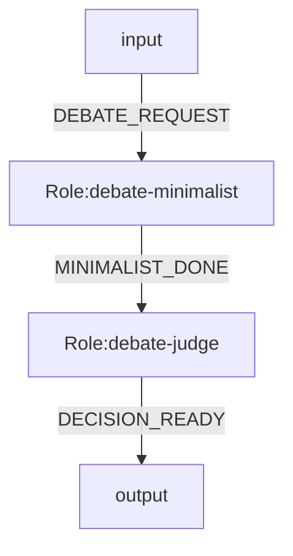
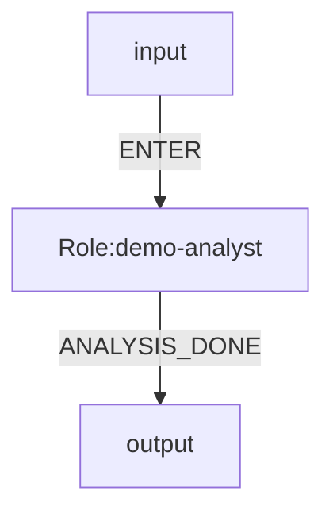
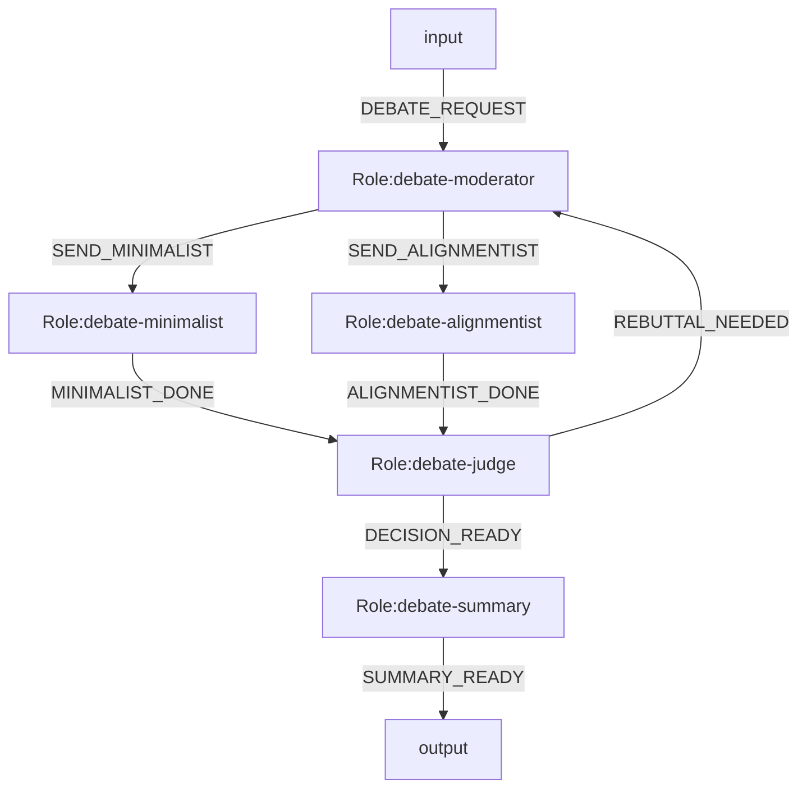

# OGSystem Usage Manual

## Read This First

OGSystem 当前是一套单机、文件优先、可恢复的图编排运行时。它最重要的特点不是“功能很多”，而是把编排语义、执行状态、恢复契约和运行证据收敛到了一条可审计的主路径里。

建议先建立这四个认知：

- 这是一个 graph runtime，不再维护第二套独立引擎。
- Mermaid 图不是展示层，而是会被编译成真正的 `ExecutionPlan`。
- `.ogs/runs/<run-id>/` 不是临时日志目录，而是运行时的数据平面与恢复依据。
- Resume 的前提不是“目录还在”，而是“语义指纹、状态快照、会话索引和 checkpoint/WAL 仍然一致”。

## Capability Snapshot

OGSystem 当前重点优化以下能力：

- 显式图语义：`parallel_split`、`all_of` join、`loop.max` 都有解析期和执行期约束。
- 文件优先恢复：`state.json`、`sessions.json`、`plan-fingerprint.json`、`checkpoints/`、`execution-outcome.json` 组成恢复权威集。
- 会话血缘隔离：`roleId:sessionLineageId` 保证顺序流转可复用会话，并行 sibling 不串会话记忆。
- Crash 自愈补偿：角色结果先 durable，再 checkpoint；恢复时补偿缺失 checkpoint，而不是盲目重跑节点。
- 绑定预检：运行前静态扫描所有 role 节点，未绑定节点必须满足 noop 法律授权与单出口约束，避免中途才失败。
- 运维可观察：`audit/`、`events.ndjson`、per-role execution snapshots 让每一步都有证据。

## Architecture Snapshot

理解项目时，可以先按下面这条链路看：

- `adapter.ts`：加载系统、角色、模型、law，构造运行上下文并校验 resume 指纹。
- `parse-mermaid.ts` + `execution-plan.ts`：把 Mermaid DSL 归一化为运行时可执行计划。
- `graph-runner.ts`：推进图状态、管理 branch/lineage、写 checkpoint、处理 resume 补偿。
- `role-executor.ts`：执行单个 role，做 prompt 投影、schema 校验、输出修复和结果落盘。
- `run-artifacts.ts`：管理 runDir、会话索引、`.resume.lock`、execution artifacts 与缓冲刷盘。

## Recommended Reading Order

如果你是第一次进入项目，建议按以下顺序阅读：

1. `README.md`
2. `docs/README.md`
3. `docs/product-introduction.md`
4. 本手册
5. `docs/ogsystem-orchestration-semantics-v1.md`
6. `docs/DECISIONS.md`
7. `docs/ogsystem-ebook.md`

## 1. Runtime Status

This repository now has one active runtime path: the graph runtime.

Use this rule:

- default execution path: use `model.bind.<roleId>=<modelId>`
- graph semantics: add `role.mode/join.mode/loop.max` only when the system needs parallel split, `all_of` join, or bounded loop
- `join.mode.<roleId>=all_of` requires `join.sources.<roleId>` and that source list must match the role's Mermaid incoming edges exactly
- compatibility execution mode: `exec.bind.<roleId>` still works when paired with `profiles/tools`, but it runs inside the same graph runtime rather than a separate engine

## 2. Semantic Layers

- `system.mmd`: role graph, events, law binding, role-to-model binding
- `role repo`: role semantics and I/O contracts
- `model repo`: executor and model runtime config
- `user profile`: delivery preference only

Hard boundary:

- role is semantic
- model is execution
- user profile is delivery preference
- system is orchestration

## 3. Recommended Directory Layout

```txt
OGSystem/
  .ogs/
    runtime.json
    user-profile.json
    laws.json
    project.json
    providers/
      opencode.json
    runs-index.json
    runs/
      <run-id>/
        ...

  og-roles/
    roles/
      <roleId>/
        role.json
        prompt.md
        output.schema.json
        persona.md
        work.md
        input.schema.json

  og-models/
    catalog/
      opencode-models.json
    models/
      <modelId>/
        model.json

  examples/
    target-model-binding-system.mmd
    langgraph-debate-current/
      system.mmd
      laws.json
      user-profile.json
    langgraph-expert-consultation/
      system.mmd
      laws.json
      user-profile.json
    console-system.mmd
    console-profiles.json
    console-tools.json
    console-laws.json
```

## 4. system.mmd

Target example:



Legacy-compatible execution example (current adapter):



Graph execution example:



Orchestration semantics contract:

- `parallel_split` activates all downstream targets of the current role in the same transition
- default routing without `role.mode` is event-driven; runtime injects `allowed_events`, and non-parallel roles with outgoing flows must emit `event`
- `join.mode.<roleId>=all_of` waits until every role listed in `join.sources.<roleId>` has produced a result under the same `lineageId`
- `all_of` join projects upstream results into `{{context}}` as a JSON string keyed by `join.sources` role ids (where each value contains that source's `event/content/data`) rather than exposing raw runtime state or plain-text sections
- `loop.max.<roleId>=N` is both a parser-time cycle budget declaration and an execution-time guard; runtime also injects `round`
- `branchId`, `lineageId`, and `sessionLineageId` are distinct runtime identifiers for branch instance, split/join lineage, and session reuse/isolation

## 5. Role Package Contract

Required:

- `role.json`
- `prompt.md`
- `output.schema.json`

Optional:

- `persona.md`
- `work.md`
- `input.schema.json`
- `talent` and `preferredModelTags` in `role.json` (soft hints only)

Role rules:

- `role.json.roleId` must equal directory name
- role packages do not define routing
- role packages do not hard-bind model ids

## 6. Model Package Contract

`og-models/models/<modelId>/model.json` defines execution configuration.

Example:

```json
{
  "modelId": "general-steady",
  "executor": "opencode",
  "model": "openai/gpt-5.4",
  "args": {
    "reasoningEffort": "medium"
  },
  "timeoutMs": 120000,
  "maxOutputBytes": 65536,
  "tags": ["general", "steady", "long-context"]
}
```

Model rules:

- model packages do not include persona/prompt logic
- model packages do not include routing logic
- `og-models/catalog/opencode-models.json` is the raw availability snapshot
- `og-models/models/*` should stay a small curated alias layer
- prefer semantic aliases in `modelId` (for example `general-fast`, `general-balanced`, `general-steady`) and map them to concrete provider models in `model.json`
- keep `system.mmd` stable by evolving model mapping in `og-models/models/*` instead of editing role flow definitions for every model upgrade
- for `executor: "opencode"`, `model.bind` roles run through OpenCode SDK v2 structured output:
  - input = rendered role prompt + `output.schema.json` + model selection + role working directory
  - output = one JSON object from `assistant.info.structured`; if `structured` is missing or string-encoded, runtime falls back to assistant text parts and JSON extraction
  - `args.reasoningEffort` is treated as the OpenCode `variant`
  - unsupported arbitrary CLI flags are not used on the SDK path

## 7. User Profile Contract

`.ogs/user-profile.json` contains delivery preference.

Example:

```json
{
  "userProfileId": "default.zh.concise",
  "language": "zh-CN",
  "style": "concise",
  "riskPreference": "medium",
  "outputLength": "short",
  "domainBackground": ["software-architecture"]
}
```

User profile rules:

- must not directly select model id
- should only affect language/style/detail/risk framing

## 8. Runtime Config

`.ogs/runtime.json` keeps runtime-level defaults:

- executor
- repo roots
- runs directory
- workspace directory names
- optional retention policy (explicit threshold cleanup)

Example:

```json
{
  "configVersion": "1",
  "executor": "opencode",
  "roleRepo": "./og-roles",
  "modelRepo": "./og-models",
  "runsDir": ".ogs/runs",
  "retention": {
    "enabled": false,
    "executionDirThreshold": 2000,
    "keepLatest": 100
  }
}
```

Compatibility rule:

- `configVersion` is optional for the current repo default, but when present it must be `"1"`
- unsupported config versions fail fast; the runtime does not provide in-place migration
- when `retention.enabled=true`, runtime can trigger cleanup automatically only when `executionDirCount > executionDirThreshold`
- CLI `--cleanup-executions` has higher priority than runtime retention config for that run

Config schema guard (editor/CI):

- `schemas/runtime-config.schema.json`
- `schemas/user-profile.schema.json`
- these schema files are for static validation and IDE hints; runtime still uses `src/runtime/config.ts` as the single runtime validation authority

## 9. Run Directory Contract

When a run starts, `.ogs/runs/<run-id>/` should persist:

- run-id format: `YYYYMMDD-HHMMSS-<shortHash>`

- run-level files: `run.md`, `request.md`, `system.mmd`, `repro.sh`, `state.json`, `metrics.json`, `events.ndjson`, `plan-fingerprint.json`
- run-level OpenCode metadata: `.opencode/server.pid`, `.opencode/endpoint.json` for `model.bind` runs
- run-level OpenCode session index: `sessions.json`
- run-level checkpoint WAL: `checkpoints/<sequence>-<executionId>.json`
- run-level shared workspace: `shared/`
- run-level lifecycle control: `control/stop-request.json`, `control/stop-outcome.json`
- audit files: `audit/summary.md`, `audit/transitions.md`
- log channels: `logs/engine.ndjson`, `logs/roles/<roleId>.ndjson`
- per-role latest files: `role.md`, `execution.json`, `latest-session.json`, `inbox.md`, `prompt.md`, `result.json`, `outbox.md`, `audit.json`, `private/`
- per-role history: `executions/<execution-id>/...` including `session.json` and `execution-outcome.json`

Resume source of truth:

- `state.json.graphState`
- `sessions.json`
- `plan-fingerprint.json`
- `checkpoints/`
- `roles/<roleId>/executions/<executionId>/execution-outcome.json`
- startup guard: `.resume.lock` (ephemeral advisory lock, not a state authority file)
- all authority files are written atomically at their own file boundary
- resume rejects partial/corrupted `graphState` snapshots before role execution starts
- resume hard-fails when the runtime-loaded fingerprint changes (`system`, `rolePackages`, `modelPackages`, `effectiveLaw`)
- fingerprint `sourceHints` are diagnostic-only path hints; they do not participate in the identity digest
- resume reconciles committed execution outcomes into missing checkpoints before normal replay continues
- if a checkpoint already exists but the durable outcome marker is still unreconciled, resume only backfills `checkpointSequence`/`reconciledAt` and does not emit a duplicate checkpoint
- resume acquires `.resume.lock` on startup, releases it on clean exit, and replaces a stale same-host lock when the recorded pid is no longer alive

Audit/operator artifacts:

- `events.ndjson`
- `logs/engine.ndjson`
- `logs/roles/<roleId>.ndjson`
- Markdown projections such as `run.md`, `request.md`, `audit/summary.md`, and `audit/transitions.md`
`state.json` is the authoritative runtime state snapshot.
`events.ndjson` is append-only complete history; CLI logs filtering uses the split log channels first.
`latest-session.json` is an operator-facing latest snapshot only.
`repro.sh` is a run-local resume repro script generated for troubleshooting handoff, with environment context comments (Node/OS/timestamp).
Resume reloads `sessions.json`, not `latest-session.json` or per-execution `session.json`.
`inbox.md` is a projection of normalized runtime input, not a free-form summary.
`.ogs/runs/` is generated runtime state and should be ignored by git.

Minimal shared-workspace rule:

- default shared path is `.ogs/runs/<run-id>/shared/`
- runtime exposes it through `OGSYSTEM_SHARED_DIR`
- role directories do not receive a `shared` symlink by default

Runtime prompt projection contract:

- `task`: original user prompt
- `context`: direct upstream `content`; for `join.mode=<roleId>: all_of`, runtime serializes a JSON string keyed by `join.sources` role ids, and each value carries that source branch's `event`/`content`/`data`
- `allowed_events`: JSON array string of outgoing event ids
- `last_output`: mirrors the current `context` projection
- `round`: current loop iteration as a string
- `system_notes`: reserved runtime hint channel; currently only populated selectively
- `user_profile`: serialized user-profile payload

Lineage contract:

- each active branch carries `branchId`, `lineageId`, and `sessionLineageId`
- `lineageId` scopes branch-family correlation such as `all_of` join readiness and result lookup
- `sessionLineageId` scopes OpenCode session reuse and sibling-branch isolation
- session keys are always `roleId:sessionLineageId`

OpenCode lifecycle rule for `model.bind`:

- one OGSystem run starts one shared `opencode serve`
- each role/node session is keyed by `roleId:sessionLineageId`
- repeated turns on the same branch lineage reuse the same OpenCode `session`
- sibling branches of the same role do not share a session
- sibling branches of the same role still share the same role directory and private workspace; the isolation guarantee is model-session isolation, not per-branch file-system isolation
- ordinary single-target sequential flow keeps the current `sessionLineageId`; fan-out and `all_of` join activation allocate a new lineage
- each node prompt still binds to that node's role directory
- node audit records include `sessionId`, `messageId`, and shared `serverPid`
- run events include `opencode_server_started` and `opencode_server_closed`
- transient provider/service failures are retried on the same role session
- after node completion, session metadata can be retained for audit/resume while the shared server stays alive
- parallel graph branches therefore run as concurrent sessions on the same server process

Join context projection rule:

- when `join.mode.<roleId>=all_of`, runtime injects upstream results into `{{context}}` as one JSON object keyed by source `roleId`
- each keyed value keeps the normalized `event`, `content`, and optional `data` fields from that upstream result
- the injected join context is a normalized projection, not the raw `graphState`

Role output repair policy:

- wrapped stdout that still contains one recoverable JSON object is normalized once
- unknown event is auto-normalized only when the role has exactly one allowed outgoing event
- schema mismatch fails fast and remains visible in the audit trail
- repair statistics are recorded in `audit/summary.md` and the adapter result JSON
- `audit/summary.md` includes a Mermaid gantt timeline when transition count is within render threshold

For graph-based runs, `state.json` also persists:

- `activeBranches`
- `completedBranches`
- `pendingJoinRoleIds`
- `loopIterations`
- `graphState`
- `graphState.recentAudits` (fixed window, default 5)
- `graphState.auditSummary` (aggregated counters for ok/failed/noop/repair/failure codes)
- `graphState.roleMetricsByRoleId` (per-role totals, status split, accumulated duration)
- run summary counters: `totalTransitions`, `okCount`, `failedCount`, `noopCount`
- structured `failureCountsByErrorCode`

Optional history cleanup:

- `--cleanup-executions <n>` keeps only the latest `n` per-role `executions/<executionId>/` snapshots
- runtime config can also enforce explicit threshold cleanup through `retention.enabled/executionDirThreshold/keepLatest`
- cleanup never touches `state.json` or `sessions.json`
- `metrics.json` now includes `rssBytes`, `stateWriteMs`, and `executionDirCount` for growth/I/O observability

## 9.1 Artifact Retention Policy Classes

OGSystem classifies persisted run artifacts into three classes:

- `runtime_consumed`: runtime-critical files read by resume and recovery logic (`state.json`, `sessions.json`, `plan-fingerprint.json`, `checkpoints/...`, `execution-outcome.json`, `.resume.lock`)
- `operator_latest`: latest operator-facing snapshots (`run.md`, `request.md`, `repro.sh`, `audit/*.md`, `roles/<roleId>/*.md|*.json`, `events.ndjson`, `logs/engine.ndjson`, `logs/roles/<roleId>.ndjson`)
- `history_only`: immutable per-execution snapshots (`roles/<roleId>/executions/<executionId>/...`)

This contract is implemented by:

- `src/runtime/run-artifact-policy.ts`
- `tests/run-artifact-policy.test.mjs`

## 9.2 Doctor And Recovery Inspection

Use `run:doctor` as runtime preflight and recovery inspection.

Preflight command:

```bash
pnpm run run:doctor -- \
  --required opencode \
  --system examples/target-model-binding-system.mmd \
  --laws .ogs/laws.json
```

Lint command:

```bash
pnpm run lint:system -- --system examples/target-model-binding-system.mmd
```

Lint rules:

- reuses the same Mermaid parse/validate/compile path as runtime execution
- stays read-only
- emits one hard-fail diagnostic per error in `line errorCode message` form

Console progress logging:

```bash
pnpm run run:adapter -- \
  --system examples/target-model-binding-system.mmd \
  --prompt "demo" \
  --dry-run \
  --log-run
```

- `--log-run` is off by default
- writes one-line run/role/transition progress logs to `stderr`
- when `stderr` is TTY and `NO_COLOR` is not set, status and transition logs use ANSI colors for faster scanning
- keeps the final adapter result JSON on `stdout`

Graph preview link (optional):

```bash
pnpm run run:adapter -- \
  --system examples/target-model-binding-system.mmd \
  --prompt "demo" \
  --dry-run \
  --print-graph-link
```

- prints Mermaid Live URL to `stderr`
- use for quick visual validation without changing runtime behavior

Run-directory inspection (resume prerequisites):

```bash
pnpm run run:doctor -- \
  --run-dir .ogs/runs/<run-id>
```

Optional online connectivity precheck:

```bash
pnpm run run:doctor -- \
  --system examples/target-model-binding-system.mmd \
  --online-check
```

- `--online-check` is opt-in and may consume tokens
- probes model connectivity through OpenCode before long runs

`run:doctor` output separation:

- `errors`: fail run/readiness checks
- `warnings`: inventory or compatibility issues that do not block execution
- `notes`: detected runtime capabilities and inspected metadata

For recovery, prioritize:

1. `state.json.graphState` exists and is readable
2. `sessions.json` exists and contains role session records when session reuse is expected
3. `report.run.resumePrerequisites` has required entries marked `ok: true`

## 10. Commands

Lifecycle CLI (preferred):

```bash
pnpm run run:adapter -- project init
pnpm run run:adapter -- run start --system examples/target-model-binding-system.mmd --prompt "demo" --dry-run
pnpm run run:adapter -- run list
pnpm run run:adapter -- run status <run-id>
pnpm run run:adapter -- run logs <run-id> --engine
pnpm run run:adapter -- run resume <run-id> --dry-run
pnpm run run:adapter -- run stop <run-id>
```

Preferred runtime command:

```bash
pnpm run run:adapter -- \
  --system examples/target-model-binding-system.mmd \
  --prompt "讨论当前架构是否继续最小化" \
  --dry-run
```

This path auto-discovers:

- `.ogs/runtime.json`
- `.ogs/user-profile.json`
- `.ogs/laws.json`
- `og-models/`
- `og-roles/`

Legacy-compatible binding command:

```bash
pnpm run run:adapter -- \
  --system examples/console-system.mmd \
  --profiles examples/console-profiles.json \
  --tools examples/console-tools.json \
  --laws examples/console-laws.json \
  --prompt "analyze this repository" \
  --dry-run
```

Graph runtime command:

```bash
pnpm run run:adapter -- \
  --system examples/langgraph-debate-current/system.mmd \
  --laws examples/langgraph-debate-current/laws.json \
  --user-profile examples/langgraph-debate-current/user-profile.json \
  --prompt "是否应继续保持 OGSystem 最小化并延后 reducer 与恢复语义？" \
  --dry-run
```

Minimal expert consultation command:

```bash
pnpm run run:adapter -- \
  --system examples/langgraph-expert-consultation/system.mmd \
  --laws examples/langgraph-expert-consultation/laws.json \
  --user-profile examples/langgraph-expert-consultation/user-profile.json \
  --prompt "患者间断高热、皮疹、胸闷、肌无力，常规检查未能解释原因，请组织多学科会诊。" \
  --dry-run
```

Resume a graph runtime run from persisted `state.json.graphState`:

```bash
pnpm run run:adapter -- \
  --system examples/langgraph-debate-current/system.mmd \
  --laws examples/langgraph-debate-current/laws.json \
  --user-profile examples/langgraph-debate-current/user-profile.json \
  --resume-run .ogs/runs/<run-id> \
  --prompt "是否应继续保持 OGSystem 最小化并延后 reducer 与恢复语义？" \
  --dry-run
```

Operational note:

- a second same-host `--resume-run` against the same `runDir` fails fast while `.resume.lock` is held
- stale locks left by dead processes are replaced automatically on the next resume attempt

Replay benchmark command:

```bash
pnpm run bench:runtime-replay
```

Validation command for generated Mermaid:

```bash
node skills/ogsystem-nl-to-mmd/scripts/validate_ogsystem_mmd.mjs \
  --system examples/target-model-binding-system.mmd
```

Validation command for an actual generated run:

```bash
node skills/ogsystem-nl-to-mmd/scripts/validate_ogsystem_mmd.mjs \
  --system examples/target-model-binding-system.mmd \
  --user-profile .ogs/user-profile.json \
  --laws .ogs/laws.json \
  --run-dir .ogs/runs/<run-id>
```

## 11. Migration Notes

- new docs and templates should use `model.bind.*`
- during migration, `exec.bind.*` remains a compatibility path
- runtime precedence is:
  - `model.bind.<roleId>`
  - then `exec.bind.<roleId>`
