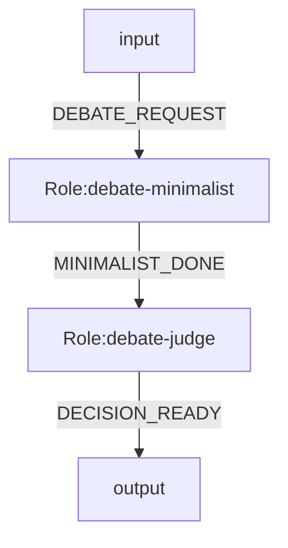
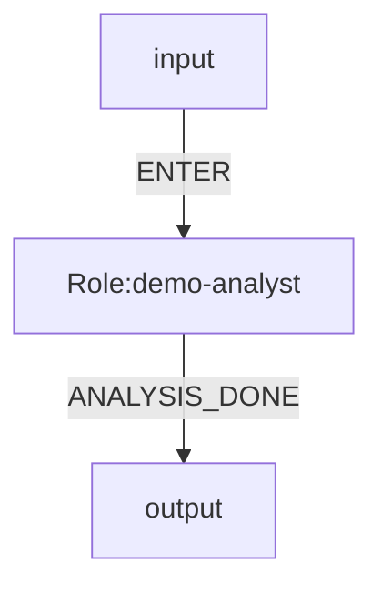
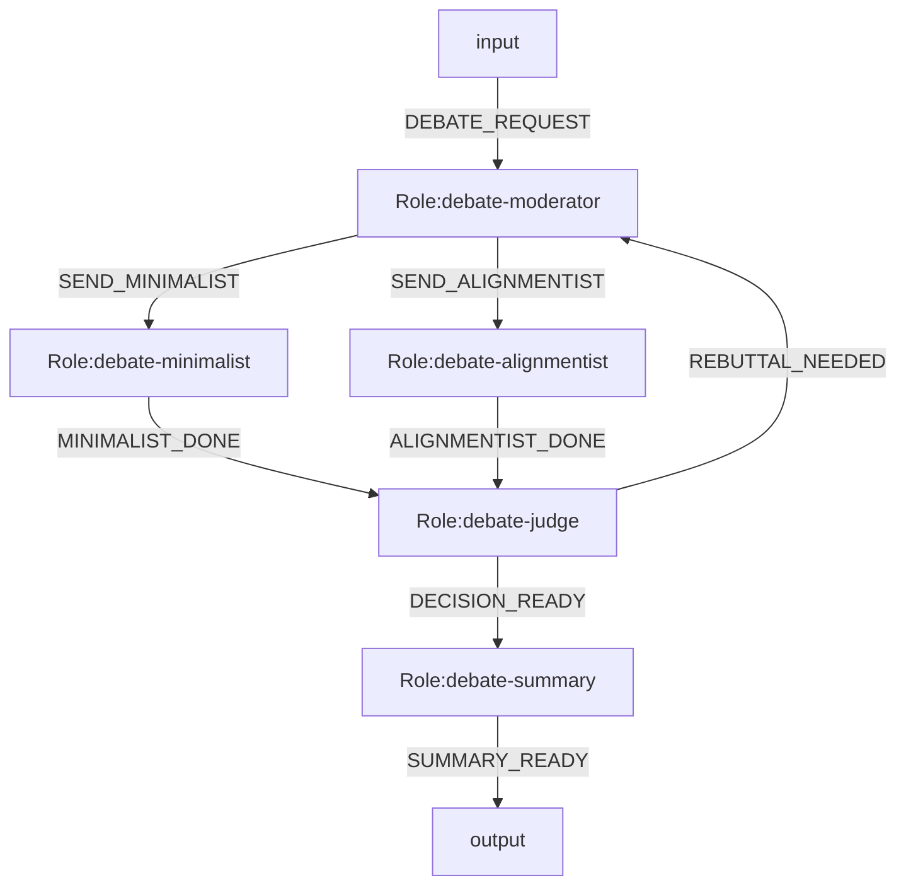

# OGSystem Usage Manual

## 1. Runtime Status

This repository now has one active runtime path: the graph runtime.

Use this rule:

- default execution path: use `model.bind.<roleId>=<modelId>`
- graph semantics: add `role.mode/join.mode/loop.max` only when the system needs parallel split, `all_of` join, or bounded loop
- compatibility execution mode: `exec.bind.<roleId>` still works when paired with `profiles/tools`, but it runs inside the same graph runtime rather than a separate engine

## 2. Semantic Layers

- `system.mmd`: role graph, events, law binding, role-to-model binding
- `role repo`: role semantics and I/O contracts
- `model repo`: executor and model runtime config
- `user profile`: delivery preference only

Hard boundary:

- role is semantic
- model is execution
- user profile is delivery preference
- system is orchestration

## 3. Recommended Directory Layout

```txt
OGSystem/
  .ogsystem/
    runtime.json
    user-profile.json
    laws.json

  og-roles/
    roles/
      <roleId>/
        role.json
        prompt.md
        output.schema.json
        persona.md
        work.md
        input.schema.json

  og-models/
    catalog/
      opencode-models.json
    models/
      <modelId>/
        model.json

  examples/
    target-model-binding-system.mmd
    langgraph-debate-current/
      system.mmd
      laws.json
      user-profile.json
    langgraph-expert-consultation/
      system.mmd
      laws.json
      user-profile.json
    console-system.mmd
    console-profiles.json
    console-tools.json
    console-laws.json
```

## 4. system.mmd

Target example:



Legacy-compatible execution example (current adapter):



Graph execution example:



## 5. Role Package Contract

Required:

- `role.json`
- `prompt.md`
- `output.schema.json`

Optional:

- `persona.md`
- `work.md`
- `input.schema.json`
- `talent` and `preferredModelTags` in `role.json` (soft hints only)

Role rules:

- `role.json.roleId` must equal directory name
- role packages do not define routing
- role packages do not hard-bind model ids

## 6. Model Package Contract

`og-models/models/<modelId>/model.json` defines execution configuration.

Example:

```json
{
  "modelId": "deep-o3",
  "executor": "opencode",
  "model": "openai/o3",
  "args": {
    "reasoningEffort": "high"
  },
  "timeoutMs": 180000,
  "maxOutputBytes": 65536,
  "tags": ["reasoning", "long-context"]
}
```

Model rules:

- model packages do not include persona/prompt logic
- model packages do not include routing logic
- `og-models/catalog/opencode-models.json` is the raw availability snapshot
- `og-models/models/*` should stay a small curated alias layer
- for `executor: "opencode"`, `model.bind` roles run through OpenCode SDK v2 structured output:
  - input = rendered role prompt + `output.schema.json` + model selection + role working directory
  - output = one JSON object from `assistant.info.structured`; if `structured` is missing or string-encoded, runtime falls back to assistant text parts and JSON extraction
  - `args.reasoningEffort` is treated as the OpenCode `variant`
  - unsupported arbitrary CLI flags are not used on the SDK path

## 7. User Profile Contract

`.ogsystem/user-profile.json` contains delivery preference.

Example:

```json
{
  "userProfileId": "default.zh.concise",
  "language": "zh-CN",
  "style": "concise",
  "riskPreference": "medium",
  "outputLength": "short",
  "domainBackground": ["software-architecture"]
}
```

User profile rules:

- must not directly select model id
- should only affect language/style/detail/risk framing

## 8. Runtime Config

`.ogsystem/runtime.json` keeps runtime-level defaults:

- executor
- repo roots
- runs directory
- workspace directory names

Example:

```json
{
  "configVersion": "1",
  "executor": "opencode",
  "roleRepo": "./og-roles",
  "modelRepo": "./og-models",
  "runsDir": "ogsystem-history"
}
```

Compatibility rule:

- `configVersion` is optional for the current repo default, but when present it must be `"1"`
- unsupported config versions fail fast; the runtime does not provide in-place migration

## 9. Run Directory Contract

When a run starts, `ogsystem-history/<run-id>/` should persist:

- run-id format: `yyyy-MM-dd_HH24-mm-ss_xxxx` (`xxxx` = 4-char system code)

- run-level files: `run.md`, `request.md`, `system.mmd`, `state.json`, `metrics.json`, `events.ndjson`, `plan-fingerprint.json`
- run-level OpenCode metadata: `opencode-server.json` for `model.bind` runs
- run-level OpenCode session index: `sessions.json`
- run-level checkpoint WAL: `checkpoints/<sequence>-<executionId>.json`
- run-level shared workspace: `shared/`
- audit files: `audit/summary.md`, `audit/transitions.md`
- per-role latest files: `role.md`, `execution.json`, `latest-session.json`, `inbox.md`, `prompt.md`, `result.json`, `outbox.md`, `audit.json`, `private/`
- per-role history: `executions/<execution-id>/...` including `session.json` and `execution-outcome.json`

Resume source of truth:

- `state.json.graphState`
- `sessions.json`
- `plan-fingerprint.json`
- `checkpoints/`
- `roles/<roleId>/executions/<executionId>/execution-outcome.json`
- all authority files are written atomically at their own file boundary
- resume rejects partial/corrupted `graphState` snapshots before role execution starts
- resume hard-fails when the runtime-loaded fingerprint changes (`system`, `rolePackages`, `modelPackages`, `effectiveLaw`)
- fingerprint `sourceHints` are diagnostic-only path hints; they do not participate in the identity digest
- resume reconciles committed execution outcomes into missing checkpoints before normal replay continues
- if a checkpoint already exists but the durable outcome marker is still unreconciled, resume only backfills `checkpointSequence`/`reconciledAt` and does not emit a duplicate checkpoint

Audit/operator artifacts:

- `events.ndjson`
- Markdown projections such as `run.md`, `request.md`, `audit/summary.md`, and `audit/transitions.md`
`state.json` is the authoritative runtime state snapshot.
`events.ndjson` is append-only audit history.
`latest-session.json` is an operator-facing latest snapshot only.
Resume reloads `sessions.json`, not `latest-session.json` or per-execution `session.json`.
`inbox.md` is a projection of normalized runtime input, not a free-form summary.
`ogsystem-history/` is generated runtime state and should be ignored by git.

Minimal shared-workspace rule:

- default shared path is `ogsystem-history/<run-id>/shared/`
- runtime exposes it through `OGSYSTEM_SHARED_DIR`
- role directories do not receive a `shared` symlink by default

OpenCode lifecycle rule for `model.bind`:

- one OGSystem run starts one shared `opencode serve`
- each role/node session is keyed by `roleId:sessionLineageId`
- repeated turns on the same branch lineage reuse the same OpenCode `session`
- sibling branches of the same role do not share a session
- each node prompt still binds to that node's role directory
- node audit records include `sessionId`, `messageId`, and shared `serverPid`
- run events include `opencode_server_started` and `opencode_server_closed`
- transient provider/service failures are retried on the same role session
- after node completion, session metadata can be retained for audit/resume while the shared server stays alive
- parallel graph branches therefore run as concurrent sessions on the same server process

Role output repair policy:

- wrapped stdout that still contains one recoverable JSON object is normalized once
- unknown event is auto-normalized only when the role has exactly one allowed outgoing event
- schema mismatch fails fast and remains visible in the audit trail
- repair statistics are recorded in `audit/summary.md` and the adapter result JSON

For graph-based runs, `state.json` also persists:

- `activeBranches`
- `completedBranches`
- `pendingJoinRoleIds`
- `loopIterations`
- `graphState`
- run summary counters: `totalTransitions`, `okCount`, `failedCount`, `noopCount`
- structured `failureCountsByErrorCode`

Optional history cleanup:

- `--cleanup-executions <n>` keeps only the latest `n` per-role `executions/<executionId>/` snapshots
- cleanup never touches `state.json` or `sessions.json`

## 9.1 Artifact Retention Policy Classes

OGSystem classifies persisted run artifacts into three classes:

- `runtime_consumed`: runtime-critical files read by resume and recovery logic (`state.json`, `sessions.json`, `plan-fingerprint.json`, `checkpoints/...`, `execution-outcome.json`)
- `operator_latest`: latest operator-facing snapshots (`run.md`, `request.md`, `audit/*.md`, `roles/<roleId>/*.md|*.json`, `events.ndjson`)
- `history_only`: immutable per-execution snapshots (`roles/<roleId>/executions/<executionId>/...`)

This contract is implemented by:

- `src/runtime/run-artifact-policy.ts`
- `tests/run-artifact-policy.test.mjs`

## 9.2 Doctor And Recovery Inspection

Use `run:doctor` as runtime preflight and recovery inspection.

Preflight command:

```bash
npm run run:doctor -- \
  --required opencode \
  --system examples/target-model-binding-system.mmd \
  --laws .ogsystem/laws.json
```

Lint command:

```bash
npm run lint:system -- --system examples/target-model-binding-system.mmd
```

Lint rules:

- reuses the same Mermaid parse/validate/compile path as runtime execution
- stays read-only
- emits one hard-fail diagnostic per error in `line errorCode message` form

Console progress logging:

```bash
npm run run:adapter -- \
  --system examples/target-model-binding-system.mmd \
  --prompt "demo" \
  --dry-run \
  --log-run
```

- `--log-run` is off by default
- writes one-line run/role/transition progress logs to `stderr`
- keeps the final adapter result JSON on `stdout`

Run-directory inspection (resume prerequisites):

```bash
npm run run:doctor -- \
  --run-dir ogsystem-history/<run-id>
```

`run:doctor` output separation:

- `errors`: fail run/readiness checks
- `warnings`: inventory or compatibility issues that do not block execution
- `notes`: detected runtime capabilities and inspected metadata

For recovery, prioritize:

1. `state.json.graphState` exists and is readable
2. `sessions.json` exists and contains role session records when session reuse is expected
3. `report.run.resumePrerequisites` has required entries marked `ok: true`

## 10. Commands

Preferred runtime command:

```bash
npm run run:adapter -- \
  --system examples/target-model-binding-system.mmd \
  --prompt "讨论当前架构是否继续最小化" \
  --dry-run
```

This path auto-discovers:

- `.ogsystem/runtime.json`
- `.ogsystem/user-profile.json`
- `.ogsystem/laws.json`
- `og-models/`
- `og-roles/`

Legacy-compatible binding command:

```bash
npm run run:adapter -- \
  --system examples/console-system.mmd \
  --profiles examples/console-profiles.json \
  --tools examples/console-tools.json \
  --laws examples/console-laws.json \
  --prompt "analyze this repository" \
  --dry-run
```

Graph runtime command:

```bash
npm run run:adapter -- \
  --system examples/langgraph-debate-current/system.mmd \
  --laws examples/langgraph-debate-current/laws.json \
  --user-profile examples/langgraph-debate-current/user-profile.json \
  --prompt "是否应继续保持 OGSystem 最小化并延后 reducer 与恢复语义？" \
  --dry-run
```

Minimal expert consultation command:

```bash
npm run run:adapter -- \
  --system examples/langgraph-expert-consultation/system.mmd \
  --laws examples/langgraph-expert-consultation/laws.json \
  --user-profile examples/langgraph-expert-consultation/user-profile.json \
  --prompt "患者间断高热、皮疹、胸闷、肌无力，常规检查未能解释原因，请组织多学科会诊。" \
  --dry-run
```

Resume a graph runtime run from persisted `state.json.graphState`:

```bash
npm run run:adapter -- \
  --system examples/langgraph-debate-current/system.mmd \
  --laws examples/langgraph-debate-current/laws.json \
  --user-profile examples/langgraph-debate-current/user-profile.json \
  --resume-run ogsystem-history/<run-id> \
  --prompt "是否应继续保持 OGSystem 最小化并延后 reducer 与恢复语义？" \
  --dry-run
```

Validation command for generated Mermaid:

```bash
node skills/ogsystem-nl-to-mmd/scripts/validate_ogsystem_mmd.mjs \
  --system examples/target-model-binding-system.mmd
```

Validation command for an actual generated run:

```bash
node skills/ogsystem-nl-to-mmd/scripts/validate_ogsystem_mmd.mjs \
  --system examples/target-model-binding-system.mmd \
  --user-profile .ogsystem/user-profile.json \
  --laws .ogsystem/laws.json \
  --run-dir ogsystem-history/<run-id>
```

## 11. Migration Notes

- new docs and templates should use `model.bind.*`
- during migration, `exec.bind.*` remains a compatibility path
- runtime precedence is:
  - `model.bind.<roleId>`
  - then `exec.bind.<roleId>`
