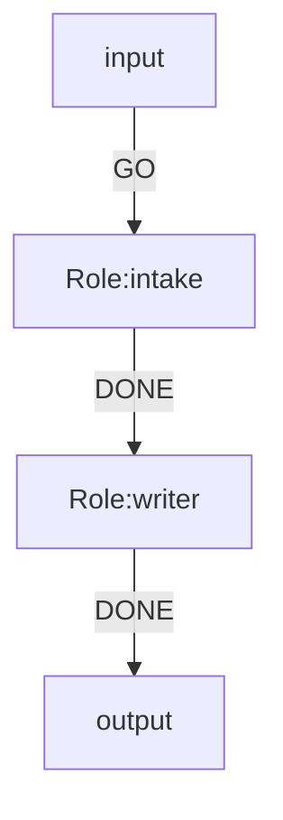
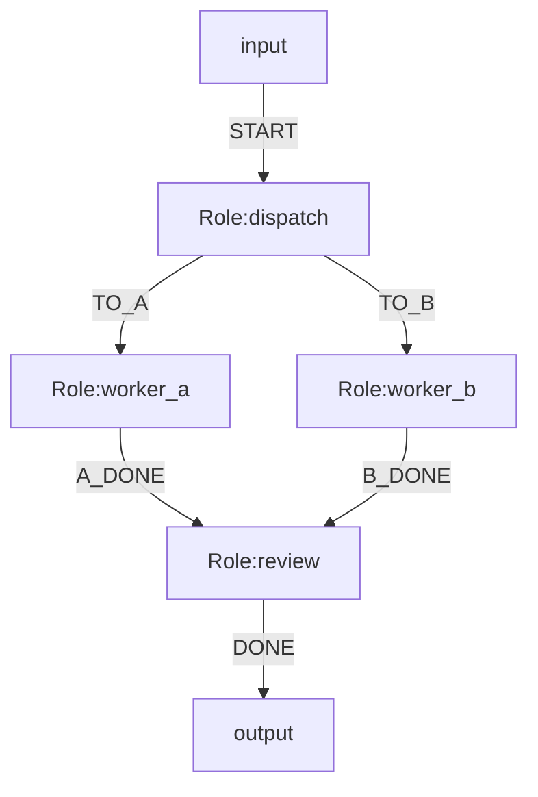
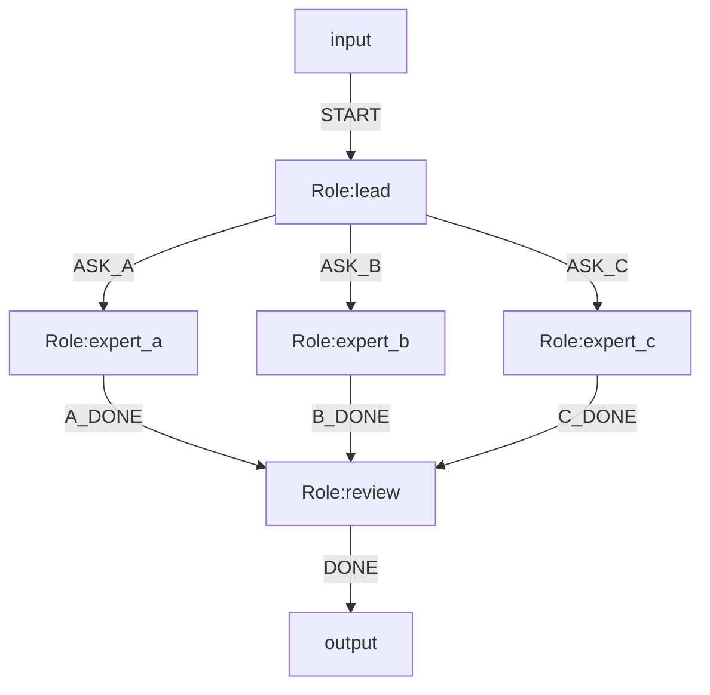
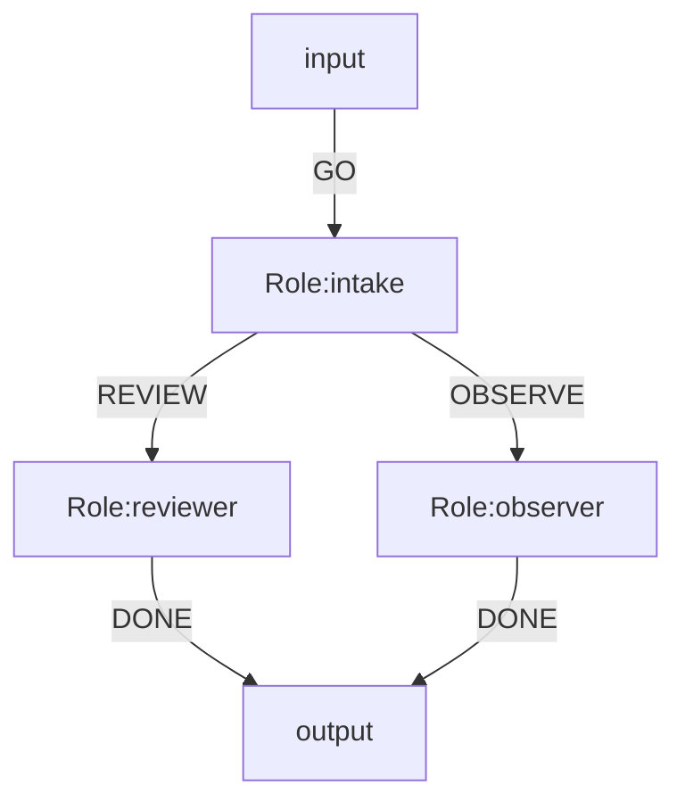
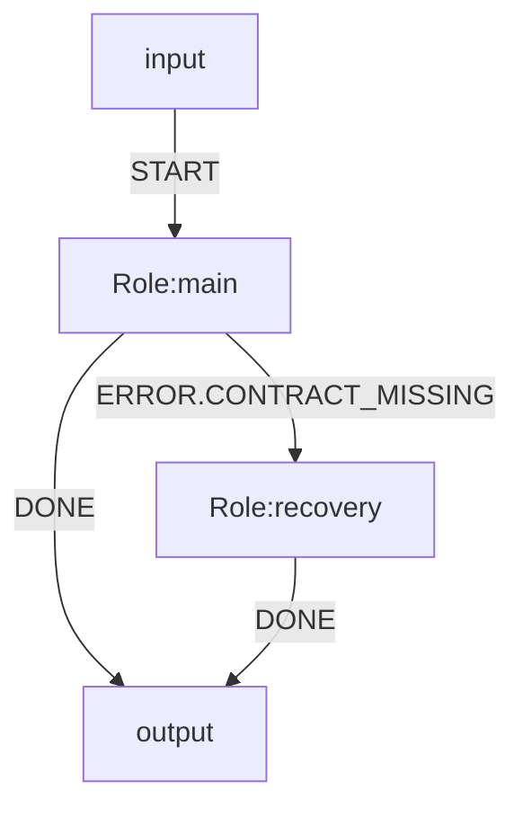
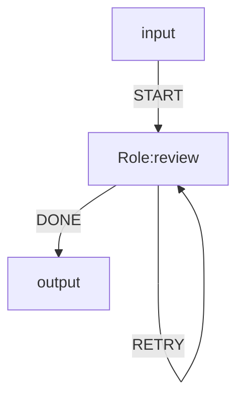
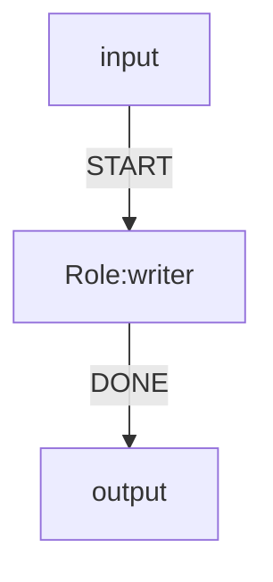
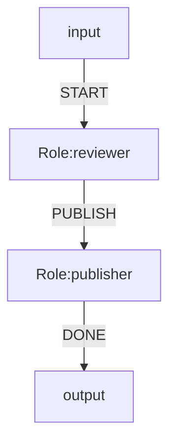

# NL2MMD 结构模板手册

本手册只讨论结构和内容，不讨论样式。

目标是把自然语言先归入稳定的 OGSystem 语义模板，再填充 Mermaid 骨架，而不是让模型自由生成整张图。

## 1. 选择原则

优先按主语义选模板：

- 有“至少 N 个”“阈值”“共识”“法定人数”语义，用 `quorum_consultation`。
- 有“并行”“同时分发”“多路协作”语义，用 `fanout_fanin`。
- 有“合同”“交接”“strict/transition”“route.order”语义，用 `contract_gated_handoff`。
- 有“ERROR”“补偿”“恢复”语义，用 `error_compensation`。
- 有“循环”“重试”“最多 N 次”语义，用 `bounded_loop`。
- 有“人工审核”“确认”“审批”语义，用 `human_gate`；该模板表示 runtime-native review，不生成独立 human-gate role。
- 有 Agent 与工具角色混合的语义，用 `mixed_binding`；模型选择配置始终在项目设置中，不写进 Mermaid。
- 如果没有明显结构信号，先退回 `linear_flow`。

当多个模板都可能命中时，优先更具体的结构：

- `quorum_consultation` 优先于 `fanout_fanin`，因为“阈值 + 共识”比单纯并行更强。
- `contract_gated_handoff` 优先于普通线性流，只要出现合同或交接语义。
- `error_compensation` 优先于所有成功路径模板，只要主任务明确描述失败补偿。

## 2. 模板示例

### 2.1 `linear_flow`

适合单链路、无分叉、无合同、无 join 的场景。

必填槽位：

- `entry`
- `roles`
- `bindings`

示例：

### 2.2 `fanout_fanin`

适合“先并行分发，再回收到一个 merge role”。

必填槽位：

- `split`
- `branches`
- `join`

示例：

### 2.3 `quorum_consultation`

适合“会诊 / 评审 / 共识 / 至少 N 个专家”。

必填槽位：

- `consultants`
- `threshold`
- `merge`

示例：

### 2.4 `contract_gated_handoff`

适合“交接要过合同检查”的场景。

必填槽位：

- `handoff`
- `routes`
- `binds`

示例：

### 2.5 `error_compensation`

适合“主路径失败后，走补偿或恢复分支”。

`ERROR*` 是否启用由项目 `.ogs/runtime.json` 中的 `runtime.error_flows.v1` 控制；它不是 Mermaid metadata。未启用时，失败仍保持 fail-stop。

必填槽位：

- `normal-path`
- `error-path`
- `recovery`

示例：

### 2.6 `bounded_loop`

适合“明确轮次上限”的重试或回环。

必填槽位：

- `loop-cap`
- `loop-back`
- `exit`

示例：

### 2.7 `human_gate`（runtime-native review）

适合“人审 / 审批 / 确认”。它在被审核 role 上声明 `review.mode.<roleId>=required`，不增加独立的人审节点；`review.timeout.*` 当前只保存审核策略，不会自动计时过期。`runtime.error_flows.v1` 应配置在 `.ogs/runtime.json`，不是 Mermaid metadata。

必填槽位：

- `reviewed-role`
- `decision`
- `post-review`

示例：

### 2.8 `mixed_binding`

适合不同 role 分别由 Agent 与项目工具执行的场景。Agent backend/model 在 `.ogs/model-selection.json` 中配置，工具 role 使用 `exec.bind`。

必填槽位：

- `exec-binding`
- `role-note`

示例：

## 3. 使用建议

- 模板只是骨架，不替代 `parse-mermaid.ts` 和 `validate.ts` 的校验。
- 如果一个需求能被两个模板描述，优先选择更保守、更具体的那个。
- 生成时要先保证必填槽位齐全，再补可选槽位。
- 对已有系统做修改时，优先保持模板不变，只更新槽位内容。
