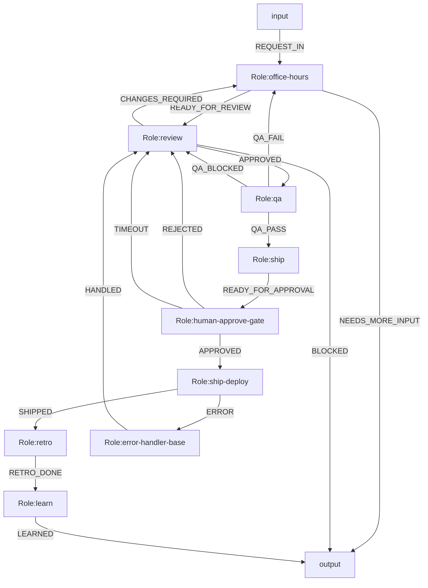

# Gstack-like 角色优先协作方案

## 结论

可以用 OGSystem 构建一个与 `gstack` 思路接近的软件团队协作系统，但更合适的建模方式不是把所有子流程都展开成 Mermaid 节点，而是：

- 以角色为主轴建模
- 允许每个角色在内部完成多个紧耦合子步骤
- 只把关键控制点外显到编排图

这里的关键控制点主要是：

- 人工审批
- 发布前后 gate
- 失败补偿与回滚
- 需要独立审计或独立重试的验证步骤

## 适合的角色集合

建议先收敛成 6 个主角色：

1. `office-hours`
2. `review`
3. `qa`
4. `ship`
5. `retro`
6. `learn`

每个角色都输出结构化结果：

```json
{
  "event": "EVENT_NAME",
  "content": "简要结论",
  "data": {}
}
```

## 角色职责

### `office-hours`

负责需求 intake、背景澄清、范围边界识别、任务整形、风险初筛。  
角色内部可以完成：

- 多轮需求澄清
- 约束整理
- 初始任务拆分
- 风险和依赖识别

建议事件：

- `READY_FOR_REVIEW`
- `NEEDS_MORE_INPUT`
- `REJECTED`

### `review`

负责 readiness review，而不是简单“看一下”。  
角色内部可以完成：

- 方案一致性检查
- 架构/实现路径评审
- 验收标准确认
- 是否进入 QA/交付阶段的判断

建议事件：

- `APPROVED`
- `CHANGES_REQUIRED`
- `BLOCKED`

### `qa`

负责质量验证，但建议把“测试策略设计 + 执行协调 + 结果汇总”放在角色内部。  
角色内部可以完成：

- 静态检查
- 单元/集成测试
- 浏览器或 E2E 检查
- 结果汇总和问题分级

建议事件：

- `QA_PASS`
- `QA_FAIL`
- `QA_BLOCKED`

说明：如果后续需要更强审计能力，可以把 `qa` 再拆成外显子节点，例如 `qa-browser`、`qa-tests`、`qa-summary`。

### `ship`

负责交付与发布，但不建议把审批和回滚完全藏进角色内部。  
角色内部可以完成：

- 交付前检查
- 打包/部署执行
- 发布后验证
- 发布结果汇总

建议事件：

- `READY_FOR_APPROVAL`
- `SHIPPED`
- `SHIP_BLOCKED`

### `retro`

负责发布后的复盘。  
角色内部可以完成：

- 问题归因
- 协作瓶颈分析
- 质量与效率回顾
- 后续行动项生成

建议事件：

- `RETRO_DONE`

### `learn`

负责将复盘结果沉淀成组织记忆。  
角色内部可以完成：

- 规则沉淀
- 模板更新建议
- checklist 更新
- 经验归档

建议事件：

- `LEARNED`

## 推荐编排原则

角色优先不代表“所有流程都塞进 role”。建议遵循下面的边界：

### 适合藏进角色内部的内容

- 多轮分析
- 检查清单执行
- 单角色内的推理与整理
- 同一责任边界内的顺序脚本

### 应该外显到图上的内容

- human approval
- deploy 失败后的补偿或回滚
- 需要独立证据链的 QA 环节
- 需要单独恢复或单独重试的步骤

## 推荐的最小外显流程

下面是一条比较稳妥的最小外显链路：



这条链的含义是：

- 主体协作仍由 6 个角色承担
- 只有审批和发布补偿被外显
- 这样既保留角色中心建模，又不损失系统级控制力

## 工具层现实边界

工具层可以支撑这套方案，但要接受它是“薄工具层”。

### 当前可接受的事实

- `model.bind` 适合 `office-hours`、`review`、`retro`、`learn`
- `exec.bind` 适合 `qa`、`ship` 中的脚本执行部分
- 工具本质上是本地 shell 包装

### 当前约束

1. 一个 role 只能使用一种 binding  
   不能同时 `model.bind` 和 `exec.bind`。

2. `exec` 工具层只支持本地 shell  
   更像脚本适配层，不是高阶工作流平台。

3. 一个 profile 只绑定一个工具  
   复杂动作通常需要由外层脚本自行封装。

4. 工具输出必须收敛成结构化 JSON  
   否则不适合作为稳定运行时契约。

### 这对角色设计的影响

- `office-hours`、`review`、`retro`、`learn` 建议直接用 `model.bind`
- `qa` 如果既需要分析又需要调用工具，优先做成一个脚本型角色，或者拆成：
  - `qa-planner`
  - `qa-runner`
  - `qa-summary`
- `ship` 同理，建议至少把部署执行和审批/补偿分开

## 推荐实现策略

### 方案 A：先快跑

先保留 6 个主角色，只额外增加两个基础系统角色：

- `human-approve-gate`
- `error-handler-base`

这样最快能得到一个可运行版本。

### 方案 B：后续增强

等主链跑通后，再按审计和恢复需求细化：

- 把 `qa` 拆出浏览器验证和测试执行
- 把 `ship` 拆出 deploy 与 post-deploy verify
- 把 `learn` 接到模板或规则仓更新流程

## 最终建议

如果目标是做一个 `gstack` 风格、但更适合 OGSystem 的系统，建议采用：

- 角色优先
- 必要 gate 外显
- 工具通过脚本适配
- 不把审批、补偿、回滚、独立证据链步骤完全藏进角色内部

一句话概括：

`把“工作内容”放进角色，把“系统控制权”留在图上。`
